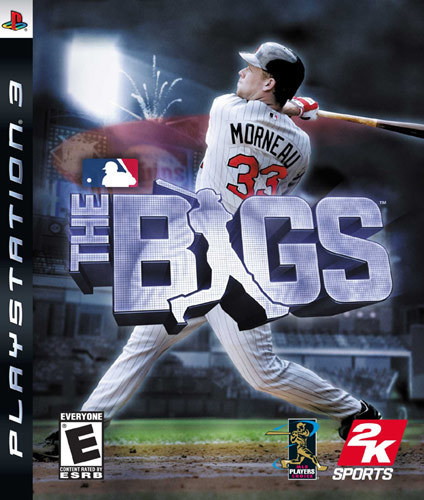
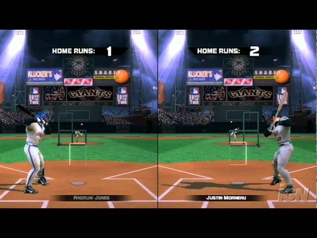
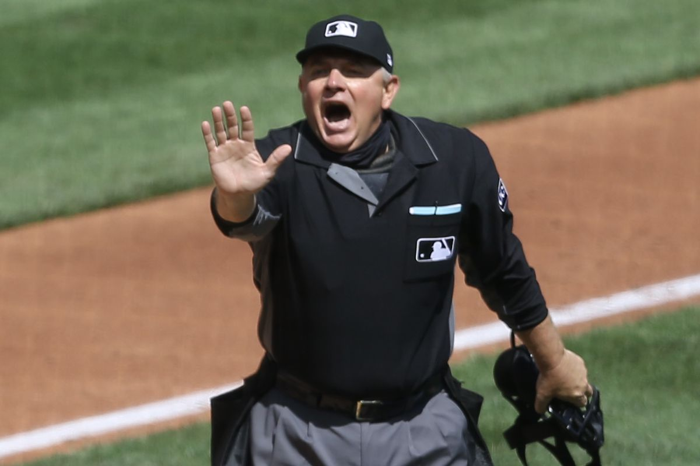
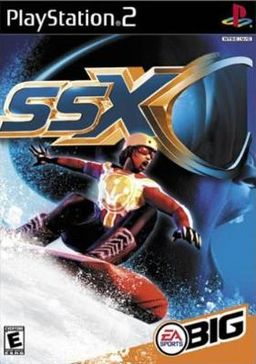
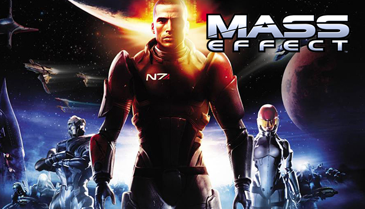

# 게임 개발중 웃긴 버그와 해프닝

게임 개발중에는 많은 버그들에 맞닥뜨리게 된다.

버그는 개발자를 골머리 썩게 만드는 골칫덩어리 중 하나이지만, 또 예상치 못한 버그의 발생은 우리에게 재미를 주기도 한다.

황당하거나 웃긴 버그와 그 황당한 버그를 해결하는 또다른 황당한 해결법을 보면서 버그를 찾는 좋은 방법, 버그의 해결법을 배우며 버그와 친숙해 져 보자.

그리고, 좋은 버그 리포트란 무엇인가에 대해 배워보자.

>  해당 문서는 게임 개발자 pope kim 님의 경험담을 바탕으로 작성되었음을 알린다.

## 더 빅스 (The Bigs 2007)

### 1. 특정상황에서 반드시 홈런을 칠 수 있는 버그

- 게임 개발 단계에서 QA 가 발견함

- 버그 재현 방법:
  1. 콘솔 설정상의 날짜를 특정 년도, 날짜로 맞춘다.
  2. 정해진 특정 팀을 고른다.
  3. 상대방이 첫번째 공을 던졌을 때 배트를 휘두르기만 하면 반드시 홈런이 나간다.

- 버그의 원리
  - C의 랜덤 생성 함수의 seed 값을 이용한 버그
  - seed 값을 주로 날짜를 넣는데, 게임에 사용된 랜덤생성 함수는 seed 값으로 특정 숫자를 넘어가면 반드시 null을 반환한다.
  - C의 srand 함수는 개발된지 매우 오래된 함수인데, 개발 당시에는 2020년이라는 큰 숫자를 상정하지 않고 개발됨
  - 게임상에서 배트를 휘둘렀을때 안타, 홈런 등의 판정이 랜덤으로 판정되게 되어있었다.
  - 그러나 날짜가 특정 범위값을 초과해 항상 null을 반환하게 되었고 그 null을 seed 값으로 생성된 값은 이제 랜덤이 아닌 어떤 특정 값을 항상 똑같이 반환하게 되었다.
  - 그 특정 값은 마침 어떤 특정 팀, 특정 상황에서 반드시 홈런으로 판정된다.
- 버그의 해결
  - C의 기본 srand 함수가 아닌 다른 랜덤 생성 함수를 사용해서 해결

### 2. "게임에 예수가 강림했다!" (텍스처 오류)

- 한 선수의 팔에 텍스처 지정 오류로 다른 흑인 선수의 얼굴이 들어감
- QA 중에 미국 출신이 많았고, 미국에는 크리스천이 많음.
- 수 많은 QA들로부터 예수가 강림했다는 버그 리포트를 받는 해프닝이 발생
- 해결:
  - 단순히 잘못 지정된 텍스처를 다시 원래 텍스처로 잘 지정해서 고침

### 3. "너희 게임은 사실적이지 않아!"

- 게임 개발 단계에서 QA가 주장(?)한 버그

- 해당 QA는 미국 국적의 자칭 메이저 리그 광팬

- 게임의 상황:

  - 게임 리소스를 아끼기 위해 백인 주심과 흑인 주심 단 두 모델링만 가지고 모든 주심을 돌려썼음.

- 해당 QA의 주장:

  - 홈베이스 주심은 스페인계, 백인계 주심이 많음
  - 1,2,3 루 주심은 흑인이 많지 않다.
  - 그러나 게임상의 주심은 흑인이 많다.
  - 따라서 이 게임은 사실적이지 않고 이는 버그이다.

- 해결:

  - 개발자들은 이를 인종차별적으로 받아들였다.

  - 그러나 해당 QA와 마찰을 빚고 싶지는 않았다.

  - 개발자들은 해당 QA에게 다음과 같이 피드백을 했다.

    >  "우리는 아프리칸-아메리칸 어린이들도 이 게임을 하면서 우리도 열심히 하면 저렇게 주심 같은 훌륭한 위치에 설 수 있다는 것을 보여주고 싶었다. 이런 메시지를 주기 위해 게임을 이렇게 만들었다."

  - 이에 대해 해당 QA는 그렇구나 라고 수긍했다고 한다.

## PS2 스노우 보드 게임

> 비밀유지 계약 문제로 정확한 게임명을 밝히지는 않음.
>
> 상기 이미지상의 게임은 이 이야기와 무관함

### 게임 설명

- 스노우 보드를 타고 산 꼭대기에서 내려오는 게임

### 플레이스테이션 2의 하드웨어 제약

- Playstation 2 는 메모리 스펙상의 제약 때문에 산 꼭대기 부터 바닥까지 모든 지형 메쉬를 한번에 읽어오지 못함
- 이를 해결하기 위해 streaming 이라는 기법을 사용함
- streaming 이란?
  - 예를들어 100미터 달리기를 하는 게임을 만든다고 해 보자
  - 한번에 100미터 모든 지형을 불러오지 못한다.
  - 눈에 보이는 10 미터 단위로 끊어서 디스크에서 데이터를 불러와 그때 그때 보여준다.
  - 유튜브 스트리밍도 비슷한 원리이다. 앞으로 보여줄 약간의 영상만 불러오고 이미 본 부분은 메모리가 부족하면 날려버린다.
- Playstation 2 는 ssd나 하드디스크같은 저장소에 게임을 불러와 실행하지 않고 CD에서 게임 데이터를 직접 로딩하는 방식으로 동작
- CD는 매우 느린 매체임을 알아두자
- 지금같이 버그픽스를 인터넷 업데이트를 통해 날릴 수 없었고, 한번 CD가 구워서 나가면 그게 곧 최종 버전임

### 버그 상황

- 예를들어 CD의 최대 작동속도가 1초에 10미터의 지형 데이터를 불러올 수 있을 정도라고 해 보자.
  - 만약 플레이어가 게임을 너무 잘해서 초속 10m 넘게 보드를 타게 된다면 어떻게 될까?
  - 지형에 구멍이 생겨서 플레이어가 맵 밖으로 떨어진다.
- 위 버그가 게임 출시 직전에 발견되었다.

### 고민

- 최고속도의 제한을 둔다?
  - 출시 직전이라 물리엔진을 건드리기 어려운 상황이었다
  - 해당 방법은 사용하지 못함

### 최종 해결법

- 플레이어가 일정 속도 이상을 넘어가면 아무 이유 없이 넘어지게 만듦
- 놀랍게도 게임 출시 이후에 10년 넘게 아무도 해당 현상에 문제제기하지 않음
- 이용자들은 단순히 너무빨리 달려 본인이 장애물을 못봐서 넘어진것으로 여겼다고 함

## Mass Effect 1

- 바이오 웨어 개발
- 언리얼 엔진 사용

### 트레일러 사기?

- E3, GDC 같은 행사에 게임을 런칭할때 트레일러 영상을 보여주게 됨
- 트레일러 영상은 보통 게임 개발이 완료되기 훨씬 전에 만들어서 보여 줌
- 즉, 실제 리얼타임 게임 플레이를 녹화 한 것이 아닌, 게임 플레이와 별개로 따로 영상을 제작해서 공개하게 됨
- 바이오 웨어는 그 당시 언리얼을 이용한 엄청나게 사실적인 그래픽을 강조하며 트레일러를 공개 함
- 해당 트레일러: https://youtu.be/nETxAJsD0N4

### 에픽게임즈(언리얼)이 극대노하다

- 언리얼은 해당 영상이 공개 되기 전에 언리얼로 이런거 절대 못만드니까 제발 사기치지 말고 영상 다시 만들라고 게임사에 연락함
- 개발사 바이오 웨어는 에픽게임즈의 경고를 무시하고 영상을 공개
- 보통의 경우에는 파트너사들끼리 워딩이나 영상을 허락과 조정을 거쳐서 같이 정하게 됨
- 바이오 웨어는 마케팅 수단으로 사실적인 그래픽을 내새웠었고 이를 위해 무리수를 던졌음

### 실제 게임은?

- 영상에서 공개된 엄청난 시각 효과들은 모두 빠지고 출시됨
- 실제 게임 플레이도 그래픽관련 이슈가 많았음

### 비슷한 사례

- 라스트 오브 어스 파트 2 트레일러 사기 논란

## 콘솔 자체 버그

### 

### 플레이스테이션3 그래픽 성능 문제

- 당시 xbox360 과 PS3 는 거의 동일한 설계의 칩이 장착됨 (POWER 아키텍처 CELL-Broadband Engine)
- 따라서 두 콘솔의 성능은 거의 동일해야 함
- 그러나 이상하게도 플레이스테이션3 의 그래픽 성능이 xbox360 보다 절반밖에 나오지 않음
- 콘솔 발매 초기였고 게임 개발자들은 자신들의 최적화 실력 문제라고 생각했었음

### 밝혀진 진실

- 소니의 모 자회사에서 콘솔 자체에 하드웨어적인 버그가 있었음을 밝힘
- 콘솔 출시 날짜를 맞추기 위해 그냥 출시함
- GPU assembly 버그
- 하드웨어 자체 버그라 수정 불가
- 이미 제품은 생산, 판매 완료된 상태

### 눈물겨운 해결(?)법

- 소니는 어셈블리를 운 좋게 특정 순서로 배치하면 성능이 어느정도 나올 수 있음을 발견
- 게임 개발자들은 성능이 잘 나오는 어셈블리 순서를 일일히 찾아야 했다.
  - 매일 밤마다 밤새 회사 내의 모든 컴퓨터를 총 동원해 어셈블리 순서를 바꿔가며 모든 경우의 수를 다 테스트해가며 게임 성능을 측정함
  - 그 중에서 성능이 가장 잘 나오는 어셈블리 순서를 찾아서 해당 쉐이더 컴파일러에 적용함
  - 그렇게 게임에 들어가는 모든 쉐이더에 가장 최적의 컴파일법을 찾아 각각 적용함
  - 이를 이루어 내는데만 한달이 넘게 걸림
- 이렇게 얻어낸 성능 향상은 평균 80% 이상