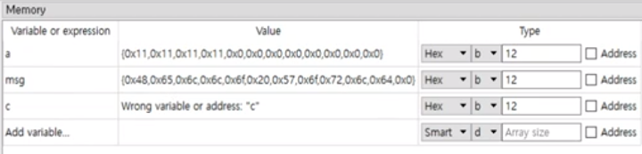
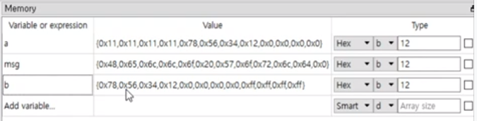
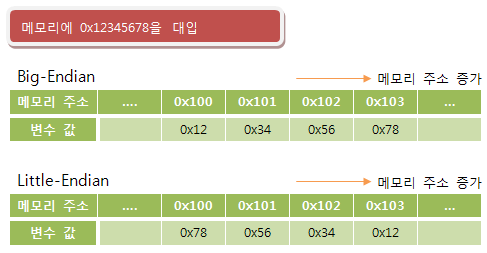

# 문자와 엔디안

## 문자

우리는 과거 Hello World 출력 예제에서 다음처럼 Hello world 문장을 저장했었다

```assembly
%include "io64.inc"

section .text
global CMAIN
CMAIN:
    mov rbp, rsp; for correct debugging
    
    xor rax, rax
    ret
    
section .data
    msg db 'Hello World', 0x00
    
    
section .bss
    e resb 10
```

이제 우리는 `msg db 'Hello World', 0x00` 해당 라인이 `msg` 라는 변수를 만들어 무언가를 저장하는 형태임을 알고있다.

그렇다면 어떻게 문장이 저장되는 것 일까?

```assembly
section .data
    a db 0x11, 0x11, 0x11, 0x11
```

위 `a db 0x11, 0x11, 0x 11, 0x11` 문장처럼 연속으로 메모리에 저장이 가능하다

이와 같은 원리로 `msg` 변수의 메모리 부분을 보면 다음과 같다



결국 아스키 코드 + 널 문자를 저장한 것임을 알 수 있다

### 아스키 코드


결국 아까의 코드는 이와 같이 다시 써도 같은 의미를 갖게 된다.

```assembly
%include "io64.inc"

section .text
global CMAIN
CMAIN:
    mov rbp, rsp; for correct debugging
    
    PRINT_STRING msg ; 윈도우 상에서 지원하는 화면 출력 기능
    
    xor rax, rax
    ret
    
section .data
    ;msg db 'Hello World', 0x00
    msg db 0x48, 0x65, 0x6c, 0x6c, 0x6f, 0x20, 0x57, 0x6f, 0x72, 0xfc, 0x64, 0x0
    
    
section .bss
    e resb 10
```

## 엔디안

```assembly
%include "io64.inc"

section .text
global CMAIN
CMAIN:
    mov rbp, rsp; for correct debugging
    
    PRINT_STRING msg ; 윈도우 상에서 지원하는 화면 출력 기능
    
    xor rax, rax
    ret
    
section .data
    a db 0x11, 0x11, 0x11, 0x11
    b dd 0x12345678 ; 메모리에 뒤집어서 저장됨
    
    
section .bss
    e resb 10
```



변수 `b` 부분의 메모리를 보면 뒤집혀서 저장되어 있음을 볼 수 있다. 이는 버그가 아니다.

메모리에 저장을 할때 두 가지 방법이 있다.

- 리틀 엔디안 (순서가 뒤집힘)
  - 인텔, amd 환경에서는 리틀 엔디안을 사용
- 빅 엔디안 (순서대로 저장)



> 싱글 플레이 게임을 만들때는 큰 문제가 없다. 그러나 멀티플레이 게임을 만들어서 서버에 데이터를 전송하는 경우, 서로 다른 엔디안 시스템을 사용하는 경우에 이슈가 발생할 수 있다. 따라서 서버에 데이터를 보낼 때에는 엔디안을 고정시켜서 전송하게 된다.

### 왜 굳이 뒤집어서 저장할까?

두 엔디안 방식은 장단점이 존재한다. (서로의 장단점은 교차된다)

- 리틀 엔디안
  - 장점: 캐스팅에 유리하다
    - 만약 위 그림에서 78을 추출하고 싶다고 가정하면, 리틀 엔디안 방식은 78이 가장 앞에 있기 때문에 바로 추출 가능하나, 빅 엔디안 방식에서는 저 뒤 까지 이동한 뒤 추출해야 한다.
- 빅 엔디안
  - 장점: 숫자 비교에 유리
    - 만약 두 숫자의 크기를 비교할 때, 빅 엔디안 방식은 앞쪽 주소부터 비교하면 된다.

