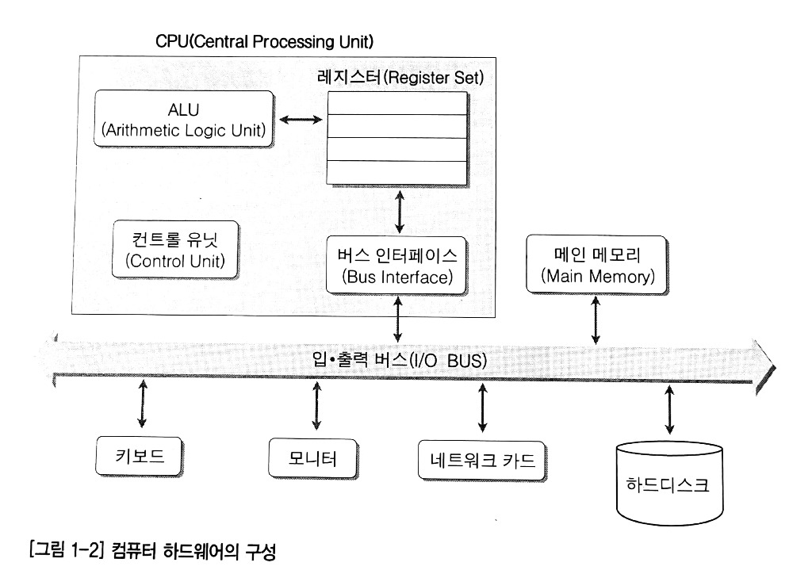
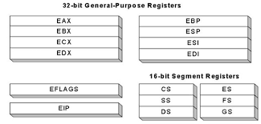
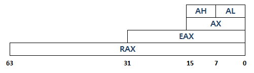
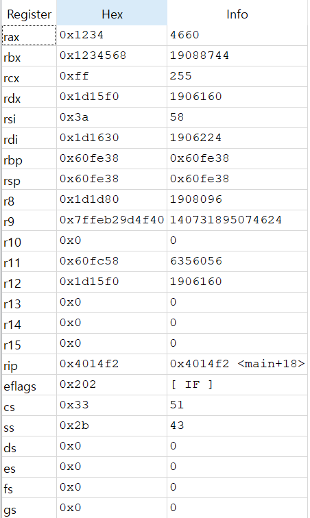
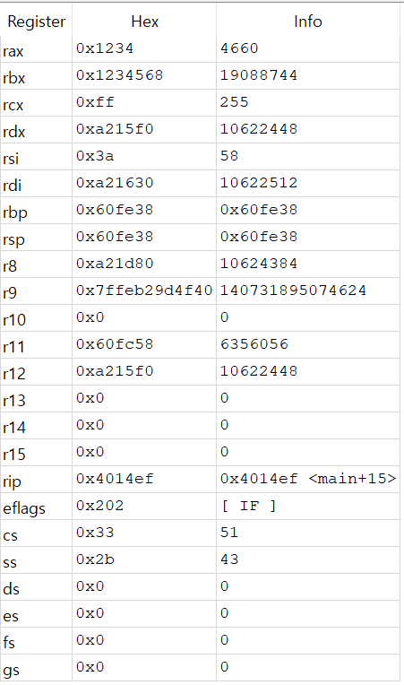

# 데이터 기초

## 데이터의 단위

- 8 bit = 1 byte
- 16 bit = 2 byte = 2 word
- 32 bit = 4 byte = 2 word = 1 dword (double-word)
- 64 bit = 8 byte = 4 word = 1 qword (quad-word)

## 컴퓨터의 구조



- cpu가 메인메모리나, 하드디스크 까지 가지 않고 임시로 저장하는 장소로 레지스터를 많이 사용

## 레지스터



- 우리가 프로그래밍을 하면서 많이 사용하는 레지스터는 EAX, EBX, ECX, EDX 이다


- 컴퓨터가 64bit 라고 했을때, 레지스터의 크기는 64bit(8byte)
- 그 레지스터를 풀로 다 사용한다면 rax
- 부분적으로 쪼개서 사용한다면
  - eax, ax, ah, al 등으로 표현



## 어셈블리어에서 데이터의 이동

```assembly
%include "io64.inc"

section .text
global CMAIN
CMAIN:
    mov rbp, rsp; for correct debugging
    
    mov eax, 0x1234
    mov rbx, 0x1234568
    mov cl, 0xff
    
    xor rax, rax
    ret
    
section .data
```



```assembly
%include "io64.inc"

section .text
global CMAIN
CMAIN:
    mov rbp, rsp; for correct debugging
    
    mov eax, 0x1234
    mov rbx, 0x1234568
    mov cl, 0xff
    
    mov al, 0x00 ; 끝자리 두자리만 00으로 바뀔 것임
    
    xor rax, rax
    ret
    
section .data
```

