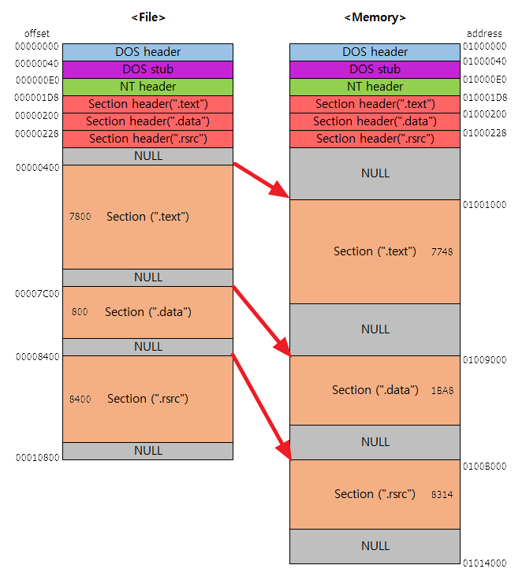

# 환경설정

## 1. 기본 설정

1. SASM 설치
2. settings 에서 buld 클릭
3. Mode 를 x64, Assembler 를 NASM 으로 설정

```assembly
%include "io64.inc"

section .text
global CMAIN
CMAIN:
    mov rbp, rsp; for correct debugging
    ;write your code here
    
    PRINT_STRING msg
    
    xor rax, rax
    ret
    
section .data
    msg db 'Hello World', 0x00
```

```shell
Hello World
```

## 2. 실행 파일 만드는 법

1. file -> save .exe 클릭
2. 원하는 경로에 저장
3. 아이콘 더블 클릭시 단순 hello world 프로그램은 화면이 바로 꺼지기 때문에 확인 불가
4. 파일 탐색기 주소창에서 `cmd.` 입력 후 `hello_world.exe` (방금 생성한 파일명) 입력시 Hello World 출력

## 3. 어셈블러란?

개발자와 컴퓨터 사이의 통역사 역할을 함


## 4. 실행 파일의 구조

