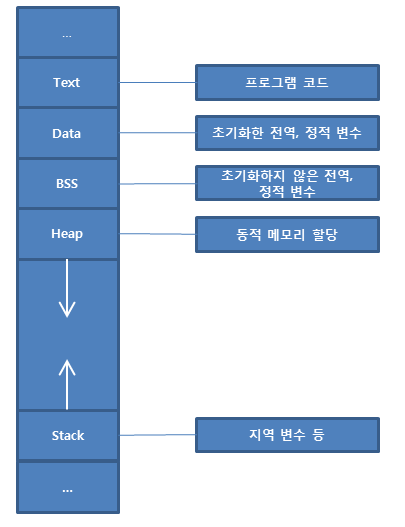
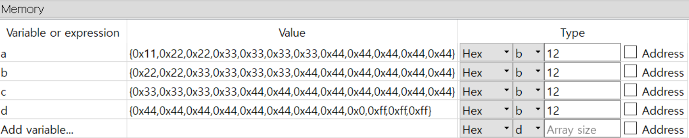

# 변수와 레지스터

## 메모리 구조



- 이전에는 Text 영역과 Data 영역을 사용하는 것을 배웠었다
- 쉽게 사용할 수 있는 영역은 Data, BSS 이 두 영역이라고 보면 된다

## 변수의 선언 및 사용

### 초기화 된 데이터

- [변수 이름] [크기] [초기값]
- [크기]    db (1)	dw (2)	dd (4)	dq (8)

### 초기화 되지 않은 데이터

- [변수 이름] [크기] [개수]
- [크기]    resb (1)    resw (2)    resd (4)    resq (8)
- res 는 아마 reserve 의 약자

```assembly
%include "io64.inc"

section .text
global CMAIN
CMAIN:
    mov rbp, rsp; for correct debugging
    
    mov eax, 0x1234
    mov rbx, 0x1234568
    mov cl, 0xff
    
    mov al, 0x00
    mov rax, rdx
    
    xor rax, rax
    ret
    
section .data
    a db 0x11   ; [0x11]
    b dw 0x2222
    c dd 0x33333333
    d dq 0x4444444444444444
    
section .bss
    e resb 10
    
```



### `mov rax, a` 를 하면 어떻게 될까?

- `a` 의 값이 `rax` 에 들어올까? -> no
- `a` 의 주소값이 `rax` 로 들어오게 된다

### 그렇다면 `a` 의 값을 `rax` 에 넣기 위해서는 어떻게 해야 할까?

- `mov rax, [a]` 
  - 이렇게 하면 rax와 동일 크기인 8바이트 크기만큼 a에서 복사되게 된다 (의도치 않은 값도 복사 됨)
- `mov al, [a]`
  - 이렇게 하면 우리가 의도했던 a의 값 `0x11` 이 `rax`로 들어가게 된다

### 반대로 레지스터의 값을 메모리에 건내주고 싶을 때는

- `mov [a], byte 0x55`
  - byte 는 1바이트 만큼 복사한다고 알려주는 것
- `mov [a], word 0x6666`
- `mov [a], cl`
  - `cl` 자체가 c레지스터의 1바이트 라는 의미이므로 딱히 크기 지정이 필요하지 않음