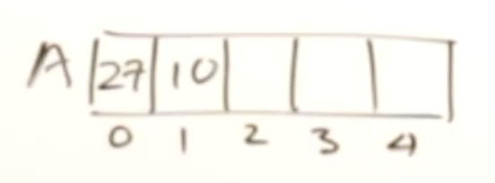
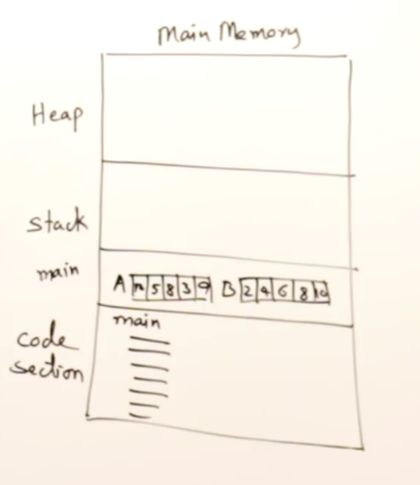

# Arrays Basics

> "Arrays are defined as a collection of similar data elements."

```c++
int A[5];

A[5] = 27;
A[1] = 10;
```



```c
int main()
{
  int A[5];
  int B[5] = {2, 4, 6, 8, 10};
  
  int i;
  for (i = 0; i < 5; i++)
  {
    printf("%d", B[i]);
  }
}
```

```shell
246810
```

