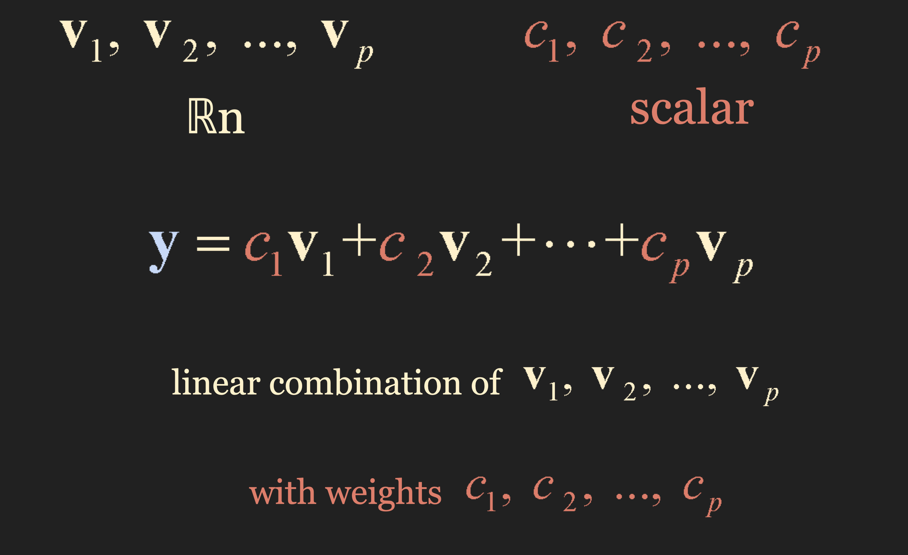
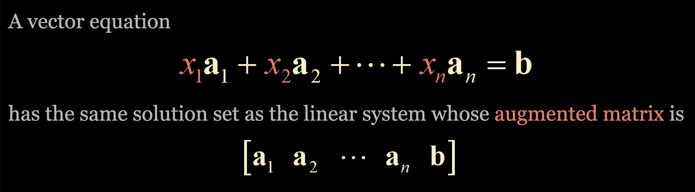

# Vector Equations

## 1. Vectors in 

## 2. Vector Summation

## 3. Scalar multiplication

 

## 4. Geometric descriptions of 

## 5. Vectors in 

## 6. Vectors in 

3차원 이상은 시각적으로 표현할 수 없다.

그냥 식으로 표현한다.

## 7. Algebraic properties of 

주의 할 점은, c + u 와 같이 스칼라 + 백터 는 정의가 되지 않는다.

## 8. Linear combinations

### Example 1

can b generated as a linear combination of a1 and a2?

 결국 위의 질문은, 다음의 augmented matrix 가 soultion 이 있냐 라고 묻는것과 같음.

### Span?

### Example 2

Theorem 2 에서 봤듯이, 이와 같은 결과가 나오면, 모순이 있고, 해가 없다는 것을 알 수 있다.
