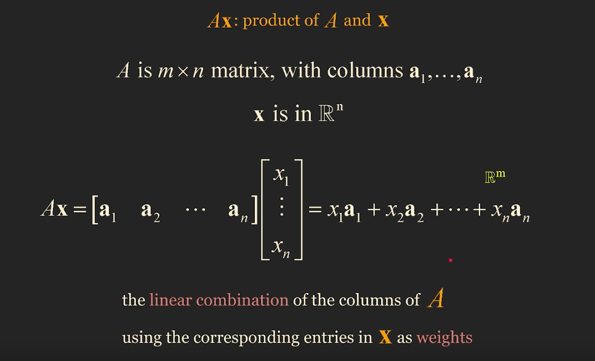
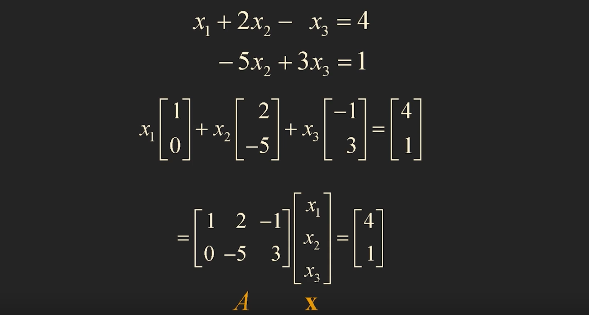
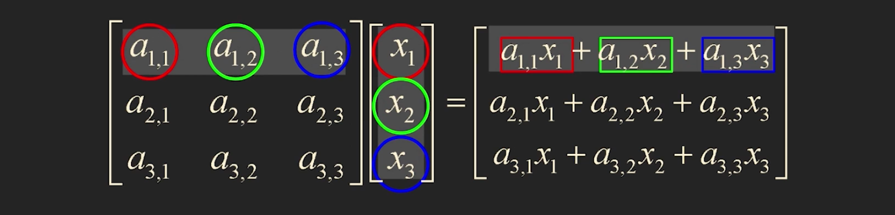
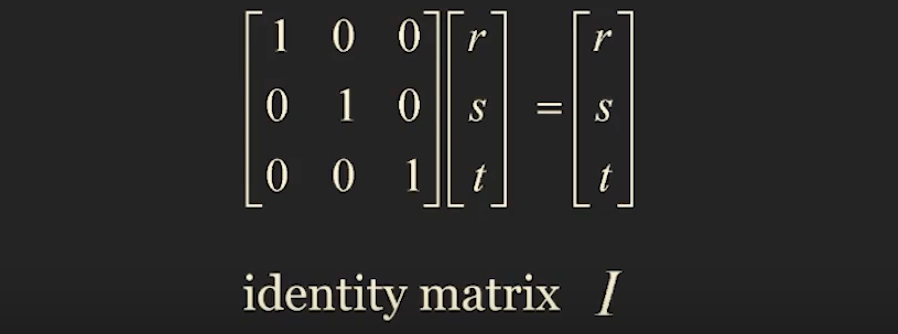
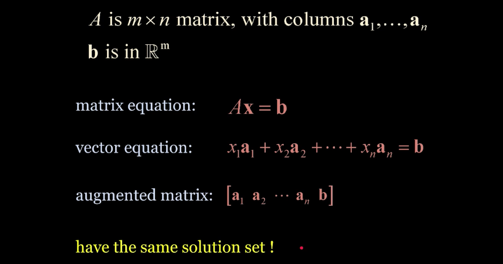
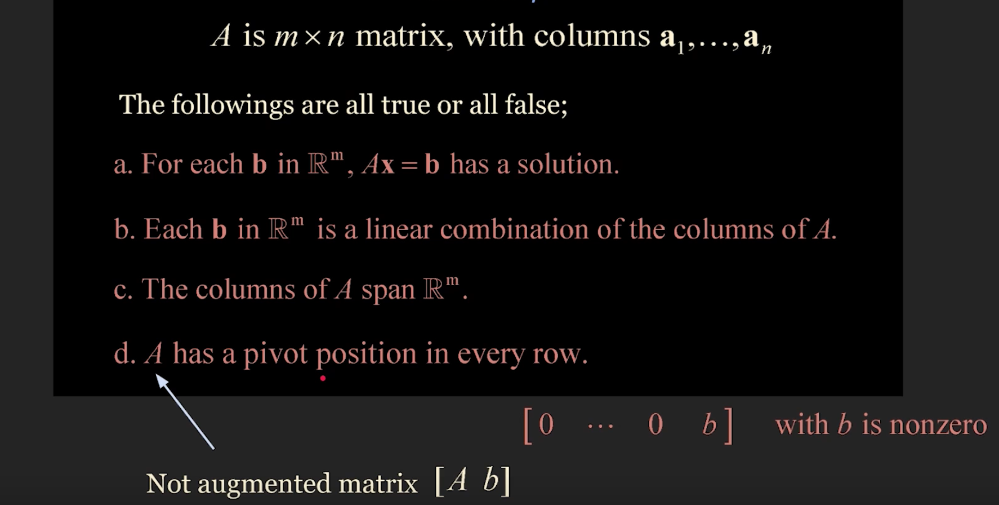
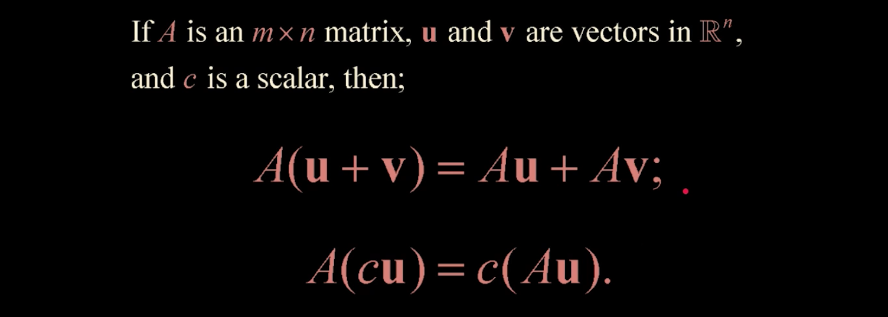

# The Matrix Equations 

## 1. Example 1. Matrix equation

## 2. Example 2. Vector equation to matrix equation

## 3. Exapmle 3. System of linear equations to matrix equation

## 4. Example 4. More efficient way to compute matrix equation

## 5. Theorem 3.

위의 세 가지 식은 모두 같은 내용을 다르게 표현한 것 뿐이다.

하나의 linear system 을 세 가지 관점으로 볼 수 있다는 것이다.

## 6. Theorem 4.

- a, b, c, d 가 모두 참, 거짓을 함께한다.
- 넷 중 하나가 참이면, 모두 참이라는 뜻이고, 넷 중 하나가 거짓이면, 모두 거짓이라는 뜻이다.
- a, b, c 는 사실상 같은 이야기를 하는 것이다.

## 7. Theorem 5.

