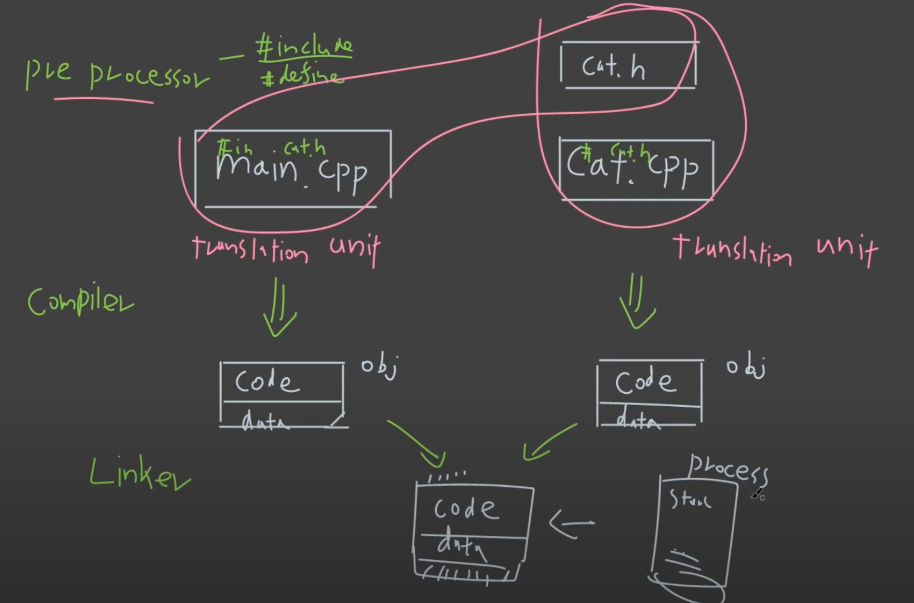

# Introduction

## 1. C++ 의 Build Process



위 그림의 전체적인 프로세스를 진행시켜주는 프로그램을 compiler 라고 한다.

### C++ 컴파일러의 종류

- GCC
- Clang
- Visual C++
- 등등

## 2. 실제 사용해보기

```c++
#include <iostream>
#include <variant>

int main()
{
	std::variant<int,float> i = 0; //C++17
	std::cout << "hi" << std::endl;
	return 0;
}
```

컴파일러는 컴파일타임에 런타임에 생길 수 있는 문제를 Warning 을 통해 알려주기도 한다. (-W 옵션을 통해 사용가능)

```shell
prompt: g++ main.cpp -o greeting -Wall -Werror -std=c++17 -g
```

- -Werror 옵션을 통해서 모든 warning 을 error 로 바꾸어 출력하게 해서, 조금 더 보수적이고 안정적이게 개발을 할 수 있다.

### Optimization 옵션

O, O1, O2, O0, Os, Ofast 등 다양한 옵션이 있다.

### march 옵션

Machine architecture 에 맞는 optimization 을 제공한다.

