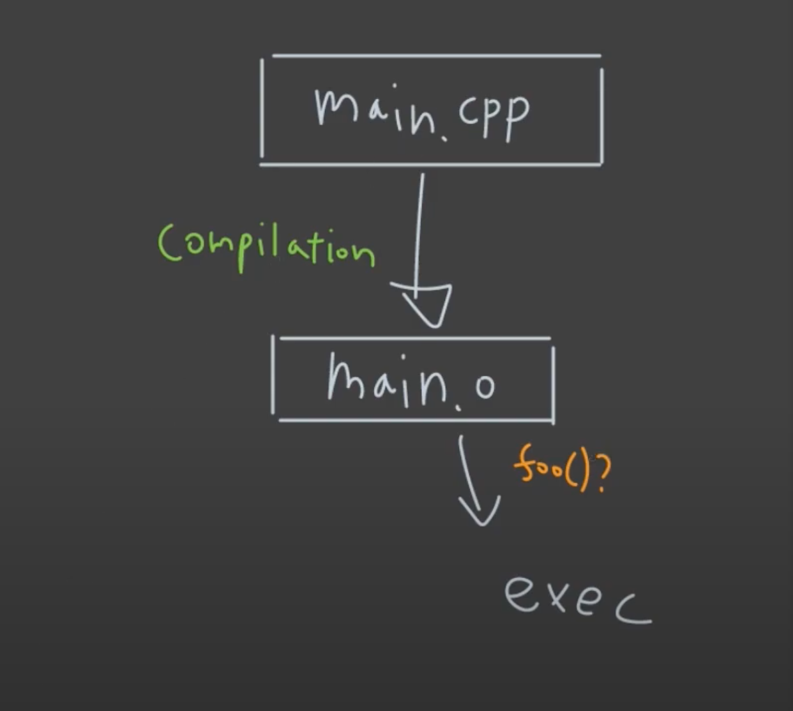
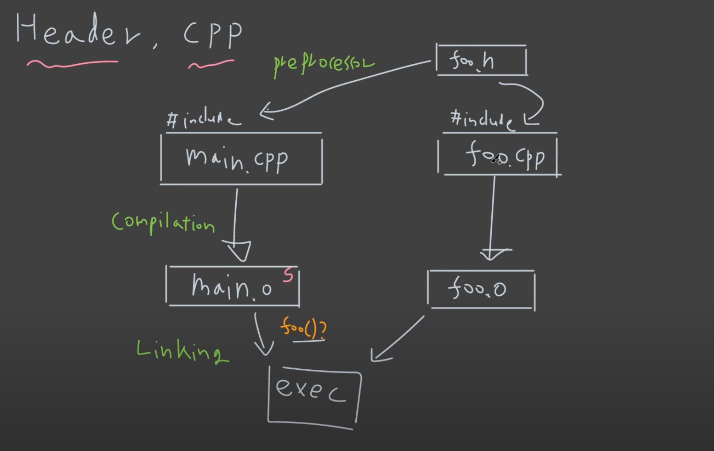
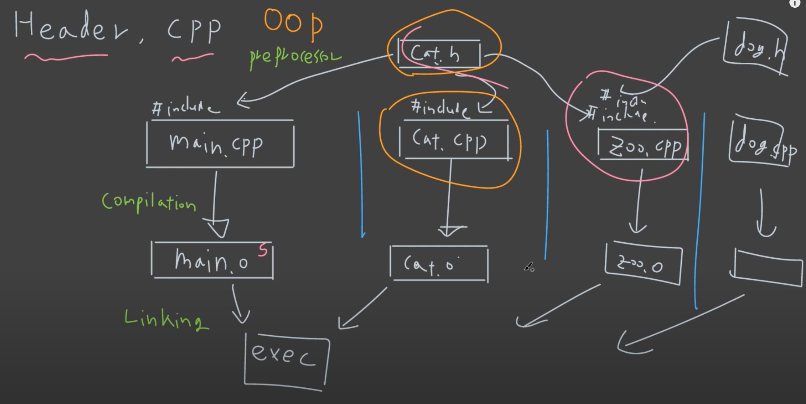

# Header File

```c++
#include <iostream>

void foo(); // declaration

int main()
{
  foo();
  return 0;
}

void foo() // implementation, definition
{
  std::cout << "foo" << std::endl;
}
```

위와 같은 하나의 파일을, 아래처럼 나누면,

```c++
// main.cpp

void foo(); // declaration

int main()
{
  foo();
  return 0;
}
```

```c++
// foo.cpp
#include <iostream>
// void foo(); // declaration (이 부분을 주석해제하면 정상적으로 컴파일 되긴 한다.)
void foo()
{
  std::cout << "foo" << std::endl;
}
```

```shell
prompt: g++ main.cpp -o foo -Wall -Werror
링킹에러 발생!
```

링킹에러가 발생하게 된다.



### 문제 해결

헤더파일을 별도로 만들어서 중복되는 declaration 부분을 따로 때어낼 수 있다.

```c++
// main.cpp

#include "foo.h"

int main()
{
  foo();
  return 0;
}
```

```c++
// foo.cpp

#include <iostream>
#include "foo.h"

void foo() // implementation, definition
{
  std::cout << "foo" << std::endl;
}
```

```c++
// foo.h

void foo(); // declaration
```

```shell
prompt: g++ main.cpp foo.cpp -o foo -Wall -Werror
prompt: ./foo
foo
```



### 보통은 클래스에서 사용

보통의 경우,

- class 의 declaration 부분은 header 파일에 넣어주고,
- definition 부분은 cpp 파일에 넣어준다.



