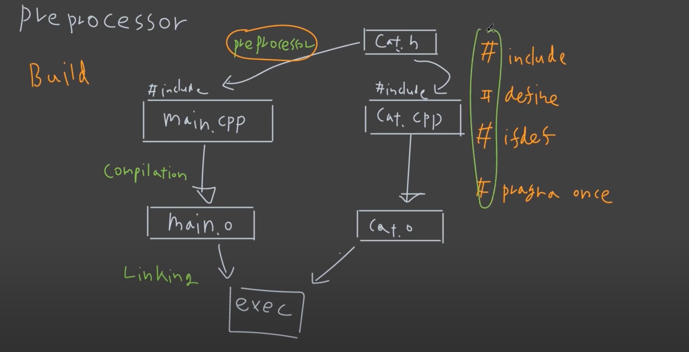

# Preprocessor



Preprocessor 의 세 가지에 대해 알아본다.

1. conditionally
2. replace
3. include

## 2. Conditionally

### Syntax

```c++
#if
#ifdef
#ifndef
#elif
#else
#endif
// 위와 같은 syntax 가 있다.
```

### Example Code 1

```c++
// 예제
#define ABCD 2
#include <iostream>
 
int main()
{
 
#ifdef ABCD
    std::cout << "1: yes\n";
#else
    std::cout << "1: no\n";
#endif
 
#ifndef ABCD
    std::cout << "2: no1\n";
#elif ABCD == 2
    std::cout << "2: yes\n";
#else
    std::cout << "2: no2\n";
#endif
 
#if !defined(DCBA) && (ABCD < 2*4-3)
    std::cout << "3: yes\n";
#endif
}
```

```shell
1: yes
2: yes
3: yes
```

컴파일러에게 보내주기 전에 코드 자체를 수정하는 개념으로 이해하면 된다.

## 2. Replace (define)

### Example Code (보통 보았을 코드 형식)

```c++
#define MAX_UINT16 65535
#define MAX(a,b) ((a)>(b))?(a):(b)
#include <iostream>

int main()
{
  std::cout << MAX_UINT16 << std::endl;
  std::cout << MAX(10,100) << std::endl;
}
```

```shell
65535
100
```

이렇게 코딩하는 경우도 있다.

### Modern C++ 형식

그러나 modern c++ 의 경우, 다음과 같이 하는 게 더 일반적이다.

```c++
#include <algorithm>
#include <limits>
#include <iostream>

constexpr int ABCD = 2;

int main()
{
  std::cout << std::numeric_limits<uint16_t>::max() << std::endl;
  std::cout << std::max(10,100) << std::endl;
  
  if constexpr(ABCD) // c++17 이상
  {
    std::cout << "1: yes\n";
  }
  else
  {
    std::cout << "1: no\n";
  }
}
```

```shell
prompt: g++ main.cpp -o preprocess -std=c++17
prompt: ./preprocess
65535
100
1: yes
```

## 3. include

include 는 기본적으로 copy, paste 방식으로 동작.

### Syntax: "" or <> ?

```c++
#include <iostream> // standard library
#include "cat.h" // user specific header
```

### include 는 헤더? cpp?

기본적으로 #include 는 헤더 파일에 넣고, 헤더파일을 cpp 파일에서 include 하는 방식으로 사용.

### 중복 include 방지 1: #ifndef 를 이용한 방법

```c++
// cat.h

#ifndef CAT_H
#define CAT_H
class Cat
{
public:
  void speak();
};
#endif
```

```c++
// main.cpp

#include "cat.h"
#include "cat.h"

int main()
{
  Cat kitty;
  kitty.speak();
  return 0;
}
```

### 중복 include 방지 2: #pragma once 를 이용한 방법

```c++
// cat.h

#pragma once

class Cat
{
public:
  void speak();
};
```

