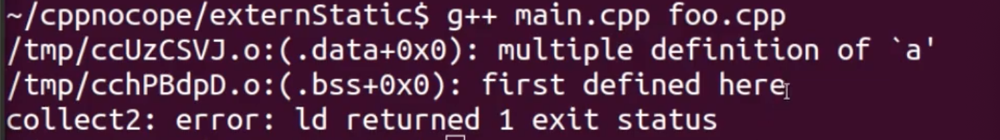
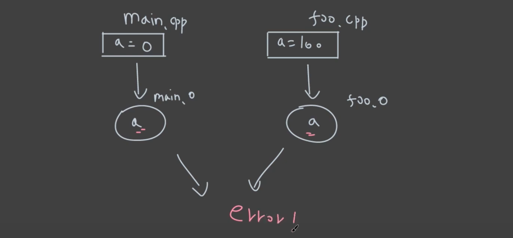
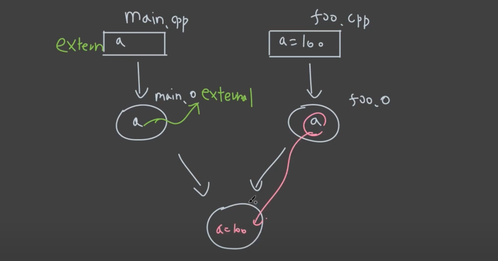
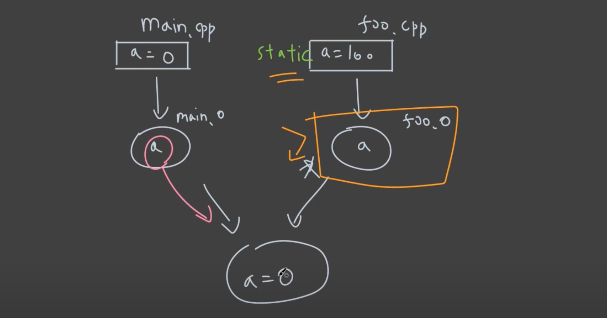
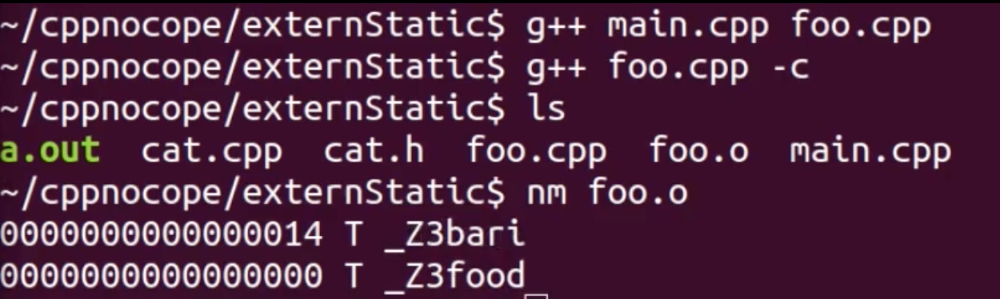
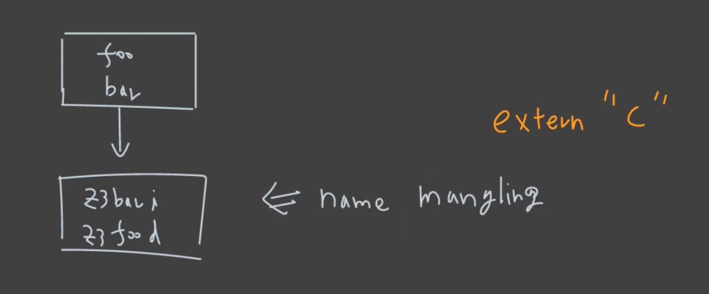

# Static & Extern

둘 다 linking process 와 관련이 있다.

- Static

  안쪽으로만 링크를 열어라.

- Extern

  바깥쪽에서 링크를 찾아라.

이것들을, variable 과 function 관점에서 살펴본다.

## 1. Variable

### 예시

```c++
// main.cpp

#include <iostream>

int a = 0;
int main()
{
  std::cout << a << std::endl;
}
```

```c++
// foo.cpp

int a = 100;
```





### 해결법: extern

```c++
// main.cpp

#include <iostream>

extern int a;
int main()
{
  std::cout << a << std::endl;
}
```

```c++
// foo.cpp

int a = 100;
```

```shell
prompt: g++ main.cpp foo.cpp
prompt: ./a.out
100
```

extern 이라는 키워드를 통해 정의는 이 파일이 바깥쪽에 있다는 것을 알려준다.



### 해결법: static

```c++
// main.cpp

#include <iostream>

int a = 0;
int main()
{
  std::cout << a << std::endl;
}
```

```c++
// foo.cpp

static int a = 100;
```

```shell
prompt: g++ main.cpp foo.cpp
prompt: ./a.out
0
```

static 이라는 keyword 를 사용해, 해당 변수를 파일 바깥에서 찾을 수 없게 만들어 준다.



## 2. Function

### 예시

```c++
// main.cpp

void foo(); // declaration
// extern void foo(); // 똑같이 동작

int main()
{
  foo();
  return 0;
}
```

```c++
#include <iostream>

void foo()
{
  std::cout << "foo" << std::endl;
}
```

```shell
prompt: g++ main.cpp foo.cpp
prompt: ./a.out
foo
```

함수에 대해서는 기본으로 extern 키워드가 붙어있다.

### Static

```c++
// main.cpp

void foo(); // declaration

int main()
{
  foo();
  // bar // 문제 발생
  return 0;
}
```

```c++
#include <iostream>

static void bar()
{
  std::cout << "bar" << std::endl;
}

void foo()
{
  std::cout << "foo" << std::endl;
  bar(); // OK
}
```

그래서, 해당 translation unit 바깥에서는 사용되는 일이 없다는 확신이 있는 것에, static 키워드를 사용하게 되면,

더 안전한 빌드 프로세스를 가져갈 수 있다.

### Class 에서의 활용

```c++
// cat.h

#pragma once

class Cat
{
public:
  void speak();
private:
  // void bye(); // 이 클래스와 관련이 없어 보인다.
  int age = 10;
};
```

```c++
// cat.cpp

#include "cat.h"
#include <iostream>

// void Cat::bye()
static void bye()
{
  std::cout << "bye" << std::endl;
}

void Cat::speak()
{
  std::cout << "meow" << std::endl;
  std::cout << "i'm" << age << std::endl;
  bye();
}
```

## 3. extern "C"

```c++
// main.cpp

int foo(double a);
double bar(int a);

int main()
{
  int a = 100;
  double b = bar(a);
  int c = foo(b);
  
  return 0;
}
```

```c++
// foo.cpp

int foo(double a)
{
  return static_cast<int>(a);
}

double bar(int a)
{
  return static)cast<double>(a);
}
```





컴파일러마다 고유한 방식으로 name mangling 이라는 것을 하는데,

이것은 function overloading 을 하기 위해 필요한 작업이다.

그런데, C++ 가 아닌, pure C 에서는 function overloading 을 지원하지 않는다.

따라서 C interface 를 위한 binary 를 제공하기 위해서는 name mangling 기능을 없애야 한다.

이때 사용하는 것이 extern "C" 라는 키워드 이다.

### extern "C" 사용

```c++
// main.cpp

int foo(double a);
double bar(int a);

int main()
{
  int a = 100;
  double b = bar(a);
  int c = foo(b);
  
  return 0;
}
```

```c++
// foo.cpp

extern "C" int foo(double a)
{
  return static_cast<int>(a);
}

extern "C" double bar(int a)
{
  return static)cast<double>(a);
}
```


extern "C" 키워드를 사용하니 mangling 이 사라진 것을 볼 수 있다.

일반적으로는 헤더파일을 분리해서 다음과 같이 된다.

```c++
// foo.cpp

#include "foo.h"

int foo(double a)
{
  return static_cast<int>(a);
}

double bar(int a)
{
  return static)cast<double>(a);
}
```

```c++
// foo.h

#pragma once

extern "C" int foo(double a);
extern "C" double bar(int a);
```

혹은, 다음과 같이 스코프 안에 넣는 방식도 있다.

```c++
// foo.h

#pragma once

extern "C"
{
  int foo(double a);
  double bar(int a);
}
```

