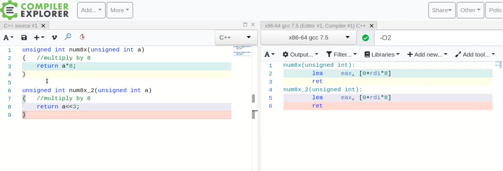
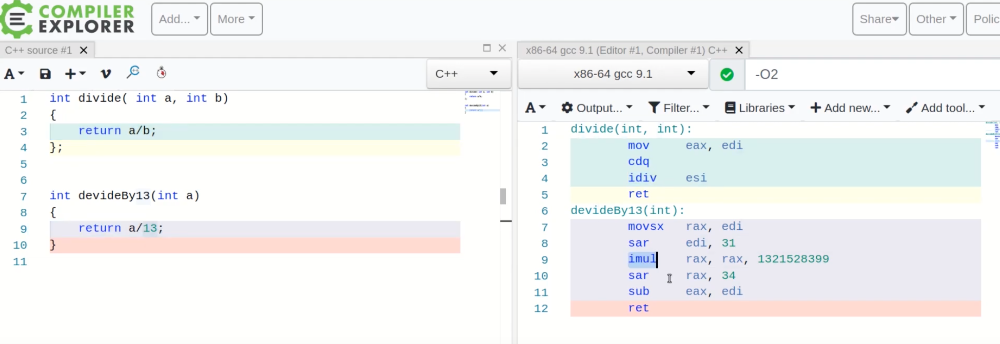
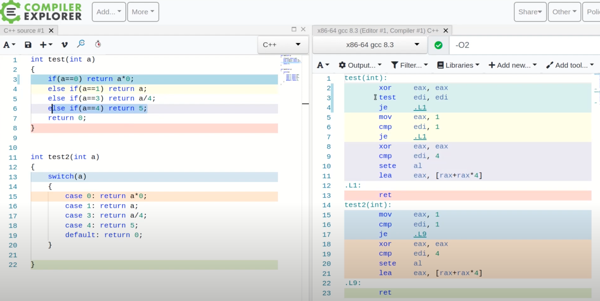
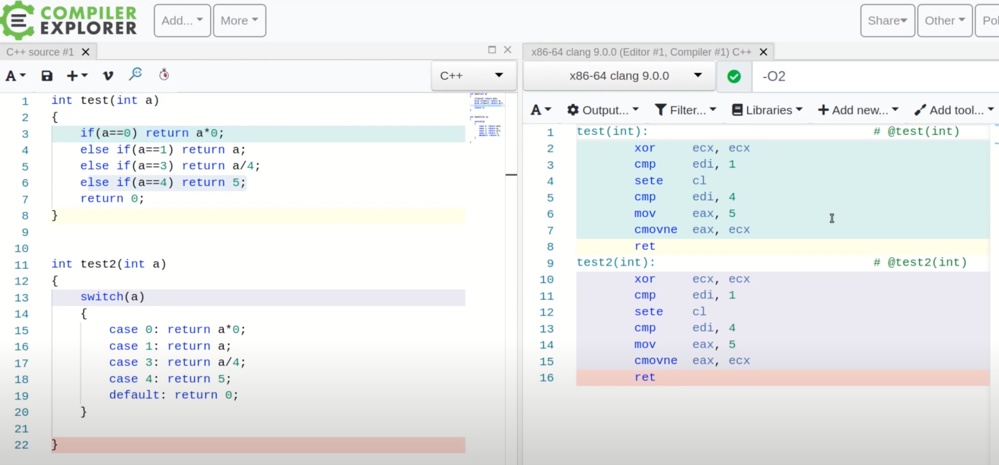

# Assembly

실제로는 어셈블리를 직접 보기 보다는,

벤치마크를 해보거나, profile 을 찍어보는 방법을 더 많이 사용한다.

그러나 학습을 하는 입장에서는 어셈블리를 살펴봄으로써

1. 어떤 식으로 나의 C++ 코드가 optimization 되는지 볼 수 있다.
2. 각 아키텍처 마다 생성되는 머신코드의 특징들을 살펴 볼 수 있다.

본 문서는 X86 을 기반으로 설명한다.

## 1. 예시 코드

```c++
double multiply(double a, double b)
{
  return a * b;
}

double divide(double a, double b)
{
  return a / b;
}
```

```shell
prompt: g++ assembly.cpp -S
prompt: ls
assembly.cpp assembly.s
```

다음과 같이 .s 머신코드 파일이 생성된 것을 볼 수 있다.

## 2. 편의성이 좋은 방법

compiler explorer 라는 서비스를 이용하는 방법이 있다. (https://godbolt.org/)

다양한 언어, 아키텍처, 컴파일러 형식, optimization 옵션 등을 지원한다.

어느 부분이 어떤 머신코드가 되었는지, 해당 어셈블리 키워드가 어떤 의미인지 등을 편리하게 알 수 있다. 

### 예시: 곱하기 연산과 시프트 연산을 비교



이처럼 편리하게, 곱하기를 직접하는 것과, 시프트 연산을 이용한 방법이 같은 머신코드를 생성하는 것을 알 수 있다.

### 예시: 나누기 함수 비교



위쪽의 세줄짜리 머신코드가 아래의 다섯줄짜리 머신코드보다 느리다.

idiv 라는 명령어가 imul 이라는 명령어 보다 5배정도 많은 클럭이 필요하기 때문.

### 예시: if-else 와 switch 비교 (gcc)



널리 알려진 것 처럼, if-else 보다 switch 문이 훨씬 빠르다는 것을 확인 할 수 있다.

### 예시: if-else 와 switch 비교 (clang)



clang 을 사용하면, 완전히 같은 코드가 생성되는 것을 볼 수 있다.

컴파일러마다 차이가 있음을 인지해야 한다.

