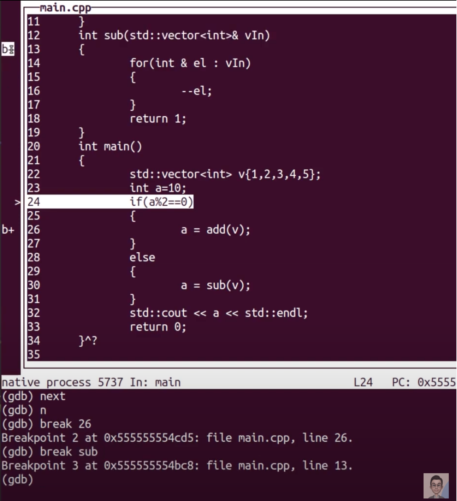
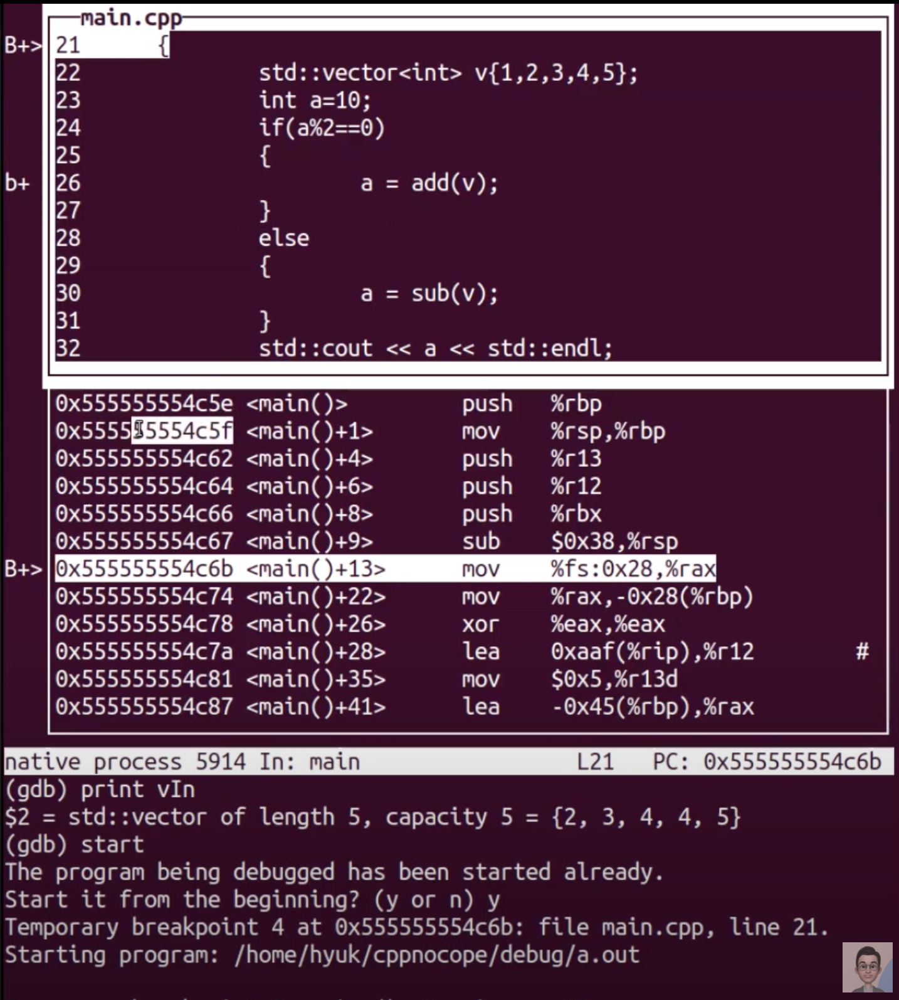
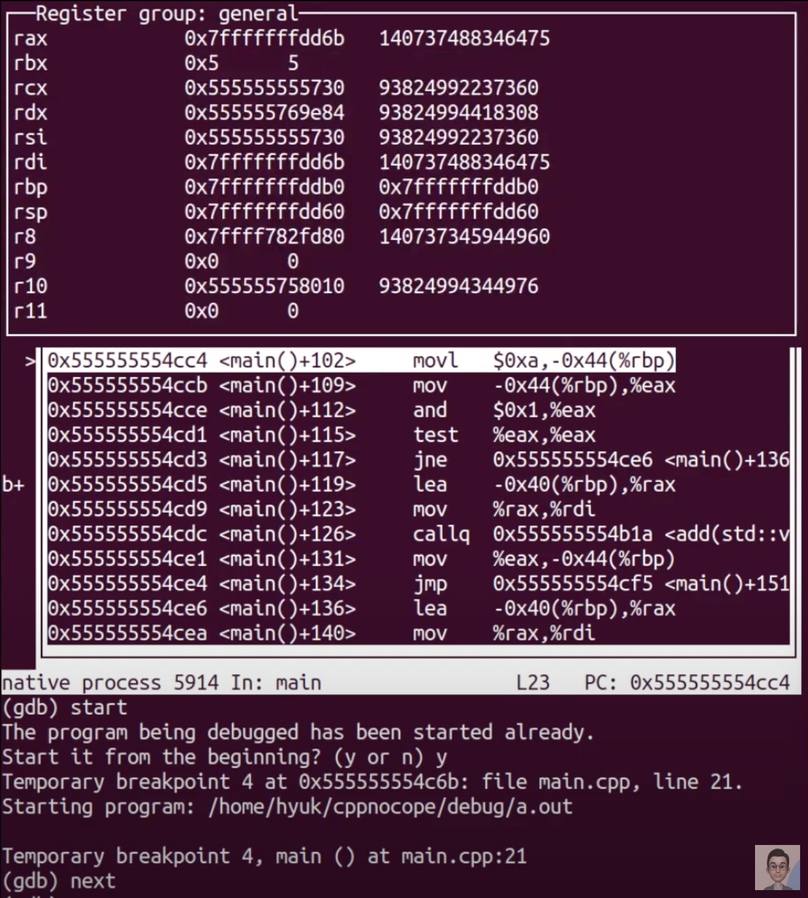

# Debug

모든 프로그래머들은 버그가 없는 코드를 짜고 싶어한다.

이를 위해 프로그래머들은,

1. unit test
2. integration test
3. code review

등을 통해 버그를 최대한 잡으려 노력한다.

그리고 해당 코드는 QA팀으로 넘어가는데, 이때 기가막히게도 항상(?) 버그가 나타난다.

그러면 우리는 debug mode 로 코드를 compile 해야 한다.

## 1. 예시: 디버깅 옵션으로 컴파일

```c++
#include <iostream>

int add(int a)
{
  return ++a;
}

int sub(int a)
{
  return --a;
}

int main()
{
  int a = 10;
  
  if (a % 2 == 0)
  {
    a = add(a);
  }
  else
  {
    a = sub(a);
  }
  
  std::cout << a<< std::endl;
  
  return 0;
}
```

```shell
prompt: g++ main.cpp -Wall -Werror
prompt: ./a.out
11
```

보통의 경우 위와 같이 컴파일하게 된다. 이를 디버그 모드로 다시 컴파일 하려면 다음과 같이 해야 한다.

```shell
prompt: g++ main.cpp -Wall -Werror -g
```

이와 같이 디버깅 옵션을 주게 되면, debugging info 가 포함되게 되는데,

debugging info 란, binary code 를, source code 와 연결시켜주는 정보라고 생각하면 된다.

이렇게 디버깅 옵션을 줄 때, optimization 옵션도 줄 수 있는데, 일반적으로 optimization 을 적용하면,

binary code 와 source code 가 일치하지 않게 되기 때문에, 디버깅이 어려워진다.

따라서 optimization 옵션을 주지 않거나, -Og 라는 디버깅 optimization 옵션을 주는 방식으로 사용한다.

```shell
prompt: g++ main.cpp -g
```

 이렇게 디버깅 옵션을 통해 컴파일 하게 되면 다음과 같은 일을 할 수 있다.

1. 변수에 어떠한 값이 써져 있는지 확인
2. break point
3. call stack 을 back trace

## 2. 예시: 디버거의 사용 (gdb)

```shell
prompt: g++ main.cpp -g
prompt: ls
a.out main.cpp
prompt: gdb a.out
```

이후, start 라는 명령어로 코드를 실행, next 라는 명령어로 다음 줄로 넘어가기 등이 가능하다.

### ctrl + X + A 단축키를 이용 interactive command line tool 을 사용할 수 있다.



### ctrl + X, 2 를 누르면, 어셈블리 코드를 볼 수 있다.



### 다시 ctrl + X, 2 를 누르면 다른 뷰로 볼 수 있는데, 레지스터를 확인할 수 있다.



### back trace 명령어: bt 를 입력한다.

### 

## 2. 예시: Visual Studio Code 를 이용한 디버깅

디버거를 선택해서 디버거를 실행하면,

gui 를 통해 편리하게 위의 기능들을 사용할 수 있다. (자세한 설명은 따로 검색해서 찾아보길 바란다.)

