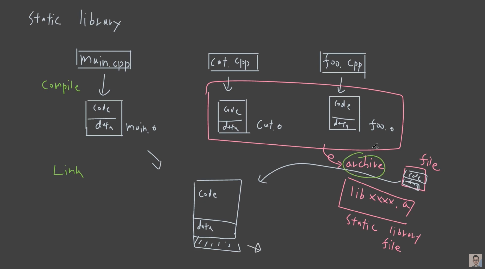

# Static Library

C++ 코딩을 하다보면 Standard library 를 사용해 본적이 있을 것이다.

이런식으로 우리는 많은 라이브러리를 사용하게 된다.

### Library 의 종류

- Header only

  - 헤더를 include 해서 사용

- Static library

  - 윈도우의 경우: `.lib` 파일
  - 리눅스의 경우: `.a` 파일

- Dynamic library

  - load time 에 binding:

    loader 가 프로세스를 실행시킬 때 라이브러리를 가져와서 binding

  - run time 에 binding:

    프로세스가 실행 과정 중에 라이브러리를 가져와서 binding

  - 윈도우의 경우: `.dll` 파일

  - 리눅스의 경우: `.so` 파일

## Static library 를 알아보기 위해 build process 를 알아보자



### 예시: 위 그림을 코드로 살펴보자

(이해를 쉽게 하기 위해 cat.cpp 와 foo.cpp 로 라이브러리를 만든 그림과는 다르게, cat.cpp 만 사용해서 라이브러리를 만든다.)

```c++
// cat.h
#pragma once

class Cat
{
public:
  void speak();
};
```

```c++
// cat.cpp
#include <iostream>
#include "cat.h"

void Cat::speak()
{
  std::cout << "meow" << std::endl;
}
```

```c++
// main.cpp
#include "cat.h"

int main()
{
  Cat kitty;
  kitty.speak();
  
  return 0;
}
```

```shell
prompt: g++ cat.cpp -c -O2 -Wall -Werror
prompt: ls
cat.cpp cat.h cat.o main.cpp
prompt: ar -rs libcat.a cat.o
ar: creating libcat.a
prompt: ls
cat.cpp cat.h cat.o libcat.a main.cpp

prompt: g++ main.cpp -L. -lcat
prompt: ls
a.out cat.cpp cat.h cat.o libcat.a main.cpp

prompt: ./a.out
meow
```

### 왜 라이브러리를 사용하는가?

.h 파일만 include 하면 될 것을, 왜 굳이 라이브러리를 사용할까?

소스코드 공개 없이 binary format 으로 배포해야 할 때 라이브러리를 사용한다.

웹 서비스에서는 라이브러리 없이 소스코드 그대로 사용해도 되는 경우가 많다.

