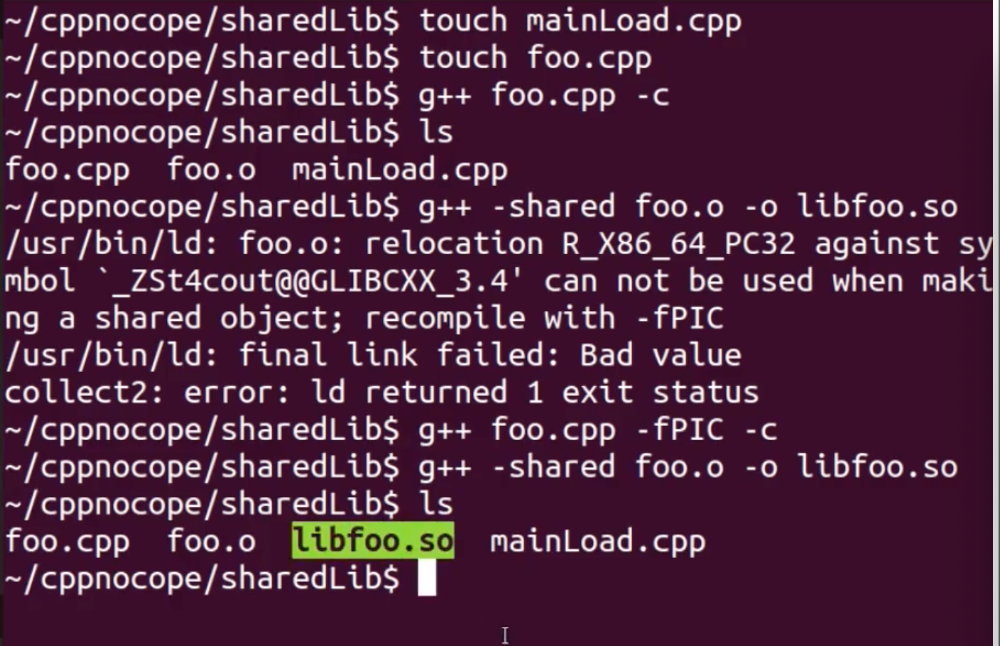
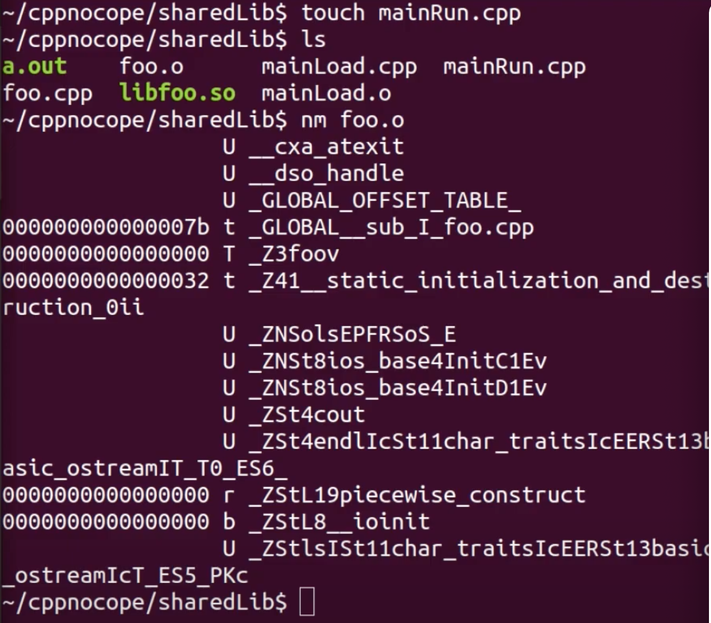

# Dynamic Library

**Dynamic library 를 구현하는 두 가지 방법이 있다**

- load time
- run time

---

- `-fPIC` : Position Independent Code 의 약자로, 컴파일시 해당 옵션을 주면 shared library 용으로 object 를 만든다.

---


## 1. 예시코드

이해를 쉽게 하기 위해 foo.cpp 만 가지고 생각해 본다.

```c++
// foo.cpp

#include <iostream>

void foo()
{
  std::cout << "foo" << std::endl;
}
```

```c++
// mainLoad.cpp

void foo(); // declaration

int main()
{
  foo();
  return 0;
}
```


shared library 의 표준 명명 방식은, lib 를 앞에 붙이고, 파일이름을 쓰고, 확장자명은 `.so` 로 하는 것이다. (예: libfoo.so)

> `lib` + `이름` + `.so` = `lib이름.so`

그러나 위의 예시에서는 에러가 발생했는데, 그 의미는 다음과 같다.

현재 foo.o 파일이 shared library 로 만들기 위해서는 Position Independent Code 가 되어야 하는데, 그렇지 않기 때문에, shared library 를 만들지 못한다는 것이다.

## 2. PIC 라는 것이 무슨 의미일까?

`libfoo.so` 라는 라이브러리를 프로그램 a, b, c 가 사용하는 상황을 가정해 보자.

- `libfoo.so` 내부의 정보가 absolute base 의 address 정보를 갖는다면:

  서로 다른 프로세스 혹은 프로그램 내부에서 address 를 지칭할 수 없게 된다.

- `libfoo.so` 내부의 정보가 relative address 라면:

  각각의 서로 다른 어플리케이션들에서 shared library 가 문제 없이 load 가 될 수 있는 것이다.

따라서 relative address 를 사용하기 위해 `-fPIC` 옵션을 주는 것이다.


## 3. 예시코드: `-fPIC` 옵션을 사용해 다시 시도




## 4. runtime 바인딩 하는 방법

```c++
// foo.cpp

#include <iostream>

void foo()
{
  std::cout << "foo" << std::endl;
}
```

```c++
// mainRun.cpp

#include <dlfcn.h>

int main()
{
  void* handle = dlopen("./libfoo.so", RTLD_LAZY); // Lazy binding 을 한다는 의미의 RTLD_LAZY 플래그를 준다.
  if (!handle)
  {
    std::cout << "No library" << std::endl;
    
    return 1;
  }
  
  void (*fooPtr)();
  fooPtr = (void(*)())dlsym(handle, "_Z3foov"); // nm foo.o 를 통해 symbol 을 찾아와 넣는다. (아래 그림 참고)
  const char* dlsym_error = dlerror();
  if (dlsym_error)
  {
    std::cout << "No symbol" << std::endl;
    
    return 1;
  }
  
  (*fooPtr)();
  dlclose(handle);
  
  return 0;
}
```




## 5. 정리

일반적으로 link 또는, load 타임에 문제를 잡아낼 수 있는 load time binding 을 많이 사용한다.

또한, shared time 의 경우, 위의 설명보다 훨씬 복잡한 메커니즘에 의해 동작한다.

만약 더 자세히 알고싶다면, GOT, PLT 등의 키워드를 통해 검색을 해서 공부해 보길 바란다.

### Static library 와 Dynamic library 중 어느 것을 사용할까?

**일반적인 경우, static library 를 선호한다.**

현대 컴퓨터는 과거보다 훨씬 풍부한 메모리 자원을 가지고 있고 일반적으로 메모리 자원보다는 CPU 등의 자원이 더 중요시 된다.

또한, build machine 등을 따로 사용하는 경우가 많기 때문에, build time 이 오래걸리기 때문에 dynamic lib 를 사용한다는 논리 또한 일반적으로 힘을 얻기 힘들다.

**그럼에도 불구하고 dynamic library 가 필요한 경우가 있다.**

대표적인 경우가 실행파일(executable)을 이미 가지고 있다면, 이 실행파일을 업데이트 하기 위해, re-build 를 하는 대신, dynamic lib 만 바꿔주면, 되는 경우가 있다. 이런 상황에 유용할 수 있다.

