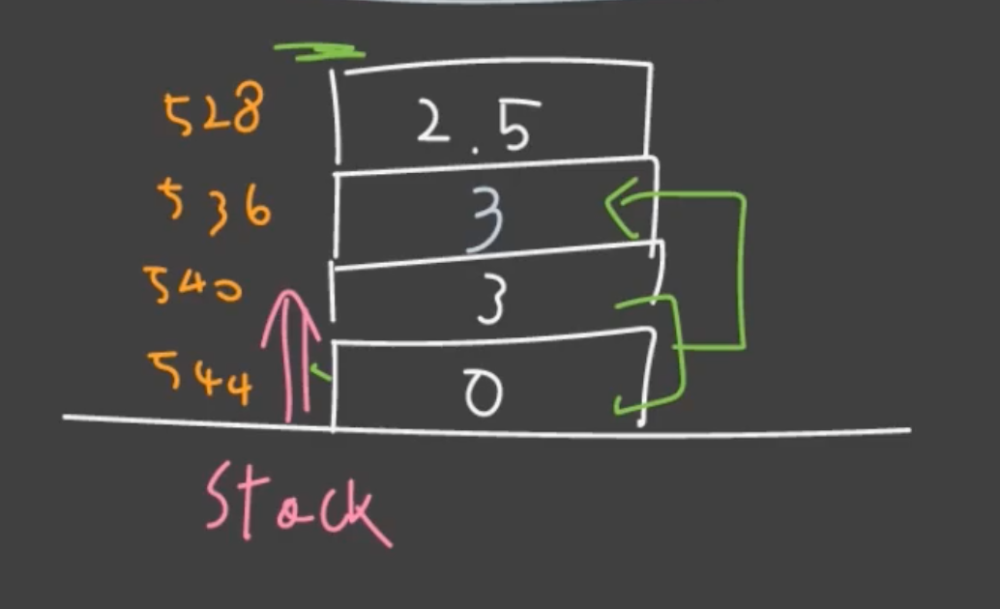
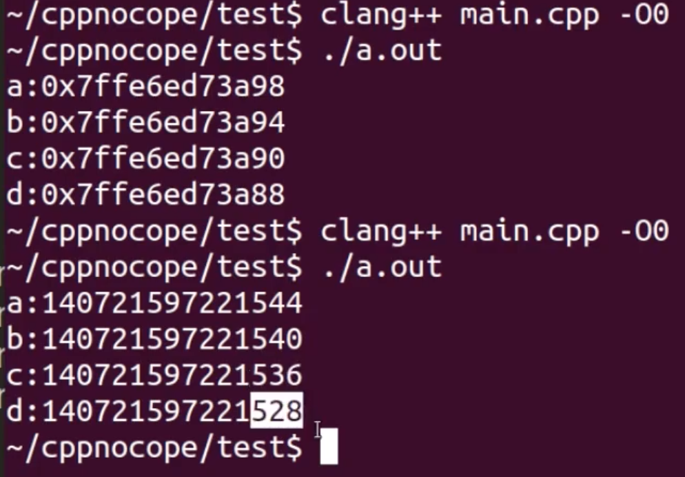
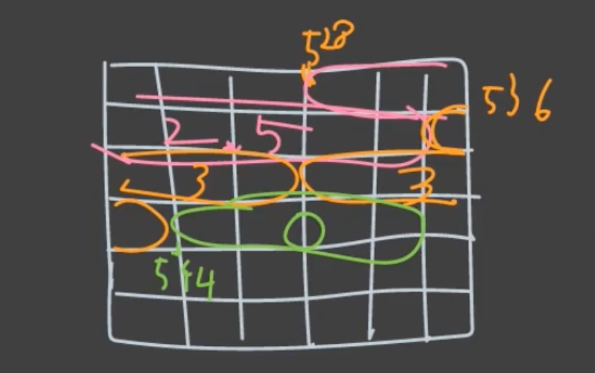

# Variables in Memory

변수가 어떻게 메모리에 저장되는가, 결론적으로는 stack 메모리에 대해 배운다.

---

```c++
int main()
{
  int a = 0;
  int b = 3;
  int c = a + b;
  double d = 2.5;
  
  std::cout << "a:" << (long)&a << std::endl;
  std::cout << "b:" << (long)&b << std::endl;
  std::cout << "c:" << (long)&c << std::endl;
  std::cout << "d:" << (long)&d << std::endl;
  
  return 0;
}
```

---

실제 메모리에서는 변수 이름을 기억하는게 아니라, 메모리의 상대적인 주소를 기억한다.






stack 메모리는 높은 주소부터 아래 주소로 쌓인다.

