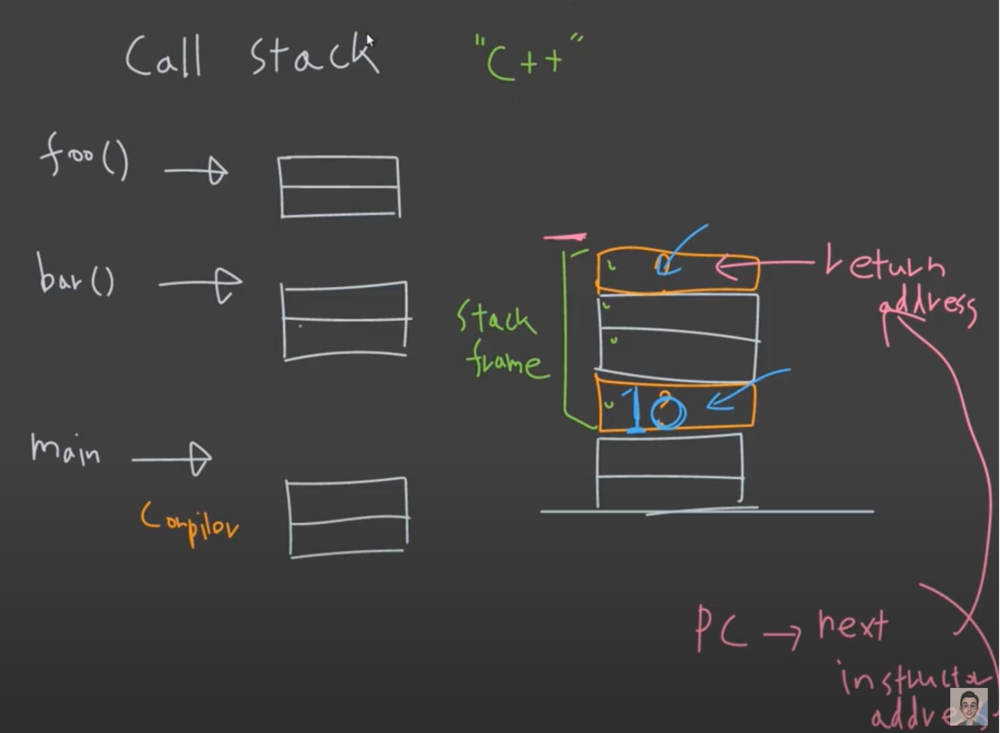
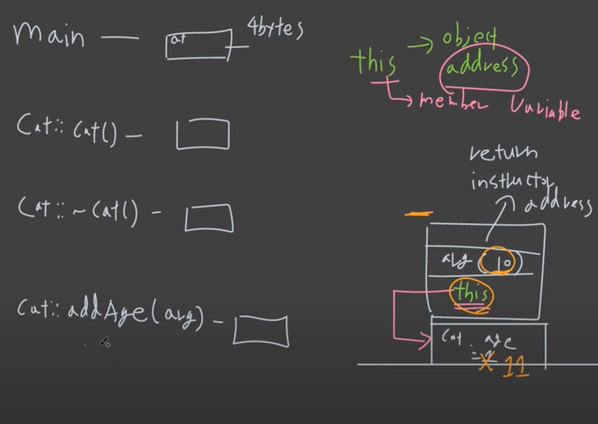

# Stack Frame

```c++
#include <iostream>

void foo(int arg)
{
  int a;
  int b;
}

void bar()
{
  Cat cat;
  Dog dog;
}

int main()
{
  int a;
  double b;
  
  foo(10);
  bar();
  
  return 0;
}
```

**Call Stack**

1. main() 의 stack frame 이 쌓인다.
2. foo() 의 stack frame 이 쌓인다.
3. foo() 가 종료되면서, foo() 의 stack frame 이 사라진다.
4. bar() 의 stack frame 이 쌓인다.
5. bar() 가 종료되면서, bar() 의 stack frame 이 사라진다.
6. main() 이 종료되면서, main() 의 stack frame 이 사라진다.



---

```c++
class Cat
{
public:
  Cat()
  {
    m_age = 1;
  }
  ~Cat();
  void addAge(int arg)
  {
    m_age += arg;
  }
private:
  int m_age;
};

int main()
{
  Cat cat;
  cat.addAge(10);
  
  return 0;
}
```

1. 처음에 main 부분이 이 쌓인다.

2. 생성자 부분이 호출되면서 메모리에 쌓인다. (main 위에)

3. 생성자는 main 부분의 cat 객체의 age 를 1로 하고 메모리에서 사라진다.

4. cat.addAge(10) 부분이 호출되면서 addAge 가 메모리에 쌓인다. (main 위)

5. addAge 부분에 return instructor address, arg, this 가 stack frame 에 같이 올라간다.

   this 란, object address 이다.

   this 를 통해 member variable 을 컨트롤 할 수 있다.

6. addAge 는 this 를 통해 arg 10 을 cat 객체의 age 에 전달한다.

7. 그 후, addAge 가 종료되고, addAge 부분이 메모리에서 해제 된다.

8. 마지막으로 destructor 가 한번 올라갔다가 내려 간 후,

9. main 부분이 메모리에서 내려오며, 프로그램이 종료된다.

중요한 부분은, stack frame 이 쌓여가는 도중에 member variable 을 control 하기 위해 this 라는, member variable 를 가리키는 address 가 들어 있다는 것이다.



