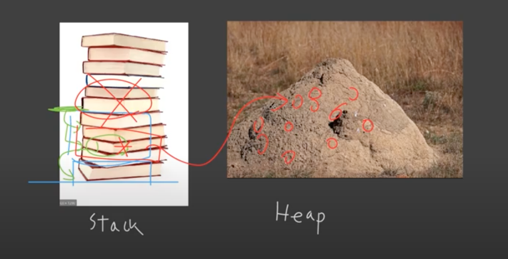

# Heap Memory Introduction

## 1. Heap 과 Stack 의 차이

### Stack

메모리를 차곡차곡 쌓아서, top 위치로부터의 상대 위치만으로 위치를 찾아감.

중간에 다른 stack 위치를 가리키는 주소가 있을 수도 있고, 그 위치를 타고 다른 위치로 이동도 가능.

stack 의 가장 큰 특징은, 새로운 할당 시, 메모리를 기존 것 위에 쌓기만 하면 되고,

해제할 때도 위에서 부터 해제하기 때문에 매우 간단.

### Heap

순서없이 더미로 쌓여 있다.

따라서 스택의 어느 공간에 pointer 를 통해 특정 heap 공간을 가리키는 형태로 사용한다.



## 2. 코드로 살펴보기

```c++
int main()
{
  int* ip; // stack 에 포인터 할당
  ip = new int; // heap 에 int 본체를 할당, stack 에 해당 heap 공간을 가리키는 주소를 저장
  *ip = 100; // stack 에 저장한 주소를 통해, heap 주소에 값 저장
  delete ip; // heap 메모리 할당 해제
  
  return 0;
}
```

## 2. 왜 heap memory 를 사용해야 하는가?

### 2.1 Life Cycle 문제

stack 메모리는 해당 부분이 끝나면 메모리가 할당 해제되어 버림.

### 2.2 Large Size

stack 메모리의 크기는 한계가 있다.

커다란 object 를 heap에 할당하고 stack에는 주소만 저장함으로서 관리 가능

### 2.3 Dynamic (runtime)

compile time 에 알 수 없는 것도 있다.

자유롭게 프로그램 실행 시간에 결정해서 메모리에 할당이 가능하다.

