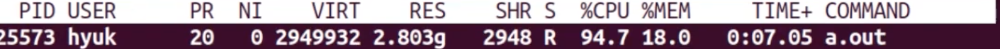
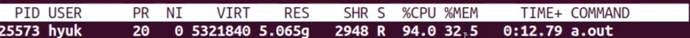
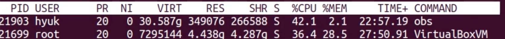
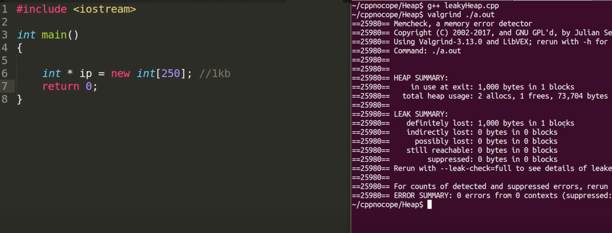
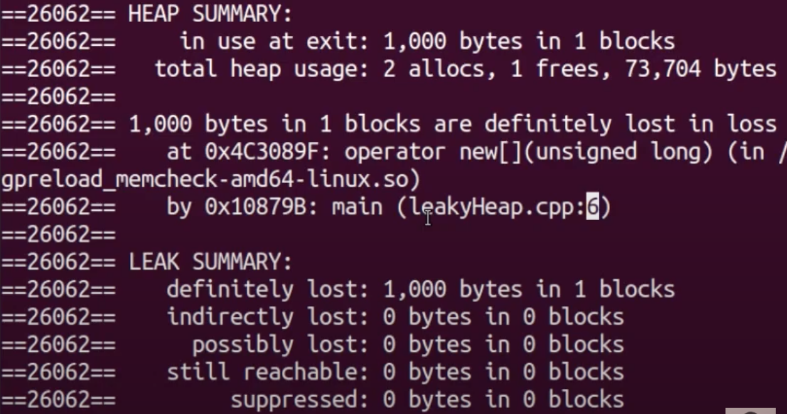
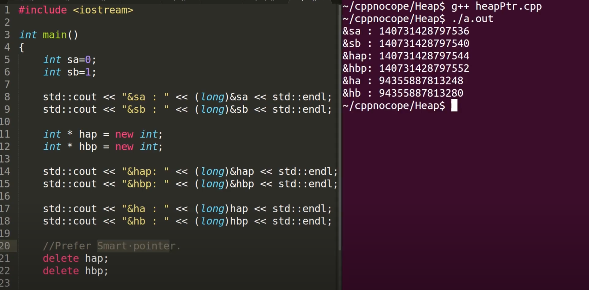
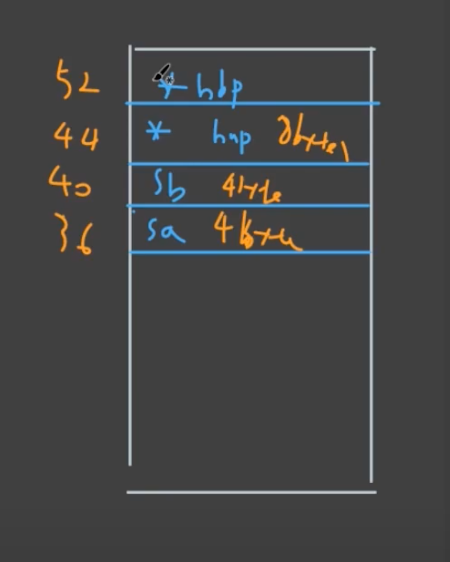
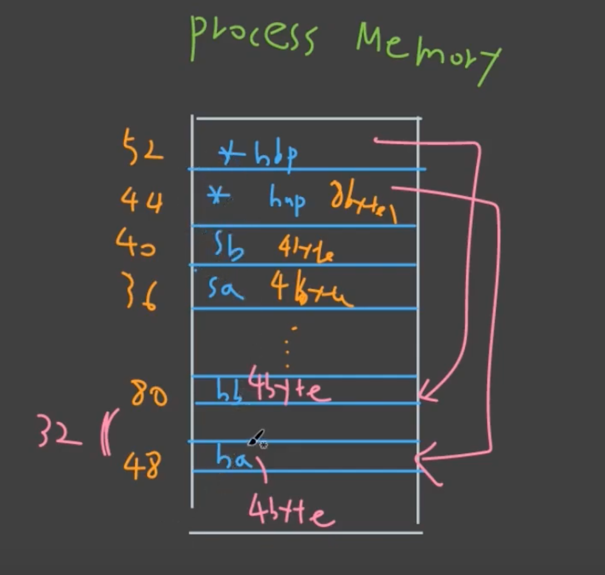
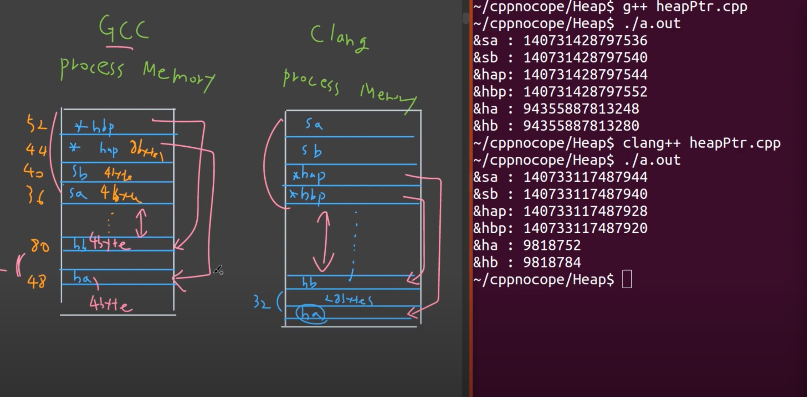

# Heap in Process

1. Memory leak 이 일어나는 코드를 살펴보며, 왜 memory leak 이 일어나면 안되는지 알아보고,

2. memory leak 을 찾을 수 있는 툴을 살펴보고,

3. process view 가 heap 메모리에 어떻게 allocation 이 되는지 본다.

## 1. Memory Leak 이 일어나는 Code

```c++
#include <iostream>

int main()
{
  int allocCount = 0;
  std::cout << "Hoew many" << std::endl;
  std::cin >> allocCount;
  
  for (int i = 0; i < allocCount; i++)
  {
    int* ip = new int[250]; // 1kb
    std::cout << "mem " << std::flush;
    delete[] ip;
  }
      
  return 0;
}
```


10000000 루프 실행새켜보면, 이 프로그램의 CPU 사용량은 매우 높지만(87.1), 메모리 사용량은 0이다.

그 이유는, 메모리를 할당받자마자 바로 해제하기 때문이다.

---

이제 delete 부분을 지우고 (memory leak 이 일어나는 code)

똑같이 10000000 루프를 실행시켜 보면,

```c++
#include <iostream>

int main()
{
  int allocCount = 0;
  std::cout << "Hoew many" << std::endl;
  std::cin >> allocCount;
  
  for (int i = 0; i < allocCount; i++)
  {
    int* ip = new int[250]; // 1kb
    std::cout << "mem " << std::flush;
    // delete[] ip;
  }
      
  return 0;
}
```







다음과 같이 메모리 사용량이 계속 늘어나다가, OS가 해당 프로그램을 죽여버린다.

Memory leak이 일어나는 code 는 이처럼, 언제 죽을지 알 수 없는 프로그램이 되어버린다.

Memory leak 을 방지하는 좋은 방법은, safer C++ style 로 코딩을 하는 것이다.

이 방법을 통해 대부분의 상황에서 원천적으로 memory leak 을 방지할 수 있다.

## 2. Memory Leak 을 찾아내는 Tool

Valgrind 는 메모리 누수 뿐만 아니라, 메모리 관련된 violation 도 체크해 주는 tool 이다.



1000 byte 가 leak 이 되었다고 알려준다.

다음처럼, 디버그 모드로 compile 하고, valgrind 의 leak-check 옵션을 full 로 하면,

```shell
prompt: g++ -g leakyHeap.cpp
prompt: valgrind --leak-check=full ./a.out
```



코드의 어느부분에서 leak 이 일어났는지 까지 알 수 있다.

## 3. Process View

> 아래 이미지의 코드에서는 설명의 용이성을 위해 new 와 delete 를 사용했지만,
>
> 실제 코드 작성시에는 smart pointer 등의 safer 한 방법을 사용하는 것이 좋다.



우리는 sa, sb, hap, hbp 순서대로 작성했지만, 실제 stack 에서는 compiler 가 순서를 바꾸어 hbp, hap, sb, sa 순으로 정렬한 것을 볼 수 있다.



그리고, 다음처럼 heap 부분은 stack 과는 다르게 띄엄 띄엄 할당되어있는 것을 알 수 있다. (이 예시에서는 32의 차이)

이는 메모리 allocator 의 임의대로 할당되므로 매번 다를 수 있다.



이를 gcc 말고, 다른 컴파일러를 사용해서 비교해보면,

clang 의 경우, GCC 보다 stack 과 heap 의 거리를 훨씬 많이 벌려 놓은 것을 확인할 수 있고,

stack 의 할당 순서도 다른 것을 볼 수 있다.



### 결국

- stack 은 촘촘하게 위에서 아래로 할당된다.
- heap 은 아래에서 위로 할당된다. 빈 공간이 있을 수 있다. (할당 해제되면 그만큼 또 빈공간이 생긴다.)

이 정도로 이해하면 된다.

