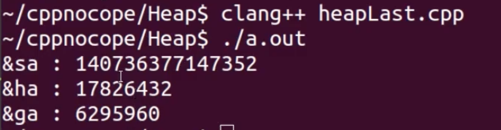
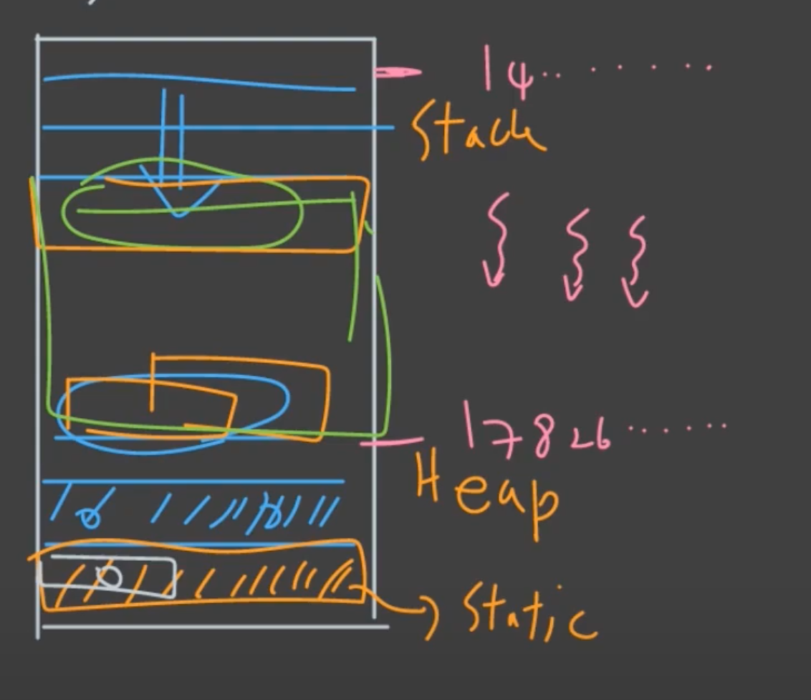

# Heap, Stack, Static

언제 stack 을 쓰고, 언제 heap 을 사용해야 할까?

이것을 알기 위해서는 stack 과 heap 의 차이를 알아야 한다.

## 1. Stack 과 Heap 의 차이

### Stack

- Stack frame 단위로 allocation, deallocation 이 된다.
- 항상 top 위치에 allocation, deallocation 이 된다.
- 따라서 allocation, deallocation 이 빠르다.
- Compile-time 에 결정되어서 유연하지 못함.
- 엄청나게 큰 메모리를 할당할 경우 stack overflow 문제 발생 가능

### Heap

- 어느 부분이 비어있고, 어느 부분이 할당되어 있는지 확인해야 함.
- 어느 정도 공간이 필요한지, run-time 에 결정된다.
- multi-thread 의 경우, race-condition 방지를 위해 더 복잡한 방식으로 할당, 해제된다.
- 따라서 stack 에 비해 allocation, deallocation 이 느리다.
- run-time 에 결정되어서 유연.

## 2. 언제 무엇을 사용할까?

```c++
#include <array>
#include <vector>

int main()
{
  int, double, float; // 이 같은 일반적인 경우는 stack 에 할당시키는 것이 맞다.
  
  // array 의 경우 아키텍처마다 차이가 있지만 이 정도 크기는 stack 에 할당한다.
  int a[5];
  int a[200];
  
  // 배열은, 위와 같은 형식보다는 아래의 형식대로 사용하는 것을 추천.
  std::array<int, 300> a; // 1.2KB
  std::array<int, 500000> b; // 2MB 수백KB~수MB 정도부터는 Heap 에 할당하는 것이 맞음.
  
  std::vector<int> b(500000); // 2MB (heap)
}
```

Java 등의 언어 출신 개발자들이 항상 new 를 통해 할당을 하는 습관이 있는 경우가 있다.

C++ 에서는, 어느정도의 메모리 할당이 일어나는지 파악해서, 메모리 할당이 수KB 미만의 정도라면 stack 에 할당하는 것이 좋다.

### 좀 더 practical 한 예제

```c++
#include <array>
#include <vector>

void foo(int num)
{
  std::vector<Cat> cats(num); // heap allocation, slow.
  
  // do some computation over cats.
}

void bar(int num)
{
  constexpr int maxCats = 1000;
  it(maxCats < num)
  {
    return false;
  }
  std::array<Cat, 1000> cats;
  // do some computation over cats.
}

int main()
{
  int count;
  std::cin >> count;
  foo(count);
  // 일반적인 경우 이와 같은 코드를 작성한다. 그러나,
  // What if we need performance critical cats?
  for (int i = 0; i < 10000; i++)
  {
    bar(count);
  }
}
```

## 3. Static (global)

```c++
#include <iostream>

int ga = 0;

int main()
{
  int sa = 0;
  std::cout << "&sa : " << (long)&sa << std::endl;
  
  int* hap = new int;
  std::cout << "&ha : " << (long)hap << std::endl;
  
  // Prefer Smart pointer
  delete hap;
  
  std::cout << "&ga : " << (long)&ga << std::endl;
  
  return 0;
}
```



