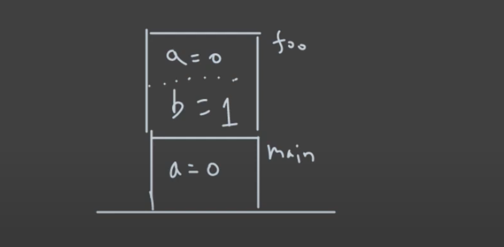
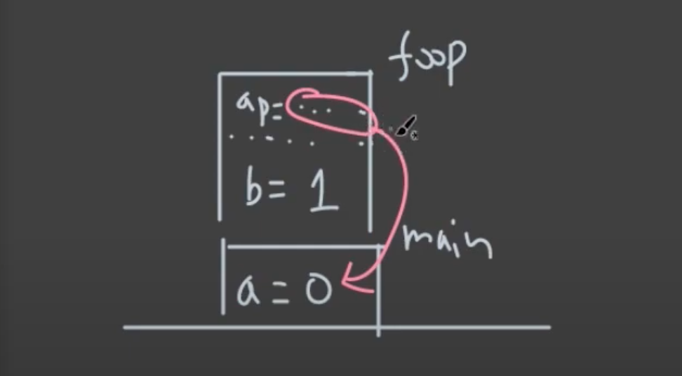
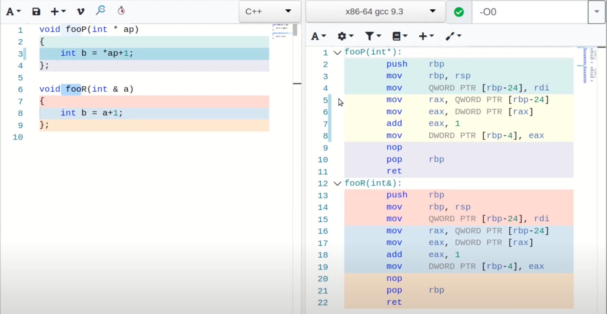

# Pointer vs Reference

## 1. 함수에 argument 를 넘기는 방식의 종류

### pass by **value**

```c++
void foo(int a)
{
  int b = a + 1;
}

int main()
{
  int a = 0;
  foo(a);
  
  return 0;
}
```



### pass by **ptr**

```c++
void fooP(int* a)
{
  int b = *ap + 1;
}

int main()
{
  int a = 0;
  fooP(&a);
  
  return 0;
}
```



### pass by **reference**

```c++
void fooR(int& a)
{
  int b = a + 1;
}

int main()
{
  int a = 0;
  fooR(a);
  
  return 0;
}
```



실제 machine code (assembly code) 레벨에서는 포인터와 동일하게 동작한다.

## 2. 그렇다면 언제 포인터를 사용하고 언제 레퍼런스를 사용해야 할까?

특별히 포인터가 필요할때를 제외하고는 레퍼런스를 사용하면 된다.

포인터를 그대로 노출하면, 버그를 일으키기 쉬워지기 때문이다.

레퍼런스를 사용할 때, const 를 붙여서 사용하는 것이 권장된다.

넘기는 것의 사이즈가 커지면, pass by value 를 사용하면 비효율적이므로(큰 object 를 통째로 복사해야하므로), 포인터나 레퍼런스를 사용한다.

