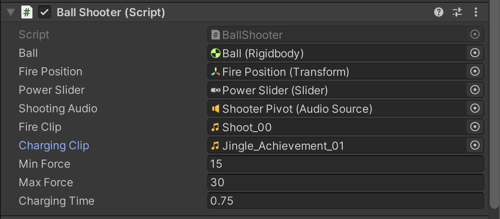

# 볼 슈터

1. Ball Shooter 스크립트로 돌아간다.

2. ```c#
   using System.Collections;
   using System.Collections.Generic;
   using UnityEngine;
   
   public class BallShooter : MonoBehaviour
   {
       public Rigidbody ball;
       public Transform firePosition;
   
   }
   
   ```

3. Shooter Pivot 하위에 빈 게임 오브젝트를 생성 하고 이름을 Fire Position 으로 함

4. Fire Position 의 위치를 적당히 포신의 앞쪽으로 위치하게 함

5. Shooter Pivot 에 `Add Component` -> `Audio Source`

   - Play On Awake 해제
   - Shoot_00 라는 파일을 AudioClip 에 넣음

6. ```c#
   using System.Collections;
   using System.Collections.Generic;
   using UnityEngine;
   using UnityEngine.UI;
   
   public class BallShooter : MonoBehaviour
   {
       public Rigidbody ball;
       public Transform firePosition;
       public Slider powerSlider;
       public AudioSource shootingAudio;
       public AudioClip fireClip;
       public AudioClip chargingClip;
       public float minForce = 15f;
       public float maxForce = 30f;
       public float chargingTime = 0.75f;
   
       private float currentForce;
       private float chargeSpeed;
       private bool fired;
       
       private void OnEnable() // 꺼졌다 켜졌을 때 마다 실행됨
       {
           currentForce = minForce;
           fired = false;
           powerSlider.value = minForce;
       }
   
       private void Start()
       {
           chargeSpeed = (maxForce - minForce) / chargingTime;
       }
   
       private void Update()
       {
           powerSlider.value = minForce;
           
           if (currentForce >= maxForce && !fired) // 힘을 최대로 채웠고, 발사되지 않았다면
           {
               currentForce = maxForce;
               Fire();
           }
           else if (Input.GetButtonDown("Fire1")) // 발사 버튼을 처음 눌렀을 때
           {
               currentForce = minForce;
   
               shootingAudio.clip = chargingClip;
               shootingAudio.Play();
           }
           else if (Input.GetButton("Fire1") && !fired) // 발사 버튼을 누르고 있을 때
           {
               currentForce = currentForce + chargeSpeed * Time.deltaTime;
               powerSlider.value = currentForce;
           }
           else if (Input.GetButtonUp("Fire1") && !fired) // 발사 버튼에서 손을 떼었을 때
           {
               Fire();
           }
   
       }
   
       private void Fire()
       {
           fired = true;
   
           Rigidbody ballInstance = Instantiate(ball, firePosition.position, firePosition.rotation);
           ballInstance.velocity = currentForce * firePosition.forward;
   
           shootingAudio.clip = fireClip;
           shootingAudio.Play();
   
           currentForce = minForce;
       }
   
   }
   
   ```

7. 

8. 회전과 발사 차징이 동시에 되는 문제가 있음.

9. Shooter Pivot 의 Ball Shooter 스크립트를 꺼 준다.

   - Rotator 가 먼저 동작하고, Ball Shooter 를 켜주게 만들 것이다.

10. ```c#
    using System.Collections;
    using System.Collections.Generic;
    using UnityEngine;
    using UnityEngine.UI;
    
    public class BallShooter : MonoBehaviour
    {
        public Rigidbody ball;
        public Transform firePosition;
        public Slider powerSlider;
        public AudioSource shootingAudio;
        public AudioClip fireClip;
        public AudioClip chargingClip;
        public float minForce = 15f;
        public float maxForce = 30f;
        public float chargingTime = 0.75f;
    
        private float currentForce;
        private float chargeSpeed;
        private bool fired;
        
        private void OnEnable() // 꺼졌다 켜졌을 때 마다 실행됨
        {
            currentForce = minForce;
            fired = false;
            powerSlider.value = minForce;
        }
    
        private void Start()
        {
            chargeSpeed = (maxForce - minForce) / chargingTime;
        }
    
        private void Update()
        {
            powerSlider.value = minForce;
            
            if (currentForce >= maxForce && !fired) // 힘을 최대로 채웠고, 발사되지 않았다면
            {
                currentForce = maxForce;
                Fire();
            }
            else if (Input.GetButtonDown("Fire1")) // 발사 버튼을 처음 눌렀을 때
            {
                currentForce = minForce;
    
                shootingAudio.clip = chargingClip;
                shootingAudio.Play();
            }
            else if (Input.GetButton("Fire1") && !fired) // 발사 버튼을 누르고 있을 때
            {
                currentForce = currentForce + chargeSpeed * Time.deltaTime;
                powerSlider.value = currentForce;
            }
            else if (Input.GetButtonUp("Fire1") && !fired) // 발사 버튼에서 손을 떼었을 때
            {
                Fire();
            }
    
        }
    
        private void Fire()
        {
            fired = true;
    
            Rigidbody ballInstance = Instantiate(ball, firePosition.position, firePosition.rotation);
            ballInstance.velocity = currentForce * firePosition.forward;
    
            shootingAudio.clip = fireClip;
            shootingAudio.Play();
    
            currentForce = minForce;
        }
    
    }
    
    ```

11. Shooter Pivot 의 Shooter Rotator 부분에 Ball Shooter 에다가 바로 아래의 Ball Shooter (Script) 를 드래그 앤 드롭