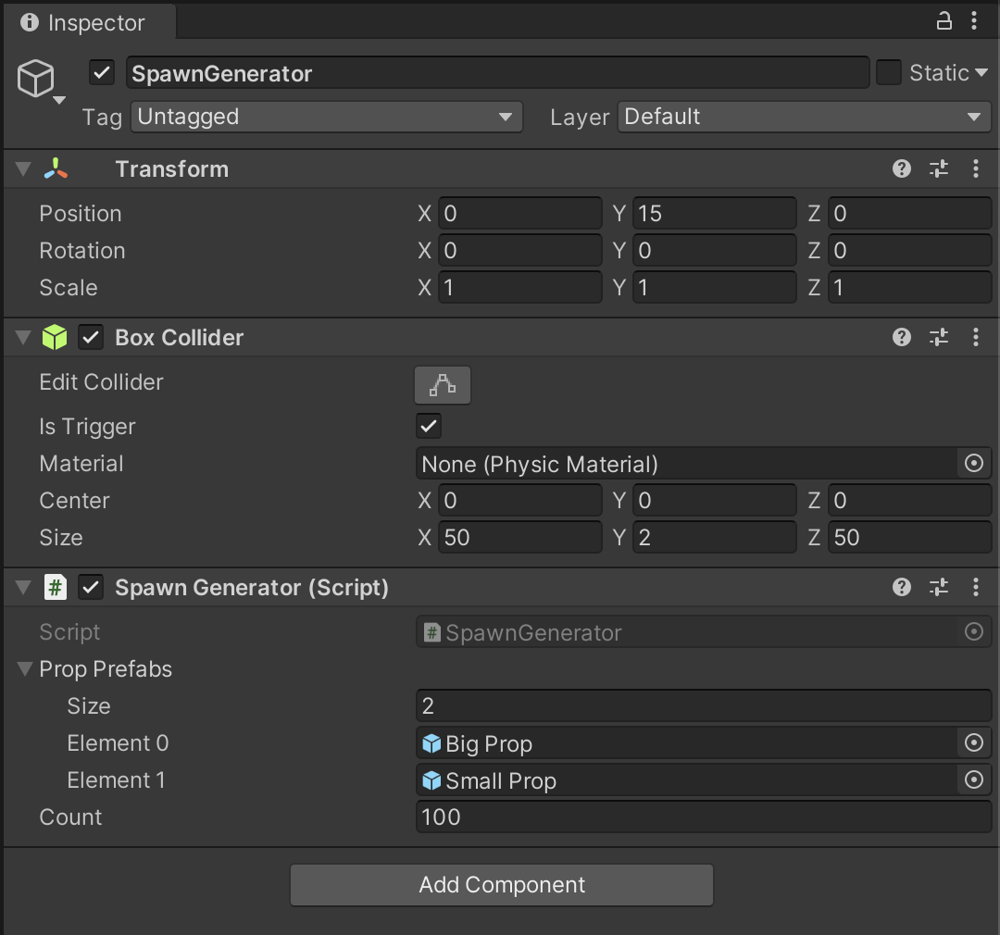

# 랜덤 오브젝트 생성기

1. 랜덤하게 오브젝트를 생성하는 것을 구현할 것이다.

2. 새로운 오브젝트를 생성한다. (Create Empty)

3. 이름을 SpawnGenerator 로 하고 Transform 을 리셋해서 정위치로 놓는다.

4. 범위 지정을 위해 Box Collider 를 사용할 것이다.

   - `SpawnGenerator` -> `Add Component` -> `Physics` -> `Box Collider`

5. Box Collider 의 Size 를 (50, 2, 50) 으로 하고, Is Trigger 를 해제한다.

6. SpawnGenerator 의 Position 을 (0, 15, 0) 으로 한다.

7. SpawnGenerator 에 새로운 스크립트 SpawnGenerator 를 붙인다.

8. ```c#
   using System.Collections;
   using System.Collections.Generic;
   using UnityEngine;
   
   public class SpawnGenerator : MonoBehaviour
   {
       public GameObject[] propPrefabs;
       private BoxCollider area;
       public int count = 100;
       private List<GameObject> props = new List<GameObject>();
   
       // Start is called before the first frame update
       void Start()
       {
           area = GetComponent<BoxCollider>();
           for (int i = 0; i < count; i++)
           {
               Spawn();
           }
   
           area.enabled = false;
           
       }
   
       private void Spawn()
       {
           int selection = Random.Range(0, propPrefabs.Length);
           GameObject selectedPrefab = propPrefabs[selection];
           Vector3 spawnPos = GetRandomPosition();
           GameObject instance = Instantiate(selectedPrefab, spawnPos, Quaternion.identity);
           props.Add(instance);
       }
   
       // private Vector3 GetRandomPosition()
       // {
       //     float x = Random.Range(area.bounds.min.x, area.bounds.max.x);
       //     float z = Random.Range(area.bounds.min.z, area.bounds.max.z);
       //     return new Vector3(x, 0, z);
       // }
   
       private Vector3 GetRandomPosition()
       {
           Vector3 basePosition = transform.position;
           Vector3 size = area.size;
   
           float posX = basePosition.x + Random.Range(-size.x/2f, size.x/2f);
           float posY = basePosition.y + Random.Range(-size.y/2f, size.y/2f);
           float posZ = basePosition.z + Random.Range(-size.z/2f, size.z/2f);
           Vector3 spawnPos = new Vector3(posX, posY, posZ);
   
           return spawnPos;
       }
   
       public void Reset()
       {
           for (int i = 0; i < props.Count; i++)
           {
               props[i].transform.position = GetRandomPosition();
               props[i].SetActive(true);
           }
       }
   }
   
   ```

9. 

