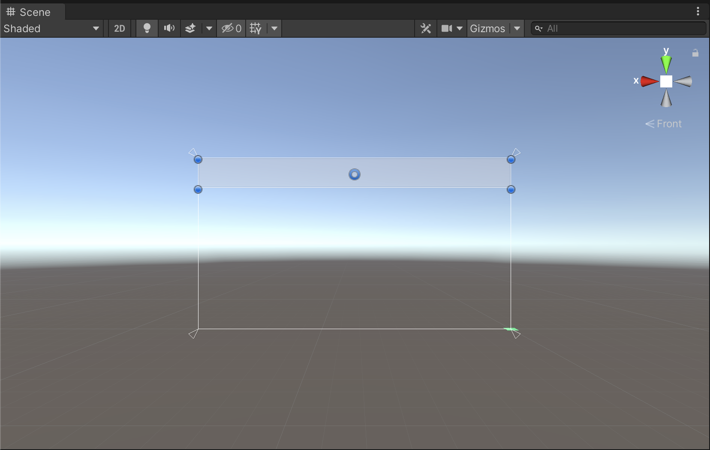
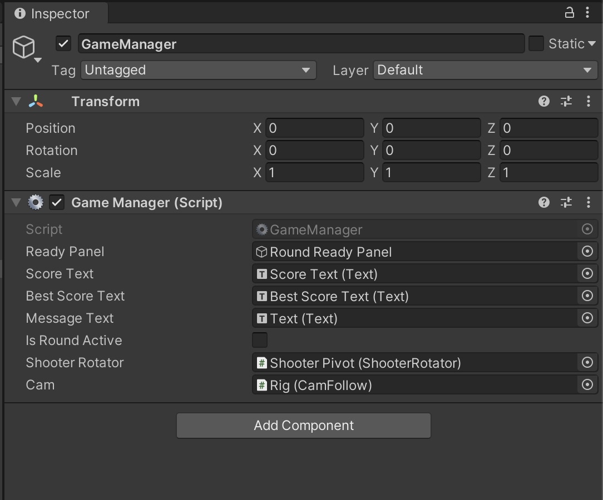
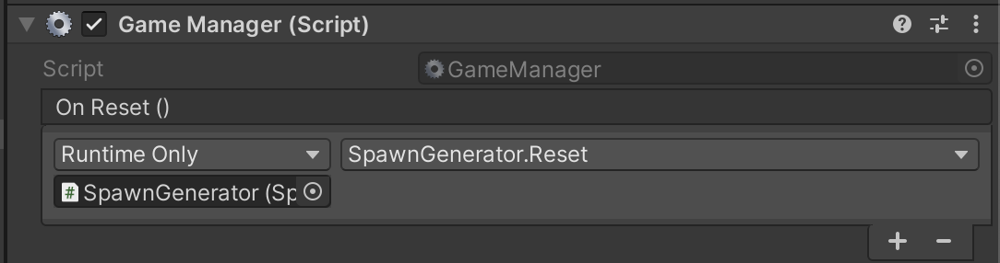
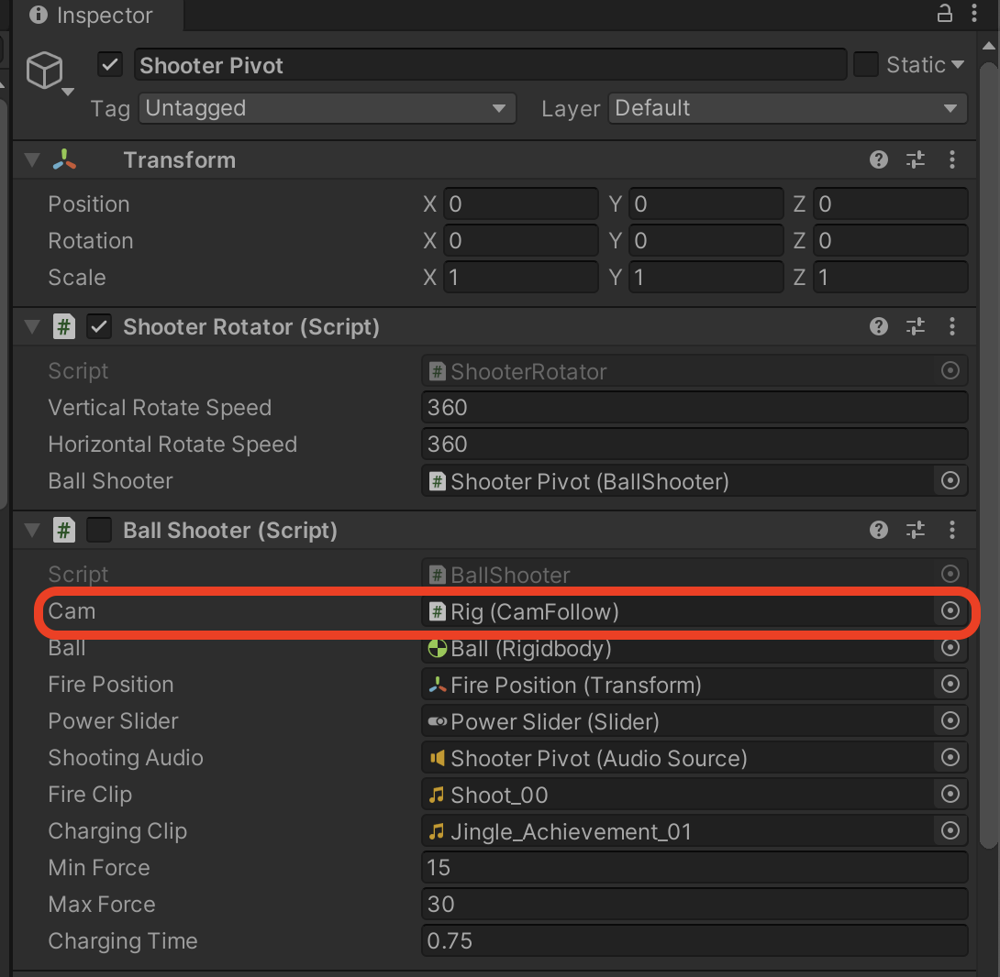

# 게임 매니저

1. Hierarchy 창에서 오른쪽 마우스 -> `UI` -> `Canvas`

2. `EventSystem` 은 지움 (인터렉션 요소가 필요없기 때문)

3. Canvas 의 Inpector 에서

   - `Canvas Scaler` -> `UI Scale Mode` -> `Scale With Screen Size`
   - Reference Resolution -> 640 * 360

4. Canvas 의 자식으로 `UI` -> `Panel` 추가

5. Panel 을 Rect 툴을 이용해 다음과 같이 만든다.

   

6. Panel 의 이름을 Info Bar 로 바꾼다.

7. Info Bar 의 자식으로 `UI` -> `Text` 를 두개 만들어 준다. 각각 이름을 다음과 같이 한다.

   - Score Text
   - Best Score Text

8. Info Bar 하위의 Text 들의 위치를 자동으로 정렬해 주고 싶다.

9. `Info Bar` -> `Add Component` -> `Horizontal Layout Group`

10. `Info Bar` -> `Control Child Size` -> `Width` , `Height` 를 체크

11. `Score Text` -> `Text` 내용을 `Score: 0` 으로 바꾼다.

12. 같은 방법으로 `Best Score Text` 의 내용도 `Best Score: 0` 으로 바꾼다.

13. `Score Text` 와 `Best Score Text` 두 개를 동시에 선택 한 채로

    - Allignment 를 Center, Middle 로 바꿔준다.
    - Best Fit 체크
    - 폰트를 원하는 폰트로 변경

14. 이제 라운드가 넘어갈때마다 띄워줄 화면을 만든다.

15. `Canvas` 하위에 -> `UI` -> `Panel` 추가

16. 이름을 Round Ready Panel 로 변경

17. `Round Ready Panel` 자식으로 `Text` 추가

18. `Text` 의

    - 내용을 `Ready...` 로 수정
    - Allignment 를 Center, Middle 로 변경,
    - 폰트도 원하는 폰트로 변경
    - Best Fit 체크
    - Anchor Preset 에서 `Option` 또는 `Alt` 키를 누른채로 가장 오른쪽 아래의 Stretch 옵션을 선택

19. Round Ready Panel 을 꺼 둔다. (Inspector 창에서 맨 위 오브젝트 이름 왼쪽의 체크표시 해제)

## 게임의 라운드 구성

이 게임의 라운드는 세 개의 Phase 로 구성되어 있다.

### Ready Phase

- 카메라 리셋
- 포신 리셋
- 점수 리셋
- UI Ready

### Play Phase

- 볼을 발사
- 볼이 어딘가에 닿아서 폭발
- 점수 계산
- 까지 완료되면 종료

### End Phase

- 포신 조작 요소 off
- UI End
- 리셋 후 다시 Ready Phase 로 들어감

---

1. Hierarchy 창에서 Create Empty

2. 이름을 GameManager 로 함, 위치 리셋

3. `Add Component` -> 새로운 스크립트 이름을 GameManager 로 함

4. ```c#
   using System.Collections;
   using System.Collections.Generic;
   using UnityEngine;
   using UnityEngine.UI;
   
   public class GameManager : MonoBehaviour
   {
       public static GameManager instance;
       public GameObject readyPanel;
       public Text scoreText;
       public Text bestScoreText;
       public Text messageText;
       public bool isRoundActive = false;
       private int score = 0;
       public ShooterRotator shooterRotator;
       public CamFollow cam;
   
       private void Awake()
       {
           if (instance == null)
           {
               instance = this;
           }
           else if (instance != this)
           {
               Destroy(gameObject);
           }
           UpdateUI();
       }
   
       void Start()
       {
           StartCoroutine("RoundRoutine");
       }
   
       public void AddScore(int newScore)
       {
           score += newScore;
           UpdateBestScore();
           UpdateUI();
       }
   
       void UpdateBestScore()
       {
           if (GetBestScore() < score)
           {
               PlayerPrefs.SetInt("BestScore", score);
           }
       }
   
       int GetBestScore()
       {
           return PlayerPrefs.GetInt("BestScore", 0);
       }
   
       void UpdateUI()
       {
           scoreText.text = "Score: " + score;
           bestScoreText.text = "Best: " + GetBestScore();
       }
   
       public void OnBallDestroy()
       {
           UpdateUI();
           isRoundActive = false;
       }
   
       public void Reset()
       {
           score = 0;
           UpdateUI();
   
           // 라운드를 처음부터 다시 시작하기 위해 코루틴을 재시작
           StartCoroutine("RoundRoutine");
       }
   
       IEnumerator RoundRoutine()
       {
           // READY
           readyPanel.SetActive(true);
           cam.SetTarget(shooterRotator.transform, CamFollow.State.Idle);
           shooterRotator.enabled = false;
   
           isRoundActive = false;
           messageText.text = "READY...";
   
           yield return new WaitForSeconds(3f);
   
           // PLAY
           isRoundActive = true;
           readyPanel.SetActive(false);
           shooterRotator.enabled = true;
   
           cam.SetTarget(shooterRotator.transform, CamFollow.State.Ready);
           
           while (isRoundActive)
           {
               yield return null;
           }
   
           // END
           readyPanel.SetActive(true);
           shooterRotator.enabled = false;
   
           messageText.text = "Wait For Next Round...";
   
           yield return new WaitForSeconds(3f);
   
           Reset();
       }
   }
   
   ```

5. 

6. Ball 스크립트를 수정 (공이 땅에 닿았을 때 isRoundActive 를 false 로 하게)

7. ```c#
   using System.Collections;
   using System.Collections.Generic;
   using UnityEngine;
   
   public class Ball : MonoBehaviour
   {
       public LayerMask whatIsProp;
       public ParticleSystem explosionParticle;
       public AudioSource explosionAudio;
   
       public float maxDamage = 100f;
       public float explosionForce = 1000f;
       public float LifeTime = 10f; // 맵 밖으로 나가면 파괴되지 않는 문제가 생길 수 있으므로 수명을 제한한다.
       public float explosionRadius = 20f;
   
       void Start()
       {
           Destroy(gameObject, LifeTime);
       }
   
       void OnTriggerEnter(Collider other)
       {
           Collider[] colliders = Physics.OverlapSphere(transform.position, explosionRadius, whatIsProp);
   
           for (int i = 0; i < colliders.Length; i++)
           {
               Rigidbody targetRigidbody = colliders[i].GetComponent<Rigidbody>();
   
               if (!targetRigidbody)
                   continue;
   
               targetRigidbody.AddExplosionForce(explosionForce, transform.position, explosionRadius);
   
               Prop prop = targetRigidbody.GetComponent<Prop>();
   
               if (!prop)
                   continue;
   
               prop.TakeDamage(CalculateDamage(targetRigidbody.position));
           }
   
           // 부모 오브젝트를 파괴하면 자식 오브젝트도 파괴된다.
           // 공을 먼저 파괴시키고, 자식 게임오브젝트인 PlasmaExplosionEffect 가 파괴되지 않게 해야 한다.
           // 따라서 공 오브젝트를 파괴시킬 때, PlasmaExplosionEffect 를 Ball 의 자식에서 해제시킨다.
           explosionParticle.transform.parent = null;
   
           explosionParticle.Play();
           explosionAudio.Play();
   
           GameManager.instance.OnBallDestroy(); //공이 땅에 닿았을 때 isRoundActive 를 false 로 하게 한다.
   
           Destroy(explosionParticle.gameObject, explosionParticle.main.duration); // 재생이 다 되면 파괴한다. (메모리 낭비 방지)
           Destroy(gameObject);
       }
   
       private float CalculateDamage(Vector3 targetPosiion)
       {
           Vector3 explosionToTarget = targetPosiion - transform.position;
           float distance = explosionToTarget.magnitude;
           float edgeToCenterDistance = explosionRadius - distance;
           float percentage = edgeToCenterDistance/explosionRadius;
           float damage = maxDamage * percentage;
           damage = Mathf.Max(0f, damage);
           return damage;
       }
   }
   
   ```

8. 점수 처리를 위해 Prop 스크립트도 수정

9. ```c#
   using System.Collections;
   using System.Collections.Generic;
   using UnityEngine;
   
   public class Prop : MonoBehaviour
   {
       public int score = 5;
       public ParticleSystem explosionParticle;
       public float hp = 10f;
       public void TakeDamage(float damage)
       {
           hp -= damage;
           if (hp <= 0)
           {
               ParticleSystem instance = Instantiate(explosionParticle, transform.position, transform.rotation);
               Destroy(instance.gameObject, instance.main.duration); // 재생이 다 되면 파괴한다. (메모리 낭비 방지)
   
               AudioSource explosionAudio = GetComponent<AudioSource>();
               explosionAudio.Play();
               instance.Play();
   
               GameManager.instance.AddScore(score);
   
               // 매 스테이지에 굉장히 많은 프롭들이 필요한데, 매번 새로 생성, 파괴 하면 렉이 많이 걸림.
               // 그래서 화면에 보이지 않게 임시로 꺼 두고, 스테이지 전환시 재사용한다.
               gameObject.SetActive(false);
           }
       }
   }
   
   ```

10. `Canvas` 의 Canvas Scaler -> Match 바를 Height 쪽으로 끝까지 쭉 민다. (가로 해상도가 바뀌었을 때 세로 비율이 바뀌지 않게)

## 추가 사항

- 카메라가 포탄을 발사했을 때는 포탄을 따라갔으면 좋겠다
- 라운드가 바뀔 때 마다 Prop 이 리셋이 되었으면 좋겠다.

---

1. BallShooter.cs 파일을 수정

2. ```c#
   using System.Collections;
   using System.Collections.Generic;
   using UnityEngine;
   using UnityEngine.UI;
   
   public class BallShooter : MonoBehaviour
   {
       public CamFollow cam;
       public Rigidbody ball;
       public Transform firePosition;
       public Slider powerSlider;
       public AudioSource shootingAudio;
       public AudioClip fireClip;
       public AudioClip chargingClip;
       public float minForce = 15f;
       public float maxForce = 30f;
       public float chargingTime = 0.75f;
   
       private float currentForce;
       private float chargeSpeed;
       private bool fired;
       
       private void OnEnable() // 꺼졌다 켜졌을 때 마다 실행됨
       {
           currentForce = minForce;
           fired = false;
           powerSlider.value = minForce;
       }
   
       private void Start()
       {
           chargeSpeed = (maxForce - minForce) / chargingTime;
       }
   
       private void Update()
       {
           if (fired) // 한번이라도 발사하면 동작을 막음
           {
               return;
           }
   
           powerSlider.value = minForce;
   
           if (currentForce >= maxForce && !fired) // 힘을 최대로 채웠고, 발사되지 않았다면
           {
               currentForce = maxForce;
               Fire();
           }
           else if (Input.GetButtonDown("Fire1")) // 발사 버튼을 처음 눌렀을 때
           {
               fired = false; // 연사 가능하게 한다.
               currentForce = minForce;
   
               shootingAudio.clip = chargingClip;
               shootingAudio.Play();
           }
           else if (Input.GetButton("Fire1") && !fired) // 발사 버튼을 누르고 있을 때
           {
               currentForce = currentForce + chargeSpeed * Time.deltaTime;
               powerSlider.value = currentForce;
           }
           else if (Input.GetButtonUp("Fire1") && !fired) // 발사 버튼에서 손을 떼었을 때
           {
               Fire();
           }
   
       }
   
       private void Fire()
       {
           fired = true;
   
           Rigidbody ballInstance = Instantiate(ball, firePosition.position, firePosition.rotation);
           ballInstance.velocity = currentForce * firePosition.forward;
   
           shootingAudio.clip = fireClip;
           shootingAudio.Play();
   
           currentForce = minForce;
   
           cam.SetTarget(ballInstance.transform, CamFollow.State.Tracking);
       }
   
   }
   
   ```

3. GameManager 스크립트에 이벤트 기능을 이용해서 Prop 초기화를 구현

4. ```c#
   using System.Collections;
   using System.Collections.Generic;
   using UnityEngine;
   using UnityEngine.UI;
   using UnityEngine.Events;
   
   public class GameManager : MonoBehaviour
   {
       public UnityEvent onReset; // 이벤트가 발동되는 순간에 이벤트에 등록된 모든 함수가 자동으로 실행됨.
       public static GameManager instance;
       public GameObject readyPanel;
       public Text scoreText;
       public Text bestScoreText;
       public Text messageText;
       public bool isRoundActive = false;
       private int score = 0;
       public ShooterRotator shooterRotator;
       public CamFollow cam;
   
       private void Awake()
       {
           if (instance == null)
           {
               instance = this;
           }
           else if (instance != this)
           {
               Destroy(gameObject);
           }
           UpdateUI();
       }
   
       void Start()
       {
           StartCoroutine("RoundRoutine");
       }
   
       public void AddScore(int newScore)
       {
           score += newScore;
           UpdateBestScore();
           UpdateUI();
       }
   
       void UpdateBestScore()
       {
           if (GetBestScore() < score)
           {
               PlayerPrefs.SetInt("BestScore", score);
           }
       }
   
       int GetBestScore()
       {
           return PlayerPrefs.GetInt("BestScore", 0);
       }
   
       void UpdateUI()
       {
           scoreText.text = "Score: " + score;
           bestScoreText.text = "Best: " + GetBestScore();
       }
   
       public void OnBallDestroy()
       {
           UpdateUI();
           isRoundActive = false;
       }
   
       public void Reset()
       {
           score = 0;
           UpdateUI();
   
           // 라운드를 처음부터 다시 시작하기 위해 코루틴을 재시작
           StartCoroutine("RoundRoutine");
       }
   
       IEnumerator RoundRoutine()
       {
           // READY
           onReset.Invoke();
           
           readyPanel.SetActive(true);
           cam.SetTarget(shooterRotator.transform, CamFollow.State.Idle);
           shooterRotator.enabled = false;
   
           isRoundActive = false;
           messageText.text = "READY...";
   
           yield return new WaitForSeconds(3f);
   
           // PLAY
           isRoundActive = true;
           readyPanel.SetActive(false);
           shooterRotator.enabled = true;
   
           cam.SetTarget(shooterRotator.transform, CamFollow.State.Ready);
           
           while (isRoundActive)
           {
               yield return null;
           }
   
           // END
           readyPanel.SetActive(true);
           shooterRotator.enabled = false;
   
           messageText.text = "Wait For Next Round...";
   
           yield return new WaitForSeconds(3f);
   
           Reset();
       }
   }
   
   ```

5. 

6. 