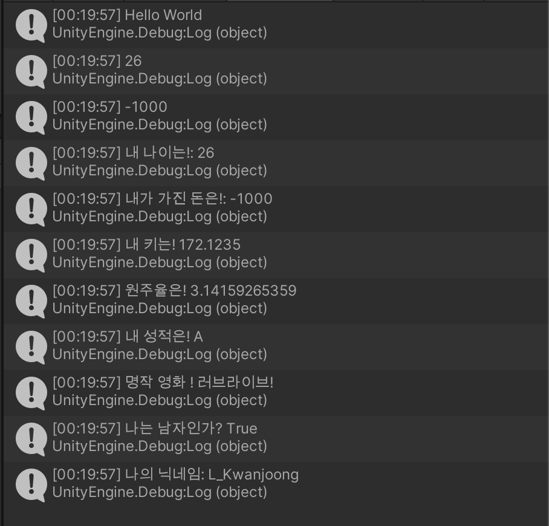

# 콘솔 출력 + C# 기본 변수

1. project 창에서 우클릭을 통해 새로운 c# 스크립트를 만들 수 있다.
2. 만든 스크립트를 편집 한 후 적용하기 위해 해당 스크립트 아이콘을 Hierarchy 창의 원하는 오브젝트에 드래그 앤 드롭한다.

```c#
using System.Collections;
using System.Collections.Generic;
using UnityEngine;

public class HelloWorld : MonoBehaviour
{
    // Start is called before the first frame update
    void Start()
    {
        // 주석, 컴퓨터가 처리하지 않는 라인 - 메모로 사용

        /*
            여러줄을 걸친
            주석을
            남길 수 있다.
        */

        // 콘솔 출력
        Debug.Log("Hello World");

        // 숫자형 변수

        // int 는 소숫점이 없는 정수
        int age = 26;
        int money = -1000;

        Debug.Log(age);
        Debug.Log(money);

        // floating point - float: 소숫점을 가지는 실수: 32비트
        // 소숫점 아래 7자리까지만 정확
        float height = 172.1234567f;

        // float의 두배의 메모리를 사용 64비트 (게임에서는 많이 사용하지 않음. 성능이 떨어지기 때문)
        // 소숫점 아래 15자리까지만 정확
        double pi = 3.14159265359;

        // bool 은 참 true 혹은 거짓 false
        bool isBoy = true;
        bool isGirl = false;

        // char character 는 한 문자
        char grade = 'A';

        // string 은 문장
        string movieTitle = "러브라이브!";

        Debug.Log("내 나이는!: " + age);
        Debug.Log("내가 가진 돈은!: " + money);
        Debug.Log("내 키는! " + height);
        Debug.Log("원주율은! " + pi);
        Debug.Log("내 성적은! " + grade);
        Debug.Log("명작 영화 ! " + movieTitle);
        Debug.Log("나는 남자인가? " + isBoy);

        // var는 할당하는 값을 기준으로 타입을 결정. 변수명이 너무 길어 타이핑 하기 귀찮을때 사용
        var myName = "L_Kwanjoong";
        var myAge = 26;

        Debug.Log("나의 닉네임: " + myName);
    }

    // Update is called once per frame
    void Update()
    {
        
    }
}

```

