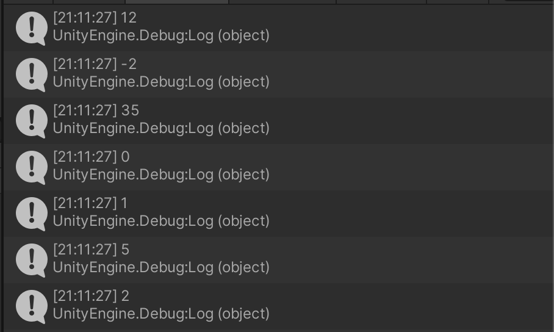
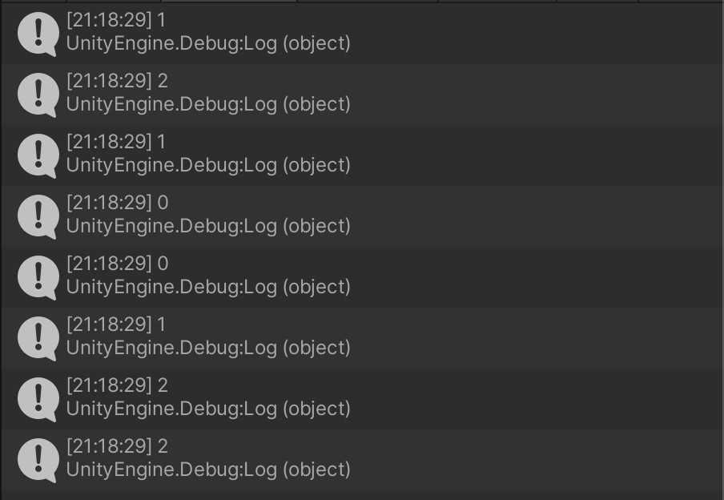

# 사칙연산 + 복합 연산자

```c#
using System.Collections;
using System.Collections.Generic;
using UnityEngine;

public class HelloMath : MonoBehaviour
{
    // Start is called before the first frame update
    void Start()
    {
        int a = 5;

        int b = 7;
        
        int sum = a + b;

        Debug.Log(sum);

        sum = a - b;

        Debug.Log(sum);

        Debug.Log(a * b);

        Debug.Log(a / b);

        Debug.Log(b / a);

        Debug.Log(a % b);

        Debug.Log(b % a);
    }
}
```



---

```c#
using System.Collections;
using System.Collections.Generic;
using UnityEngine;

public class HelloMath : MonoBehaviour
{
    // Start is called before the first frame update
    void Start()
    {
        int i = 0;

        i = i + 1;
        Debug.Log(i);

        i++; // i = i + 1;
        Debug.Log(i);

        i = i - 1;
        Debug.Log(i);

        i--; // i = i - 1;
        Debug.Log(i);

        i = 0;
        Debug.Log(i++);
        Debug.Log(i);
        Debug.Log(++i);
        Debug.Log(i);
    }
}

```



---

```c#
using System.Collections;
using System.Collections.Generic;
using UnityEngine;

public class HelloMath : MonoBehaviour
{
    // Start is called before the first frame update
    void Start()
    {
        int j = 10;

        j += 5; // j = j + 5;
        j -= 5; // j = j - 5;
        j *= 5; // j = j * 5;
        j /= 5; // j = j / 5;
        j %= 5; // j = j % 5;   
    }
}

```

