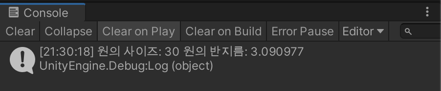

# 함수 + 스코프

```c#
using System.Collections;
using System.Collections.Generic;
using UnityEngine;

public class HelloFunction : MonoBehaviour
{
    // Start is called before the first frame update
    void Start()
    {
        float sizeOfCircle = 30f;

        float radius = GetRadius(sizeOfCircle);

        Debug.Log("원의 사이즈: " + sizeOfCircle + " 원의 반지름: " + radius);
        
    }

    float GetRadius(float size)
    {
        float pi = 3.14f;

        float tmp = size / pi;

        float radius = Mathf.Sqrt(tmp);

        return radius;
    }
}

```



- Start() 스코프 내부의 radius 와 GetRadius() 스코프의 radius 는 이름이 같지만 구분된다