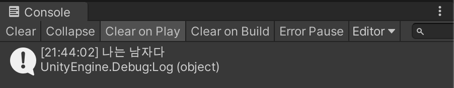

# 형변환 + 조건문

```c#
using System.Collections;
using System.Collections.Generic;
using UnityEngine;

public class HelloCSharp : MonoBehaviour
{
    // Start is called before the first frame update
    void Start()
    {
        // 형변환 캐스팅
        int height = 170;
        float heightDetail = 170.3f;

        // 자동 형변환 (잃어버리는 정보가 없으면)
        heightDetail = height;

        // 직접 명시해야 하는 경우 (잃어버리는 정보가 있으면)
        height = (int)heightDetail;

        // 조건문 if문
        bool isBoy = true;

        if (isBoy == true)
        {
            Debug.Log("나는 남자다");
        }
        else
        {
            Debug.Log("나는 여자다");
        }
    }
}
```

