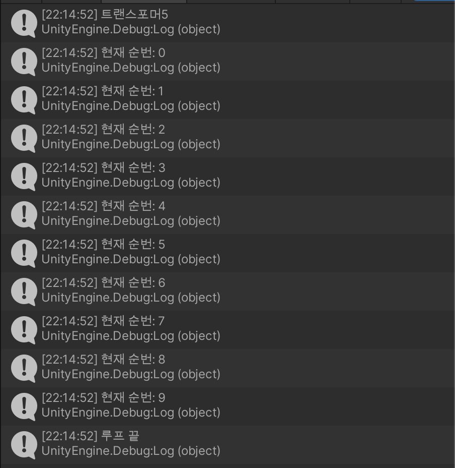
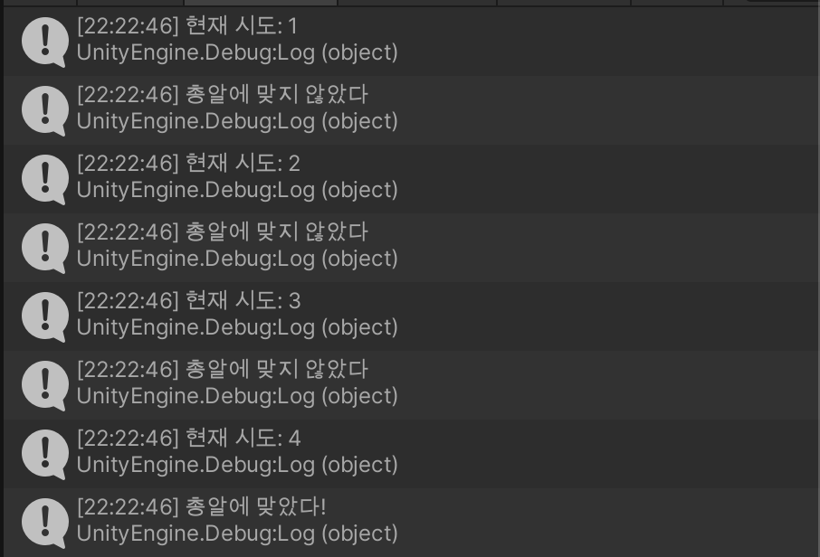

# 분기문 + 반복문

```c#
using System.Collections;
using System.Collections.Generic;
using UnityEngine;

public class HelloCSharp : MonoBehaviour
{
    // Start is called before the first frame update
    void Start()
    {
        // switch 분기문

        int year = 2017;

        switch(year)
        {
            case 2012:
                Debug.Log("레미제라블");
                break;

            case 2015:
                Debug.Log("러브라이브");
                break;

            case 2016:
                Debug.Log("곡성");
                break;
            
            case 2017:
                Debug.Log("트랜스포머5");
                break;
            
            default:
                Debug.Log("년도가 해당사항 없음");
                break;
        }

        // 루프문 Loop 반복문들

        // for 문

        for (int i = 0; i < 10; i++)
        {
            Debug.Log("현재 순번: " + i);
        }
        Debug.Log("루프 끝");
    }
}
```



```c#
using System.Collections;
using System.Collections.Generic;
using UnityEngine;

public class HelloCSharp : MonoBehaviour
{
    // Start is called before the first frame update
    void Start()
    {
        bool isShot = false;
        int index = 0;
        int luckyNumber = 4;

        while (isShot == false)
        {
            index = index + 1;
            Debug.Log("현재 시도: " + index);
            if (index == luckyNumber)
            {
                Debug.Log("총알에 맞았다!");
                isShot = true;
            }
            else
            {
                Debug.Log("총알에 맞지 않았다");
            }
        }
    }
}

```


