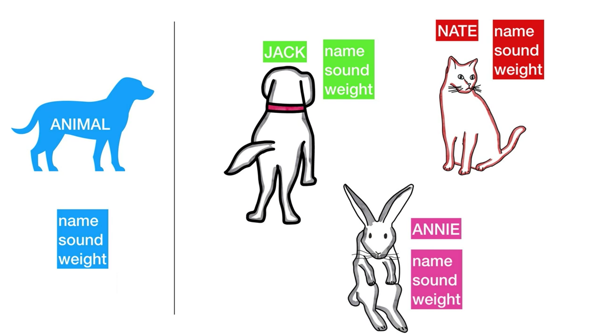

# 클래스와 오브젝트

> "컴퓨터는 사람의 사고방식을 반영하는 거울과 같아야 한다" -스티브 잡스-

OOP 를 이해하는데 가장 방해가 되는 것은 기계가 생각하는 방식으로 우리가 생각을 하려고 하는 것이다.

현대 언어의 OOP는 사람의 사고방식대로 작동되도록 만들어져 있다.


## 클래스

### 자동차를 찍어내는 틀과 같다.

## 오브젝트

### 틀을 이용해서 찍어낸 개별적인 자동차들이다.

- 자기 자신을 스스로 챙길 수 있다
- 하나의 온전한 단위로 존재한다
- 실존하는 세상세 산다
- 하나의 원본에서 파생 되어도, 서로 구분 가능하다

---

```c#
using System.Collections;
using System.Collections.Generic;
using UnityEngine;

public class NewBehaviourScript : MonoBehaviour
{
    // Start is called before the first frame update
    void Start()
    {
        Animal jack = new Animal();
        jack.name = "Jack";
        jack.sound = "Bark";
        jack.weight = 4.5f;

        Animal nate = new Animal();
        nate.name = "NATE";
        nate.sound = "Nyaa";
        nate.weight = 1.2f;

        Animal annie = new Animal();
        annie.name = "ANNIE";
        annie.sound = "Wee";
        annie.weight = 0.8f;
    }

    public class Animal
    {
        public string name;
        public string sound;
        public float weight;
    }
}
```



---

```c#
using System.Collections;
using System.Collections.Generic;
using UnityEngine;

public class NewBehaviourScript : MonoBehaviour
{
    // Start is called before the first frame update
    void Start()
    {
        Animal jack = new Animal();
        jack.name = "Jack";
        jack.sound = "Bark";
        jack.weight = 4.5f;

        Animal nate = new Animal();
        nate.name = "NATE";
        nate.sound = "Nyaa";
        nate.weight = 1.2f;

        Animal annie = new Animal();
        annie.name = "ANNIE";
        annie.sound = "Wee";
        annie.weight = 0.8f;

        nate = jack; // 중요 부분

        nate.name = "JIMMY";
        nate.sound = "Cheese";

        Debug.Log(jack.name);
        Debug.Log(jack.sound);

        Debug.Log(nate.name);
        Debug.Log(nate.sound);

        Debug.Log(annie.name);
        Debug.Log(annie.sound);
    }

    public class Animal
    {
        public string name;
        public string sound;
        public float weight;
    }
}

```


- 변수명은 실체를 가리키는 이름표일 뿐이다.

- 그렇다면 이름표가 사라진 nate 는 어떻게 되는가?
  - 미아가 되었다.
  - 찾을 방법이 사라졌기 때문에 나중에 가비지 콜렉터가 청소하게 된다.

## pass by reference, pass by value


- pass by reference
  - 실제 존재하는 컵이 1개이다.
- pass by value
  - 실제 존재하는 컵이 2개이다.

### pass by reference 는 왜 중요할까?

**'가져와서 쓴다'** 는 개념을 위해

이 개념이 없다면, 컴포넌트를 변수로 가져와서 사용한다는 개념을 사용할 수 없다.

### 예시

```c#
using System.Collections;
using System.Collections.Generic;
using UnityEngine;

public class jumper : MonoBehaviour
{

    public Rigidbody rb;
    // Start is called before the first frame update
    void Start()
    {
        rb.AddForce(0, 1000, 0);
    }

    // Update is called once per frame
    void Update()
    {
        
    }
}

```


Rigidbody 부분을 드래그 드롭해서 Rb 부분에 넣었다.

즉, Rb 는 Rigidbody 를 가져다 쓰는 것이다.

플레이를 눌러보면 cube 가 하늘로 뜨는 것을 볼 수 있다.