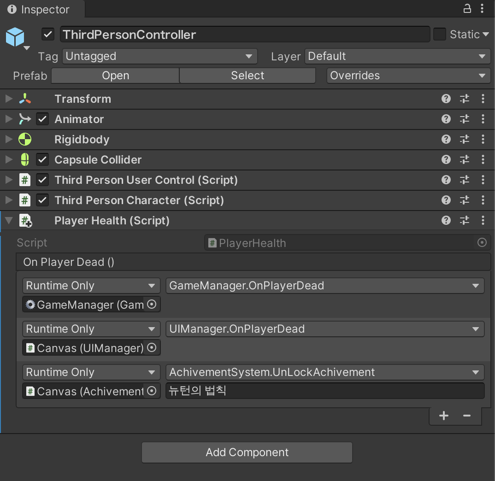

# 유니티 이벤트 (2/2)

Dead 라는 이벤트를 만들어 Dead 라는 상황에 연관된 다른 것들을 묶어서 관리함으로서 Dead 이벤트를 발동시키는 주체와, Dead 이벤트 발동시에 실행되는 모든 것들에 관한 하드한 링크를 끊을 수 있다.

```c#
using System.Collections;
using System.Collections.Generic;
using UnityEngine;
using UnityEngine.Events;

public class PlayerHealth : MonoBehaviour
{
    public UnityEvent onPlayerDead; // 유니티 이벤트

    private void Dead()
    {
        onPlayerDead.Invoke(); // 이벤트 발동 (Invoke)
        Debug.Log("죽었다!");
        Destroy(gameObject);
    }
    void OnTriggerEnter(Collider other)
    {
        Dead();
    }
}

```

1. ThirdPersonController 의 이벤트 부분에 슬롯을 3개 추가한다.
2. 