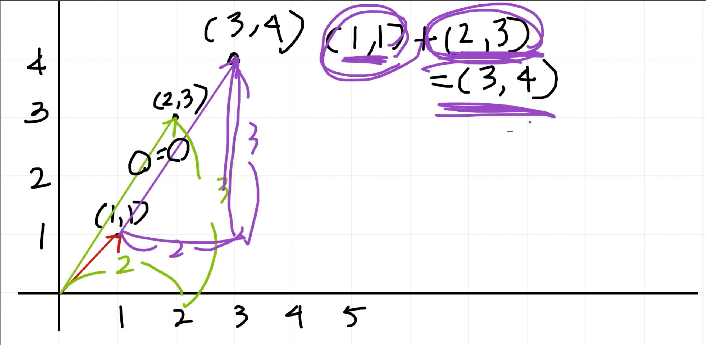
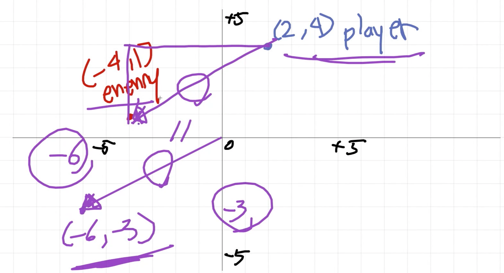
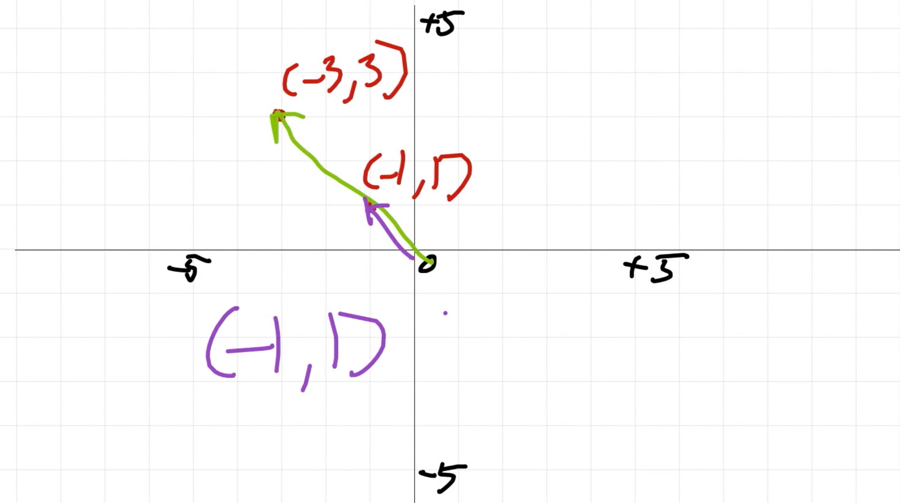

# 백터 연산 기초

## 벡터의 차원

- `Vector2` : `(1, 2)` 처럼 두개의 원소를 가진 벡터. 2차원을 나타냄
- `Vector3` : `(1, 3, 7)` 처럼 세개의 원소를 가진 벡터. 3차원을 나타냄
- 같은 원리로 vector4, vector5...
- 유니티에서는 주로 `Vector2` 와 `Vector3` 를 사용하게 된다. (각각 2D와 3D를 표현할때)

## 백터란?

### 벡터의 기본 특성

- 백터는 길이와 방향을 가졌다.
- 벡터는 한번에 두 가지로 표현될 수 있다.
  1. 절대좌표: 모든 것이 (0, 0) 에서 시작된다.
     - 예) `(1, 1)` 은, 원점에서 (1, 1) 만큼 떨어진 곳까지 간 것.
  2. 상대좌표: 내가 어디에 있는지는 모르겠지만, 현재 위치에서 어느 방향으로 어느만큼 더 가는가
- 벡터의 크기: 피타고라스의 정리로 구하고 영어로는 Magnitude 라고 한다.

### 벡터의 덧셈

- 예시) `(1, 1)` + `(2, 3)` = `(3, 4)`

  

### 벡터의 덧셈/뺄셈 활용

- `상대방의 위치` 에서 `나의 위치` 를 빼면 `간격` 을 구할 수 있다.
- 즉, `목적지` - `현재위치` = `현재위치와 목적지 사이의 간격`
- 예시)
  - 플레이어의 위치: `(2, 4)`
  - 적의 위치: `(-4, 1)`
  - `적의 위치` - `플레이어의 위치` = `(-4, 1)` - `(2, 4)` = `(-6, -3)`
  - `( (-6)^2 + (-3)^2 )^(1/2)` = `(45)^(1/2)`

### 벡터의 곱셈

- `(-1, 1)` 과 `(-3, 3)` 은 뱡향이 같고 크기만 다르다.
  - 즉, `(-1, 1)` * `3` = `(-3, 3)`
- **방향벡터** : 길이가 1인 벡터
  - `방향벡터(크기가 1)` * `속도` 의 형태로 쪼개서 편리하게 표현할 수 있다.
  - 예시) `(-4, 3)` 을 쪼개 보면,
    - `(-0.8, 0.6)` * `5` = `(-4, 3)`  (방향은 유지하고 길이가 5인 벡터를 쉽게 구했다)
    - 이제 `(-0.8, 0.6)` 에 어떤 값을 곱하면 방향은 똑같고 곱한 크기를 갖는 벡터를 쉽게 구할 수 있다.