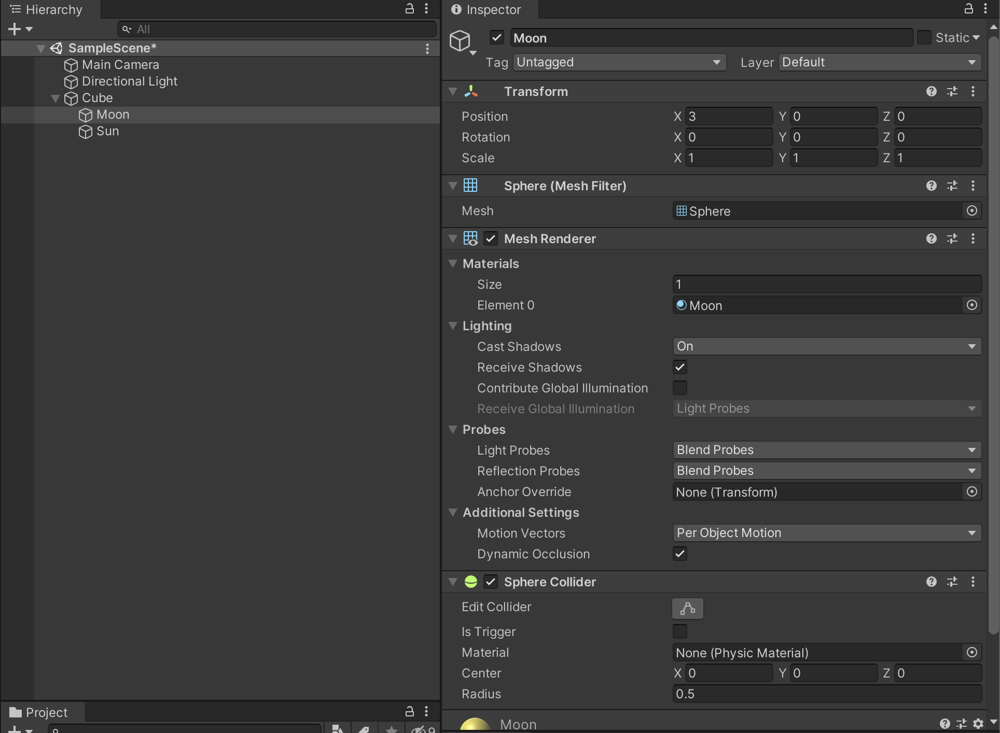

# 평행이동과 좌표계 + 부모 자식 관계

1. Mover.cs 스크립트를 새로 생성한다.
2. Cube 오브젝트를 생성해서 Mover 스크립트를 드래그 앤 드롭해서 컴포넌트 추가한다.

## 이동시키기 코드 예시

```c#
using System.Collections;
using System.Collections.Generic;
using UnityEngine;

public class Mover : MonoBehaviour
{
    public Vector3 move = new Vector3(-5, 5, -5);
    // Start is called before the first frame update
    void Start()
    {
        transform.position = new Vector3(1, 0, 0);
        transform.position = transform.position + move; // (-4, 5, -5) 로 이동하게 됨
    }

    // Update is called once per frame
    void Update()
    {
        
    }
}
```

```c#
using System.Collections;
using System.Collections.Generic;
using UnityEngine;

public class Mover : MonoBehaviour
{
    public Vector3 move = new Vector3(-5, 5, -5);
    // Start is called before the first frame update
    void Start()
    {
        transform.position = new Vector3(1, 0, 0);
        transform.Translate(move); // (-4, 5, -5) 로 이동하게 됨
    }

    // Update is called once per frame
    void Update()
    {
        
    }
}
```

```c#
using System.Collections;
using System.Collections.Generic;
using UnityEngine;

public class Mover : MonoBehaviour
{
    public Vector3 move = new Vector3(-5, 5, -5);

    // Update is called once per frame
    void Update()
    {
        if(Input.GetKey(KeyCode.Space)) // 스페이스 키를 누르면 이동
        {
            Move();
        }
        
    }

    void Move()
    {
        transform.Translate(move * Time.deltaTime);
    }
}
```

## Translate 이동은 local space 기준

- 기본적으로는 local space 기준으로 평행이동 함

- 추가 옵션을 줘서 어느 공간을 기준으로 평행 이동할지 기준을 정할 수 있음

  ```c#
  using System.Collections;
  using System.Collections.Generic;
  using UnityEngine;
  
  public class Mover : MonoBehaviour
  {
      public Vector3 move = new Vector3(-5, 5, -5);
  
      // Update is called once per frame
      void Update()
      {
          if(Input.GetKey(KeyCode.Space))
          {
              Move();
          }
          
      }
  
      void Move()
      {
          // transform.Translate(move * Time.deltaTime, Space.Self); // 자기 기준으로 이동
          transform.Translate(move * Time.deltaTime, Space.World); // 월드 기준으로 이동
      }
  }
  ```

## Transform 의 좌표는 상대적이다



- Sun 과 Moon 은 Cube 오브젝트의 하위 오브젝트이다.
- Moon 의 Position: 3, 0, 0
- Sun 의 Position: 0, 3, 0
- Sun 이나 Moon 을 Cube 하위에서 떼어내서 Transform 을 보면 Position 값이 달라지는 것을 알 수 있다.
- 즉, Transform 의 값은 상위 오브젝트와의 상대적 위치이다.
  - Rotation 과 Scale 역시 마찬가지로 상대적이다.

## transform 속성의 local 과 global 구분

```c#
using System.Collections;
using System.Collections.Generic;
using UnityEngine;

public class Setposition : MonoBehaviour
{
    // Start is called before the first frame update
    void Start()
    {
        transform.position = new Vector3(0, 0, 0); // global position 기준으로 이동
        transform.localPosition = new Vector3(0, 0, 0); // local position 기준으로 이동

        // transform.rotation
        // transform.localRotation

        // transform.localScale = new Vector3(1, 1, 1); // local scale 기준
        // transform.lossyScale = new Vector3(1, 1, 1); // global scale 기준
    }

    // Update is called once per frame
    void Update()
    {
        
    }
}

```

