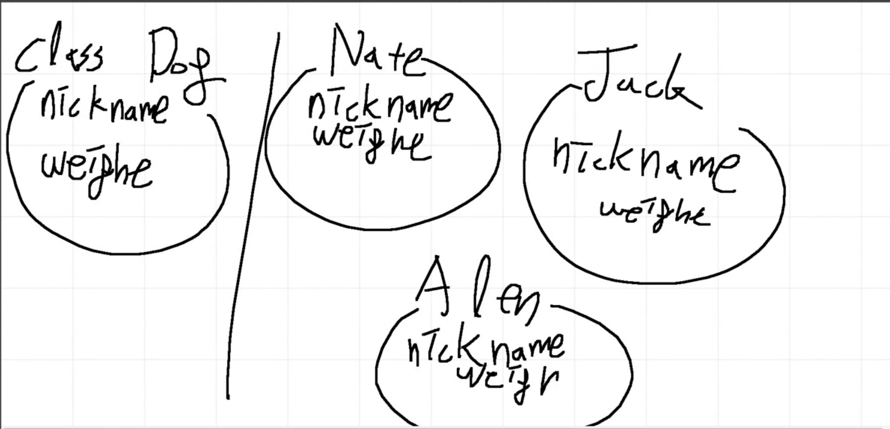
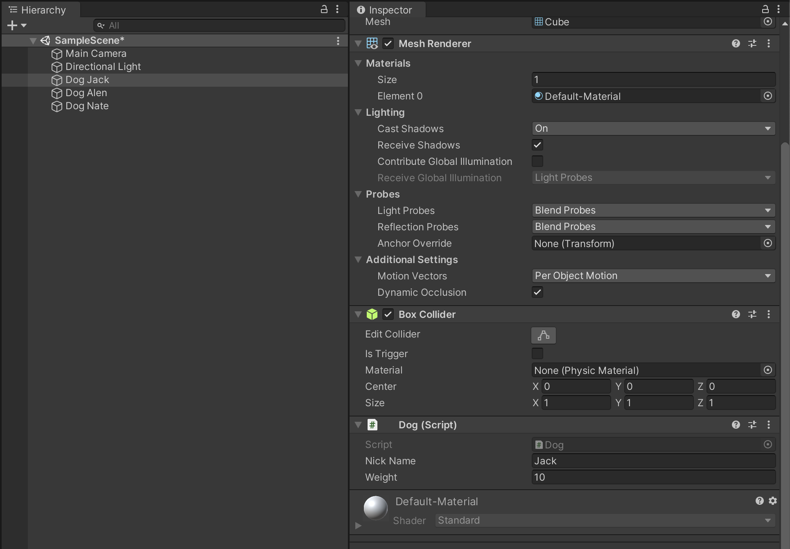
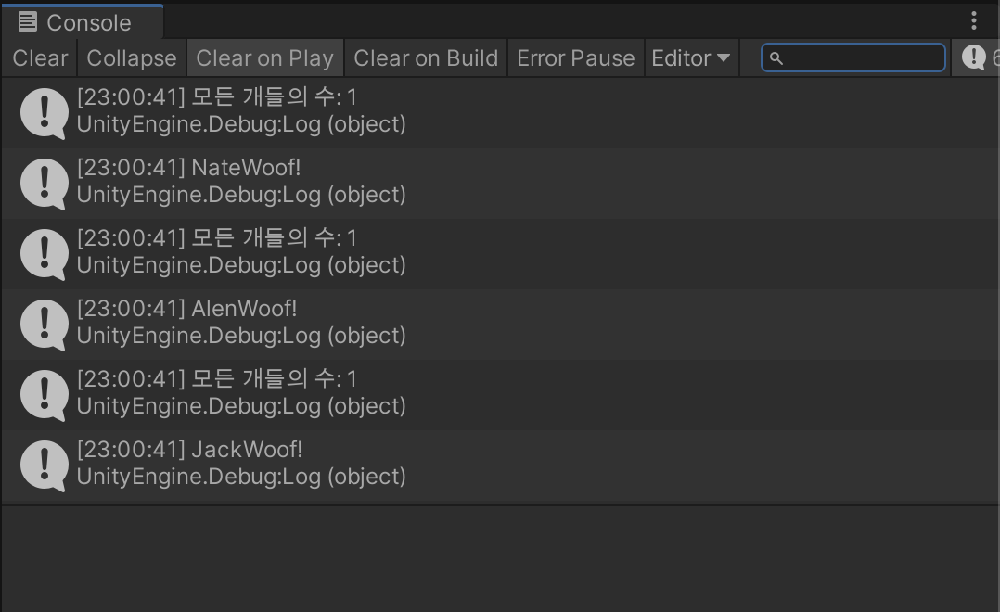
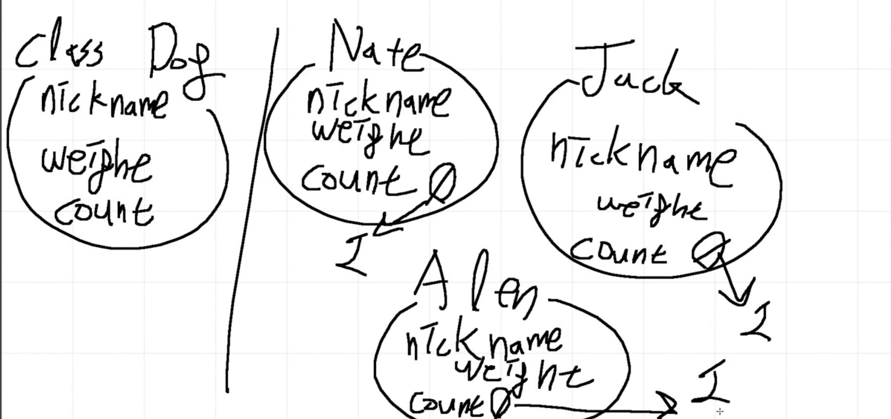
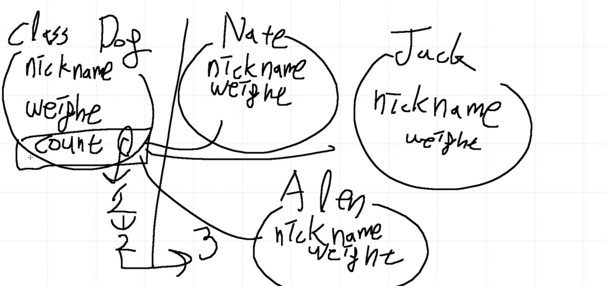

# 정적 변수 + 정적 함수

## 원래 알고 있던 클래스의 개념



```c#
using System.Collections;
using System.Collections.Generic;
using UnityEngine;

public class Dog : MonoBehaviour
{
    public string nickName;
    public float weight;
    public void Bark()
    {
        Debug.Log(nickName + "Woof!");
    }
}

```



## 모든 Dog 의 갯수를 세고 싶다면?

### 첫 시도 (잘못된 방법)

```c#
using System.Collections;
using System.Collections.Generic;
using UnityEngine;

public class Dog : MonoBehaviour
{
    public string nickName;
    public float weight;
    public int count = 0;
    void Awake()
    {
        count = count + 1;
    }
    void Start()
    {
        Bark();
    }
    public void Bark()
    {
        Debug.Log("모든 개들의 수: " + count);
        Debug.Log(nickName + "Woof!");
    }
}

```



 

>  count 를 개별 오브젝트에 할당하는 방식으로는 동물의 갯수를 셀 수 없다!

### 두번째 시도 (올바른 해결법)

- count 라는 변수는 모든 오브젝트들이 공유해야 한다!
  - -> Static 이라는 개념의 도입

- 모든 개별 object 가 단 하나의 count 를 공유
- 클래스 상의 static 변수 count 는 실재함
- static 은 dynamic 의 반대 개념

```c#
using System.Collections;
using System.Collections.Generic;
using UnityEngine;

public class Dog : MonoBehaviour
{
    public string nickName;
    public float weight;
    public static int count = 0;
    void Awake()
    {
        count = count + 1;
    }
    void Start()
    {
        Bark();
    }
    public void Bark()
    {
        Debug.Log("모든 개들의 수: " + count);
        Debug.Log(nickName + "Woof!");
    }
}

```



## Static 을 함수에 적용

```c#
using System.Collections;
using System.Collections.Generic;
using UnityEngine;

public class Dog : MonoBehaviour
{
    public string nickName;
    public float weight;
    public static int count = 0;
    void Awake()
    {
        count = count + 1;
    }
    void Start()
    {
        Bark();
    }
    public void Bark()
    {
        Debug.Log("모든 개들의 수: " + count);
        Debug.Log(nickName + "Woof!");
    }

    public static void ShowAnimalType()
    {
        Debug.Log("모두 개입니다.");
    }
}

```

- static 은 개별적으로 존재하기 때문에 개별 object 를 거치지 않고 사용 가능하다.

```c#
using System.Collections;
using System.Collections.Generic;
using UnityEngine;

public class Test : MonoBehaviour
{
    // Start is called before the first frame update
    void Start()
    {
        Debug.Log("모든 개들의 수: " + Dog.count);
        Dog.ShowAnimalType();
        // allen.ShowAnimalType(); // 틀린 예
    }
}

```

