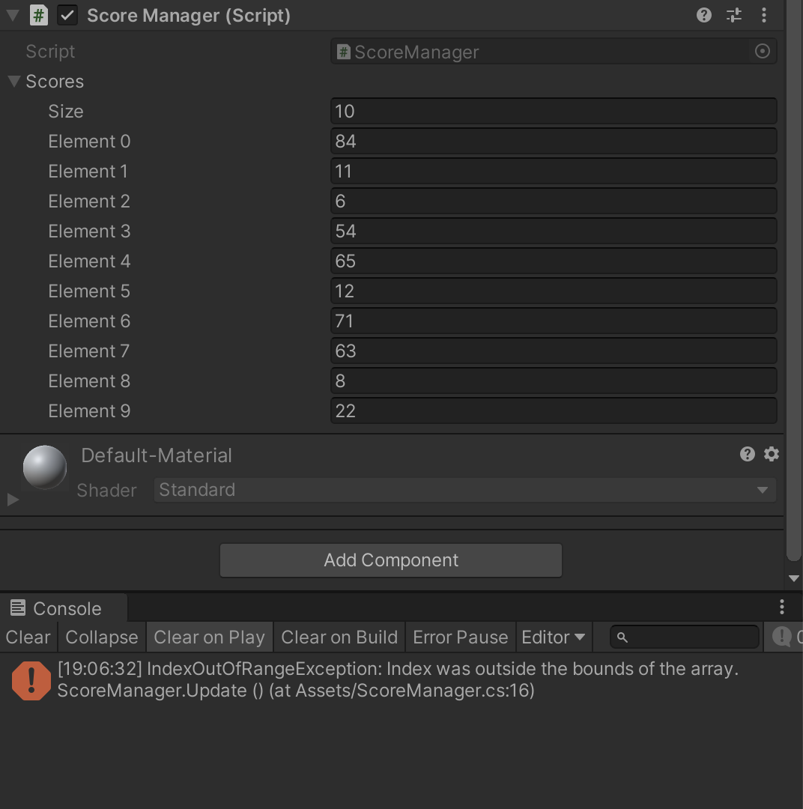

# 리스트

## 리스트란?

### 리스트와 배열의 차이

리스트는 배열과 비슷하게 여러 오브젝트를 한번에 다룰 수 있게 한다.

그러나 크기가 고정되어있는 배열과는 다르게 실시간으로 그 크기를 조절하여 사용할 수 있다.

### 리스트가 필요한 상황은 언제일까?

> 큐브를 클릭할때마다 새로운 랜덤 값을 생성해서 순서대로 저장하는 것을 만든다고 해 보자

- 배열을 이용했을 때

  ```c#
  using System.Collections;
  using System.Collections.Generic;
  using UnityEngine;
  
  public class ScoreManager : MonoBehaviour
  {
      public int[] scores = new int[10];
      private int index = 0;
  
  
      // Update is called once per frame
      void Update()
      {
          if (Input.GetMouseButtonDown(0))
          {
              scores[index] = Random.Range(0, 100);
              index++;
          }
      }
  }
  
  ```

  

  - 처음 지정된 배열의 크기인 10을 넘어가게 되면 에러가 발생한다
  - 배열의 크기의 제약을 받지 않고 원할 때 원하는 만큼의 숫자를 받고 싶다면 어떻게 해야 할까?

- 리스트를 사용했을 때

  ```c#
  using System.Collections;
  using System.Collections.Generic;
  using UnityEngine;
  
  public class ScoreManager : MonoBehaviour
  {
      public List<int> scores = new List<int>();
  
      // Update is called once per frame
      void Update()
      {
          if (Input.GetMouseButtonDown(0)) // 자유롭게 추가
          {
              int randomNumber = Random.Range(0, 100);
              scores.Add(randomNumber);
          }
  
          if (Input.GetMouseButtonDown(1)) // 삭제도 가능
          {
              scores.RemoveAt(3);
          }
      }
  }
  
  
  ```

  - 자유롭게 실시간으로 추가, 삭제가 가능함