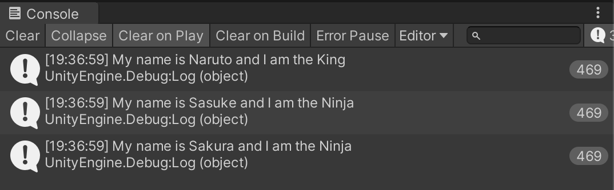
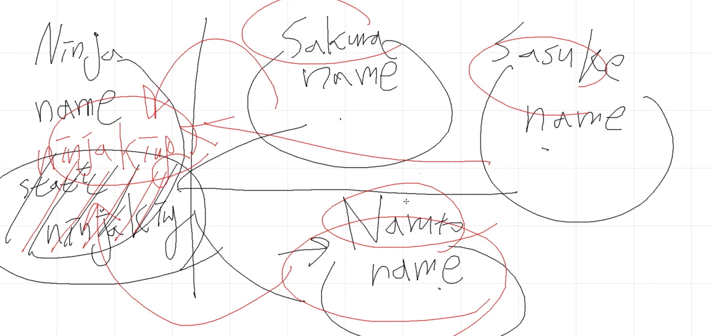
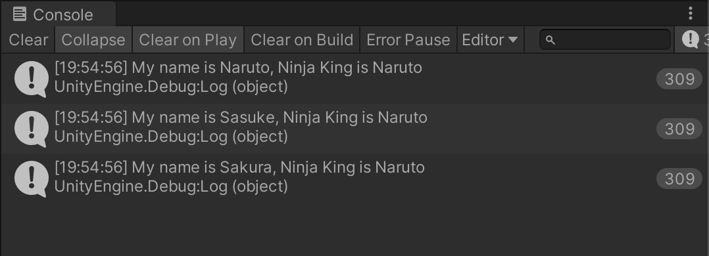

# 싱글톤

싱글톤이라는 디자인패턴에 대해 알아본다.

### 디자인 패턴이란?

- 프로그래머들 사이에서 공유되는 코드를 작성하는 패턴

## 예시

- 닌자마을에 있는 모든 닌자들이 동시에 접근할 수 있는 유일한 닌자왕을 만들고 싶다.
- 세 명의 닌자가 있다. Naruto, Sakura, Sasuke
  - Cube 오브젝트를 생성해 각각 Naruto, Sakura, Sasuke 로 만든다.
  - 그 중 닌자 king 은 Naruto 이다.

### 첫 시도

```c#
using System.Collections;
using System.Collections.Generic;
using UnityEngine;

public class Ninja : MonoBehaviour
{
    public string ninjaName;
    public bool isKing;

    void Update()
    {
        Debug.Log("My name is " + ninjaName + " and I am the " + (isKing ? "King" : "Ninja"));
    }
}

```



세 명의 닌자 모두 자신의 이름과 자신이 그냥 닌자인지 닌자킹인지 안다.

그러나 누가 닌자킹인지 다른 닌자가 알기는 힘들다.

다른 닌자들이 닌자킹을 찾기 위해서는 다른 모든 닌자들에 접근해서 isKing 이라는 변수를 확인해야만 한다.

### 두번째 시도 (싱글톤의 개념)

- 닌자킹의 왕좌(공간)를 따로 만들어 놓고 거기에 나루토를 넣어둔다.



- 이제부터는 사쿠라와 사스케가 닌자킹을 찾아서 이리저리 누가 닌자킹인지 물어보고 다니지 않아도 된다. 이제는 바로 닌자킹의 자리로 가면 그곳에 나루토가 앉아있는것을 볼 수 있다.

```c#
using System.Collections;
using System.Collections.Generic;
using UnityEngine;

public class Ninja : MonoBehaviour
{
    public static Ninja ninjaKing;
    public string ninjaName;
    public bool isKing;


    void Start()
    {
        if (isKing)
        {
            ninjaKing = this;
        }
    }

    void Update()
    {
        Debug.Log("My name is " + ninjaName + ", Ninja King is " + ninjaKing.ninjaName);
    }
}

```



## 본격적인 싱글톤의 사용

- Score 가 게임상의 점수라고 생각해 보자.
- 어떤 몬스터를 잡으면 점수가 오르고 어떤 몬스터를 잡으면 점수가 떨어진다.
- 그러한 몬스터들이 수십 수백마리가 있을것이다.
- 일일히 Score Manager 를 드래그 앤 드롭 해서 적용할 수 없다.
- 이럴 때 Score Manager 는 단 한개의 유일하면서도 모두가 접근해야 하는 것임을 알 수 있다.
- 이럴 때 다음과 같이 싱글톤을 사용한다.

### 원시적인 형태의 구현

```c#
using System.Collections;
using System.Collections.Generic;
using UnityEngine;

public class ScoreManager : MonoBehaviour
{
    public static ScoreManager instance;
    private int score = 0;

    void Awake()
    {
        instance = this;
    }
    public int GetScore()
    {
        return score;
    }

    public void AddScore(int amount)
    {
        score += amount;
    }

}

```

```c#
using System.Collections;
using System.Collections.Generic;
using UnityEngine;

public class ScoreAdder : MonoBehaviour
{
    void Update()
    {
        if (Input.GetMouseButtonDown(0))
        {
            ScoreManager.instance.AddScore(5);
            Debug.Log(ScoreManager.instance.GetScore());
        }
    }
}

```

```c#
using System.Collections;
using System.Collections.Generic;
using UnityEngine;

public class ScoreSubstractor : MonoBehaviour
{
    void Update()
    {
        if (Input.GetMouseButtonDown(1))
        {
            ScoreManager.instance.AddScore(-2);
            Debug.Log(ScoreManager.instance.GetScore());
        }
    }
}

```

### 좀 더 나은 구현

```c#
using System.Collections;
using System.Collections.Generic;
using UnityEngine;

public class ScoreManager : MonoBehaviour
{
    public static ScoreManager GetInstance()
    {
        if (instance == null)
        {
            instance = FindObjectOfType<ScoreManager>();

            if (instance == null)
            {
                GameObject container = new GameObject("Score Manager");
                instance = container.AddComponent<ScoreManager>();
            }
        }
        return instance;
    }
    private static ScoreManager instance;
    private int score = 0;
    public int GetScore()
    {
        return score;
    }

    public void AddScore(int amount)
    {
        score += amount;
    }

}

```

```c#
using System.Collections;
using System.Collections.Generic;
using UnityEngine;

public class ScoreAdder : MonoBehaviour
{
    void Update()
    {
        if (Input.GetMouseButtonDown(0))
        {
            ScoreManager.GetInstance().AddScore(5);
            Debug.Log(ScoreManager.GetInstance().GetScore());
        }
    }
}

```

```c#
using System.Collections;
using System.Collections.Generic;
using UnityEngine;

public class ScoreSubstractor : MonoBehaviour
{
    void Update()
    {
        if (Input.GetMouseButtonDown(1))
        {
            ScoreManager.GetInstance().AddScore(-2);
            Debug.Log(ScoreManager.GetInstance().GetScore());
        }
    }
}

```

