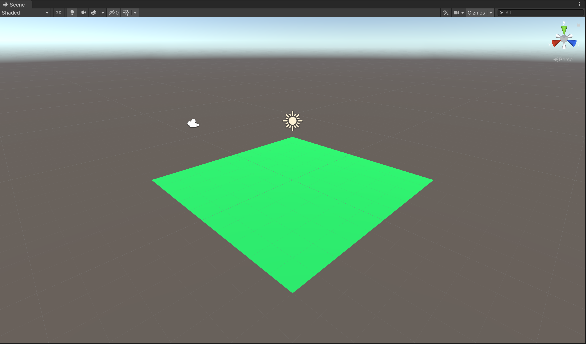

# 게임 제작: 소코반(창고지기)

## 초기 씬 구성

1. `cmd+shift+s` 를 눌러 씬을 저장한다. (`Main` 이라는 이름으로)

2. Hierarchy 창에서 3D Object -> Plane 을 추가한다

3. Plane 오브젝트의 Position 이 0,0,0 이 맞는지 확인하다.

   - 만약 포지션이 0,0,0 이 아니라면, `...` 버튼 -> `Reset`  버튼을 눌러 위치를 리셋한다.

4. 바닥(Plane)에 색깔을 주기 위해서 Project 창 빈공간에 `마우스 우클릭` -> `Create` -> `Material` , 생성된 Material 의 이름을 `Plane` 으로 바꿔준다.

   - Material 은 쉐이더와 텍스처가 합쳐진 것 이라고 생각하면 된다.

5. 4번에서 생성한 Plane 이라는 이름의 Material 을 클릭해서 Inspector 창에서 색을 바꿔준다. (적당한 색으로)

6. `Smoothness` 는 물체가 반들반들한 정도를 나타낸다. 우리는 너무 사실적인 것은 원하지 않기 때문에 `Smoothness` 를 0으로 줄여 플라스틱 같은 질감으로 만든다.

7. 이제 Project 창에서 4번 에서 생성한 Plane 을 Scence창 상의 Plane에 드래그 드롭해서 색과 질감을 적용한다.

8. 이제 플레이어를 만들 차례이다. Hierarchy 창에서 빈공간에 `마우스 우클릭` -> `3D Object` -> `Sphere` 를 선택

9. Hierarchy 창에서 `엔터 키` 를 눌러 이름을 Player 로 바꿔준다. (윈도우는 `F2 키`) 

10. Player 가 반쯤 바닥에 묻혀 있는 것을 볼 수 있다. Plane 의 Position의 Y축을 -0.5 해서 반칸 내려준다.

11. 이제 Player 를 조작할 수 있게 만들어야 한다. 물리를 적용하기 위해 Player 오브젝트에 `Add Component` -> `Physics` -> `Rigidbody`

    - Rigidbody 에 우리가 어떤 힘을 받아라 라고 명령을 내린다면, 이제 Player 는 영향을 받을 것이다.

12. Project 창에서 새로운 C# 스크립트를 만들고 파일 이름을 `Player` 로 바꾼다. 꼭 첫 글자는 대문자로 해야 한다.

    - **Camel 명명법** 을 사용한다. (지키지 않는다고 오류가 나는것은 아니지만, 개발자들 사이의 암묵적 약속임)
      - 클래스 이름은 반드시 대문자로 시작
      - 단어와 단어 사이는 대문자로 시작
      - 변수는 소문자로 시작
      - 함수는 대문자로 시작

    ```c#
    using System.Collections;
    using System.Collections.Generic;
    using UnityEngine;
    
    public class Player : MonoBehaviour
    {
        public float speed = 10f;
        public Rigidbody playerRigidbody; // 실제 존재하는 Rigidbody 를 가져다가 playerRigidbody 라는 이름을 붙여 사용
        // Start is called before the first frame update
        void Start()
        {
            
        }
    
        // Update is called once per frame
        void Update()
        {
            
        }
    }
    
    ```

13. 만든 Player 스크립트를 Hierachy 창의 Player 오브젝트에 드래그 앤 드롭 해서 붙인다.

14. Player 오브젝트의 Inspector 창에서 Player(Script) 를 확인 할 수 있다. 

15. Speed 는 10으로 할당되어 있으나, Player Rigidbody 는 할당되어 있지 않다. 위의 Rigidbody 를 드래그앤 드롭해서 끌어와서 연결시킨다.

16. ```c#
    using System.Collections;
    using System.Collections.Generic;
    using UnityEngine;
    
    public class Player : MonoBehaviour
    {
        public float speed = 10f;
        public Rigidbody playerRigidbody; // 실제 존재하는 Rigidbody 를 가져다가 playerRigidbody 라는 이름을 붙여 사용
        // Start is called before the first frame update
        void Start()
        {
            playerRigidbody.AddForce(0, 1000, 0); // 게임이 시작되었을 때 위 방향으로 1000만큼 힘을 준다.
        }
    
        // Update is called once per frame
        void Update()
        {
            
        }
    }
    
    ```

17. 16번의 코드로 Player.cs 스크립트를 바꿔 저장하고, 플레이 버튼을 눌러보면 플레이어 오브젝트가 위로 뛰는 것을 확인 할 수 있다.


