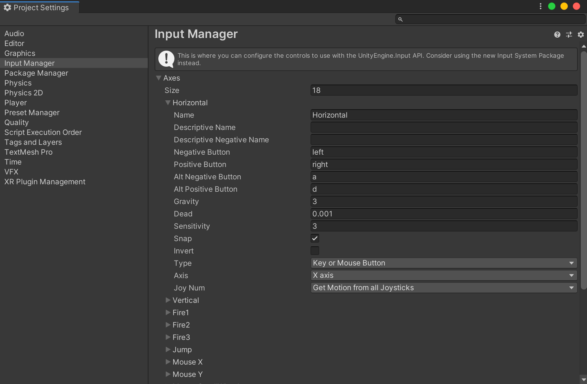
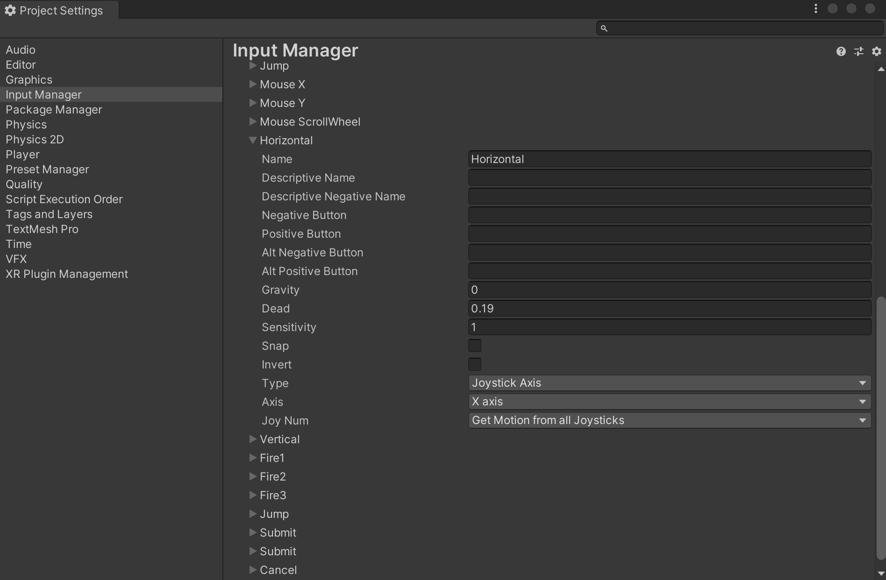

# 플레이어 조작

## 기본적인 wasd 키 입력 구현

```c#
using System.Collections;
using System.Collections.Generic;
using UnityEngine;

public class Player : MonoBehaviour
{
    public float speed = 10f;
    public Rigidbody playerRigidbody; // 실제 존재하는 Rigidbody 를 가져다가 playerRigidbody 라는 이름을 붙여 사용
    // Start is called before the first frame update
    void Start() // 게임이 처음 시작되었을때 한번 실행됨
    {
        
    }

    // Update is called once per frame
    // 영화: 초당 24프레임, 모바일게임: 초당 30프레임, PC게임: 초당 60프레임, 콘솔게임: 초당 30프레임
    // 대략 1초에 60번 실행됨. 단, 컴퓨터 사양에 따라 다르다.
    // 즉, 1초에 몇 번 실행되는지 정해져 있지는 않다.
    void Update() // 화면이 한번 깜빡일 때 마다 한번씩 실행됨
    {
        // 유저입력을 넣자.
        // Input 함수는 다양한 인풋(키보드, 조이스틱 등등)을 받는다.
        // 그 중 GetKey 함수는 키보드 입력을 받는데 해당 키 입력이 확인되면 true 를 반환하고 아니라면 false 를 반환한다.
        if (Input.GetKey(KeyCode.W))
        {
            playerRigidbody.AddForce(0, 0, speed);
        }
        if (Input.GetKey(KeyCode.A))
        {
            playerRigidbody.AddForce(-speed, 0, 0);
        }
        if (Input.GetKey(KeyCode.S))
        {
            playerRigidbody.AddForce(0, 0, -speed);
        }
        if (Input.GetKey(KeyCode.D))
        {
            playerRigidbody.AddForce(speed, 0, 0);
        }
        
    }
}

```

## 키 입력 개선

### 불만사항

- 키 입력을 일일히 `KeyCode.W` 이런식으로 매번 키를 명시하고 싶지 않다.
- 꼭 4가지 케이스로 나눠서 입력을 받아야 할까?

### 해결법

- `Input.GetAxis` 는 `-1` ~ `+1` 의 값을 반환
  - 왜 -1, +1 따로 받거나, true false 로 받지 않고 -1 ~ +1 의 범위값을 반환할까?
    - 조이스틱과 같은 아날로그 입력 때문에 중간값이 필요하기 때문.
- 직접 키보드 입력을 받는것이 아닌, 중간에 한번 거쳐서 한다.

​        예시)

​        `발사 기능` - `"Fire"` - `마우스 왼쪽 버튼`

​        `앉는 기능` - `"Crunch"` - `키보드 C`

​        `점프 기능` - `"Jump"` - `키보드 F`


​        `"Horizontal"` -> 키보드 수평방향에 대응되는 키가 맵핑되어 있음 (유니티에서 기본적으로)*

​        `<-` `->`

​        `A`  `D`

### 참고

유니티 상에서 `Edit` -> `Project Settings` -> `Input Manager` 에 들어가면 할당된 키를 확인할 수 있다.



자세히 보면 Horizontal 이 하나 더 있는 것을 확인 할 수 있다.



조이스틱이 감지되면 자동으로 이쪽으로 적용된다.

따라서 `Input.GetAxis("Horizontal")` 을 사용하면 자동으로 키보드, 조이스틱에 모두 대응할 수 있다.

### 코드

```c#
using System.Collections;
using System.Collections.Generic;
using UnityEngine;

public class Player : MonoBehaviour
{
    public float speed = 10f;
    public Rigidbody playerRigidbody;
    // Start is called before the first frame update
    void Start() // 게임이 처음 시작되었을때 한번 실행됨
    {
        
    }

    // Update is called once per frame
    void Update() // 화면이 한번 깜빡일 때 마다 한번씩 실행됨
    {
        // 유저입력을 넣자.
        float inputX = Input.GetAxis("Horizontal");
        float inputZ = Input.GetAxis("Vertical");

        playerRigidbody.AddForce(inputX * speed, 0, inputZ * speed);
    }
}

```

## 조작의 편의성

위 코드대로 조작을 해 보면, 관성이 느껴져서 조작이 어려운 것을 알 수 있다.

이는 속도를 조작하는 것이 아닌, 가하는 힘을 조작하는 방식이기 때문이다.

따라서 힘을 통해서 속도를 조작하는 방식이 아닌 바로 속도를 조작하는 방식으로 바꾼다.

```c#
using System.Collections;
using System.Collections.Generic;
using UnityEngine;

public class Player : MonoBehaviour
{
    public float speed = 10f;
    public Rigidbody playerRigidbody; // 실제 존재하는 Rigidbody 를 가져다가 playerRigidbody 라는 이름을 붙여 사용
    // Start is called before the first frame update
    void Start() // 게임이 처음 시작되었을때 한번 실행됨
    {
        
    }

    // Update is called once per frame
    // 영화: 초당 24프레임, 모바일게임: 초당 30프레임, PC게임: 초당 60프레임, 콘솔게임: 초당 30프레임
    // 대략 1초에 60번 실행됨. 단, 컴퓨터 사양에 따라 다르다.
    // 즉, 1초에 몇 번 실행되는지 정해져 있지는 않다.
    void Update() // 화면이 한번 깜빡일 때 마다 한번씩 실행됨
    {
        // 유저입력을 넣자.
        float inputX = Input.GetAxis("Horizontal");
        float inputZ = Input.GetAxis("Vertical");

        Vector3 velocity = new Vector3(inputX, 0, inputZ);
        velocity = velocity * speed;
        playerRigidbody.velocity = velocity;
    }
}

```

Vecter3 에 대해서는 추후 다룬다.

## 또 다른 문제점

플레이어를 낭떨어지로 떨어뜨리면 원래 의도와 다르게 천천히 떨어지는 것을 볼 수 있다.

이는, Update() 에서 매 프레임 마다 Y축 velocity 값을 (속도값을) 0으로 덮어씌우고 있기 때문이다.

```c#
using System.Collections;
using System.Collections.Generic;
using UnityEngine;

public class Player : MonoBehaviour
{
    public float speed = 10f;
    public Rigidbody playerRigidbody; // 실제 존재하는 Rigidbody 를 가져다가 playerRigidbody 라는 이름을 붙여 사용
    // Start is called before the first frame update
    void Start() // 게임이 처음 시작되었을때 한번 실행됨
    {
        
    }

    // Update is called once per frame
    // 영화: 초당 24프레임, 모바일게임: 초당 30프레임, PC게임: 초당 60프레임, 콘솔게임: 초당 30프레임
    // 대략 1초에 60번 실행됨. 단, 컴퓨터 사양에 따라 다르다.
    // 즉, 1초에 몇 번 실행되는지 정해져 있지는 않다.
    void Update() // 화면이 한번 깜빡일 때 마다 한번씩 실행됨
    {
        // 유저입력을 넣자.
        float inputX = Input.GetAxis("Horizontal");
        float inputZ = Input.GetAxis("Vertical");
        float fallSpeed = playerRigidbody.velocity.y;

        Vector3 velocity = new Vector3(inputX, 0, inputZ);
        velocity = velocity * speed;

        velocity.y = fallSpeed; // Y축 velocity 값을 원래 적용되었어야 할 원래 중력값으로 덮어쓰기 해 줌

        playerRigidbody.velocity = velocity;
    }
}

```

## 마지막 문제점

Player 의 Inspector 창을 보면 Player(Script) 의 Speed 값을 마음대로 수정 가능하다.

또한 아까 드래그 앤 드롭 했던 Rigidbody 를 다른 것을 누군가가 드래그 앤 드롭을 실수해서 다른 값을 넣어버릴 수도 있다.

프로그래머 이외의 기획자나 다른 사람이 마음대로 값을 수정하다가 게임이 터질 수 있다.

speed 가 public 으로 되어 있기 때문에 이 문제가 발생하는 것이다.

```c#
using System.Collections;
using System.Collections.Generic;
using UnityEngine;

public class Player : MonoBehaviour
{
    private float speed = 10f;
    private Rigidbody playerRigidbody; // 실제 존재하는 Rigidbody 를 가져다가 playerRigidbody 라는 이름을 붙여 사용
    // Start is called before the first frame update
    void Start() // 게임이 처음 시작되었을때 한번 실행됨
    {
        playerRigidbody = GetComponent<Rigidbody>(); // 제네릭 문법
    }

    // Update is called once per frame
    // 영화: 초당 24프레임, 모바일게임: 초당 30프레임, PC게임: 초당 60프레임, 콘솔게임: 초당 30프레임
    // 대략 1초에 60번 실행됨. 단, 컴퓨터 사양에 따라 다르다.
    // 즉, 1초에 몇 번 실행되는지 정해져 있지는 않다.
    void Update() // 화면이 한번 깜빡일 때 마다 한번씩 실행됨
    {
        // 유저입력을 넣자.
        float inputX = Input.GetAxis("Horizontal");
        float inputZ = Input.GetAxis("Vertical");
        float fallSpeed = playerRigidbody.velocity.y;

        Vector3 velocity = new Vector3(inputX, 0, inputZ);
        velocity = velocity * speed;

        velocity.y = fallSpeed; // Y축 velocity 값을 원래 적용되었어야 할 원래 중력값으로 덮어쓰기 해 줌

        playerRigidbody.velocity = velocity;
    }
}

```

