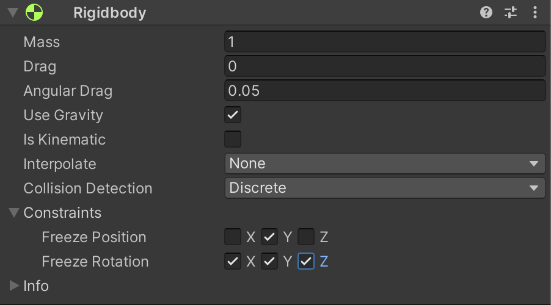

# 레벨 디자인

## 맵 구성

- cube 오브젝트를 생성해 위와 같은 맵을 만들어 준다.
- `cmd` + `D` 키를 이용해 오브젝트를 복사할 수 있다.
- Cube 의 길이와 위치를 조정해 가며 벽을 만든다.
- 세로 벽은 Vertical Wall, 가로 벽은 Horizontal Wall 로 명명해 사용한다.
- `cmd` 키를 누른채로 마우스로 위치를 조정하면 0.25 단위로 끊어지게 이동할 수 있다.
- 벽을 다 만들었다면 마지막으로 Player 의 위치를 벽에 충돌하지 않게 Z축방향으로 -0.5 이동시킨다.

## Heirachy 정리

위 지시대로 맵을 만들었다면 많은 가로벽과 세로벽이 있을 것이다.

이를 정리 할 수 있는 방법이 있다.

1. Hierarchy 창에서 `마우스 우클릭` -> `Create Empty`
2. 생성된 게임 오브젝트의 이름을 `Level` 로 명명한다.
3. `Level` 오브젝트의 Position 을 `...` -> `Reset` 해서 0, 0, 0 으로 설정한다.
4. 모든 벽 오브젝트들을 다중선택해 `Level` 에 드래그 앤 드롭한다.
5. `Level` 하위에 모든 벽 오브젝트들이 들어가게 된다  

## 박스 생성

1. 새로운 3D object cube 를 생성하고 이름을 ItemBox 로 명명한다.
2. 적당한 곳으로 위치를 옮긴다.
3. 밀어서 이동시킬 박스 이므로 끼지 않도록 크기를 `1, 1, 1` 에서 `0.9, 0.9, 0.9` 로 조정해 준다.
4. 플레이어가 밀어서 이동시키려면 물리 법칙을 적용받아야 하므로, `Add Component` -> `Physics` -> `Rigidbody` 를 해 준다.
5. 테스트 플레이를 해 보면 플레이어가 밀면 밀리는 것을 확인할 수 있다.
6. 마지막으로 Project 창에서 `마우스 우클릭` -> `Create` -> `Material` , 이름을 ItemBox 로 명명
7. 컬러를 적당한 색으로 설정하고 `ItemBox` 오브젝트로 드래그 앤 드롭 해서 색을 입힌다.

## 카메라 조정

메인 카메라 위치를 조정해서 적당한 게임 뷰가 나오도록 한다.

위 수치는 참고용으로서, 적당한 뷰가 나오면 무슨 값이든 딱히 상관없다.

## 배경의 빈 영역에 대해

만들어진 맵 바깥으로 빈 공간이 보인다.

이런 빈 영역을 카메라가 비출 때, 어떤 색으로 카메라에 표시가 될지 기본 설정 값이 있다.

기본값은 Skybox 인데 이는 빈 공간을 하늘처럼 채워준다.

그러나 이 게임에서는 하늘이 보이는 것은 이상하므로, Solid Color 로 변경해 준다.

그 후 아래의 Background 부분을 클릭해 색상을 원하는 색으로 바꿀 수도 있다.

예시로 하늘색으로 색상을 바꾸었다.

## ItemBox 가 회전해버리는 문제

플레이어가 ItemBox 의 모서리를 밀면 회전해 버리는 문제가 있다.

회전해버리면 정상적인 게임 진행이 어렵다.

Rigidbody 의 Constraints 를 이용하면 제한을 걸 수 있다.

### ItemBox 의 Rigidbody

이제 박스는 공중에 뜨거나 회전하지 않는다.

마찬가지로, Player 도 튕겨나가면서 공중에 점프되어서 맵 밖으로 나가거나 하는 일이 없게 제한을 걸어준다.

### Player 의 Rigidbody

## 프리펩 (Prefab)

> 프리펩은 재사용 가능한 미리 만들어진 에셋, 게임 오브젝트이다.

이제 많은 아이템박스를 만들어야 한다.

1. Hierarchy 창 에서 ItemBox 를 Project 창의 Assets 폴더 안으로 드래그 앤 드롭한다.
2. 이렇게 하면 프리펩이 만들어진다.
3. 이렇게 만들어진 ItemBox 프리펩을 다시 Hierarchy 창으로 드래그 앤 드롭해서 추가로 ItemBox 를 만든다.

## 골인 지점 표시

박스를 가져다 놓아야 할 구역, 골인 지점을 표시해야 한다.

1. 새로운 3D 오브젝트 Cube 를 생성한다.
2. 이름을 EndPoint 로 명명, Position 을 리셋해 준다.
3. 크기를 0.5, 0.5, 0.5 로 바꿔준다.
4. 위치를 오른쪽 위 (골인 지점)으로 옮겨준다. (Position 2.5, 0, 3.5)
5. Rotation 값을 조정해 다이아몬드 모양으로 보이도록 한다. (Rotation 60, 60, 60)
6. 색깔을 주기 위해 Project 창에서 새로운 Material 을 만들고 이름을 EndPoint 로 명명
7. 적당한 색을 준다. 예시로 노란색을 주겠다.
8. 드래그 앤 드롭해서 색을 적용한다.
9. 이렇게 만들어진 EndPoint 를 다시 Project 창으로 드래그 앤 드롭 해서 프리펩으로 만든다.
10. 프리펩을 이용해 추가로 2개의 EndPoint 를 만든다.

### Global 과 Local

우리는 이전에 EndPoint 를 회전시켜 다이아몬드 모양으로 만들었다.

따라서 Local 상태로 본다면 회전된 EndPoint 를 기준으로 이동축이 보이게 된다.

회전된 EndPoint 를 맵과 평행하게 이동시키기 위해서는 Global 을 사용하면 편리하게 맵전체를 기준으로 평행하게 이동할 수 있다.

## 테스트 및 수정

1. 테스트 플레이를 해 본다
2. 문제점이 보인다
   - 플레이어의 속도가 너무 빠르다.
     - Player 스크립트를 수정해 플레이어의 speed 값을 3 으로 조정한다.
   - EndPointer 를 통과할 수 없다.
     - EndPoint 프리펩의 Box Collider 의 `Is Trigger` 를 체크 한다
       - 프리펩에서 조정하면 해당 프리펩으로 찍어낸 모든 오브젝트에 동일 적용된다.
     - `Is Trigger` 를 체크하면 물리적으로 충돌하지는 않지만, 충돌감지는 여전히 할 수 있다.
   - 실제 원하는 플레이가 플레이 가능하도록 미세하게 박스 위치를 조정해 준다.

3. 마지막으로 플레이어의 색을 Material 을 이용해 바꿔준다.
4. `cmd` + `s` 를 눌러 저장한다.

