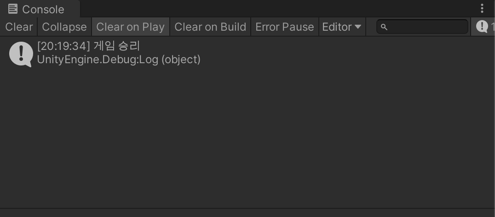

# 게임 매니저와 승리 조건

1. Project 창에서 새로운 C# 스크립트를 생성하고 이름은 GameManager 로 한다.

2. 이름을 GameManager 라고 하면 자동으로 아이콘 모양이 톱니바퀴 모양으로 바뀐다.

3. `ItemBox.cs` 스크립트를 수정해 충돌여부를 알려주는 변수를 추가한다.

   ```c#
   using System.Collections;
   using System.Collections.Generic;
   using UnityEngine;
   
   public class ItemBox : MonoBehaviour
   {
       public bool isOverlapped = false;
       private Renderer myRenderer;
       public Color touchColor;
       private Color originalColor;
       // Start is called before the first frame update
       void Start()
       {
           // GetComponent 를 이용해 자신이 가진 컴포넌트 중 Renderer 를 가져옴.
           myRenderer = GetComponent<Renderer>();
           originalColor = myRenderer.material.color; // 원래 컬러 백업
       }
   
       // Update is called once per frame
       void Update()
       {
           
       }
   
       void OnTriggerEnter(Collider other)
       {
           // EndPoint 이외에도 뚫고 지나갈 수 있는 collider 가 있을 수 있으므로 Tag 를 통해 필터링
           if (other.tag == "EndPoint")
           {
               isOverlapped = true;
               myRenderer.material.color = touchColor; // 충돌 시 색 변경
           }
       }
   
       void OnTriggerExit(Collider other)
       {
           if (other.tag == "EndPoint")
           {
               isOverlapped = false;
               myRenderer.material.color = originalColor; // 떨어질 때 원래 색으로 변경
           }
       }
   
       void OnTriggerStay(Collider other)
       {
           if (other.tag == "EndPoint")
           {
               isOverlapped = true;
               myRenderer.material.color = touchColor; // 충돌 시 색 변경
           }
       }
   }
   
   ```

4. Hierarchy 창에서 `마우스 우클릭` -> `Create Empty` 버튼을 눌러 빈 오브젝트를 생성한다

5. 해당 오브젝트의 이름을 GameManager 로 수정한다.

6. 1에서 만든 GameManager 스크립트를 5에서 만든 GameManager 오브젝트로 드래그 앤 드롭해서 추가한다.

7. ```c#
   using System.Collections;
   using System.Collections.Generic;
   using UnityEngine;
   
   public class GameManager : MonoBehaviour
   {
       public ItemBox[] itemBoxes;
       // Start is called before the first frame update
       void Start()
       {
           
       }
   
       // Update is called once per frame
       void Update()
       {
           
       }
   }
   ```

8. 7번과 같이 코드를 작성 후, GameManager 오브젝트의 Inspector 창에서 Item Boxes 를 다음과 같이 수정한다.

   1. Size 를 3으로 수정
   2. 생성된 3개의 Element 들에 각각의 ItemBox 오브젝트들을 드래그 앤 드롭

   

9. ```c#
   using System.Collections;
   using System.Collections.Generic;
   using UnityEngine;
   
   public class GameManager : MonoBehaviour
   {
       public ItemBox[] itemBoxes;
       public bool isGameOver;
       // Start is called before the first frame update
       void Start()
       {
           isGameOver = false;
       }
   
       // Update is called once per frame
       void Update()
       {
           if (isGameOver == true)
           {
               return;
           }
           
           int count = 0;
           for (int i = 0; i < 3; i++)
           {
               if (itemBoxes[i].isOverlapped == true)
               {
                   count++;
               }
           }
   
           if (count >= 3)
           {
               Debug.Log("게임 승리");
               isGameOver = true;
           }
       }
   }
   
   ```


