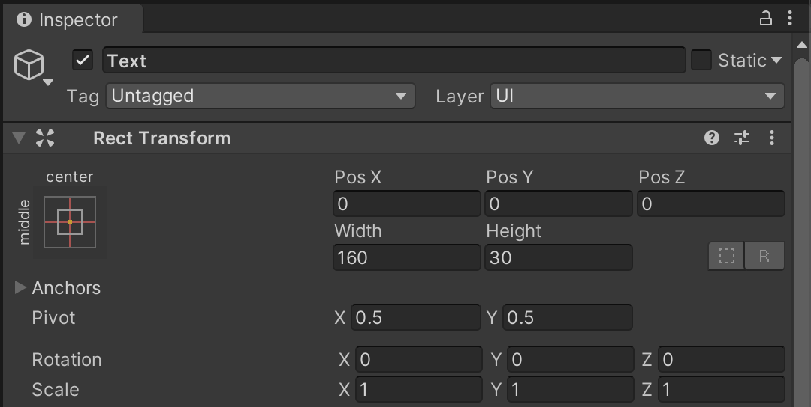
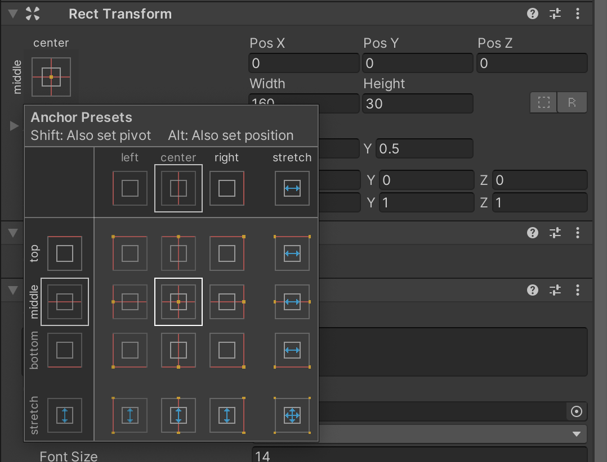
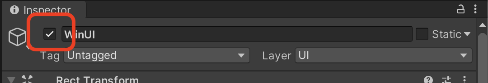
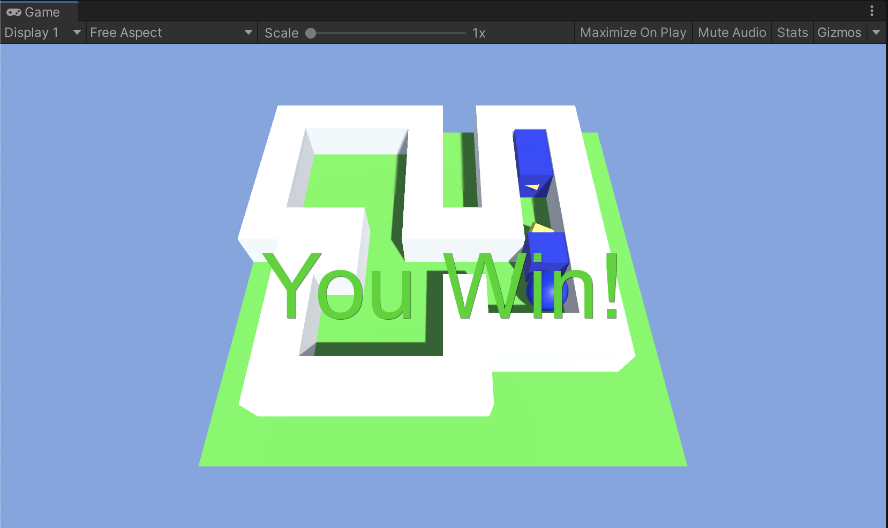

# 승리 UI 추가

## 승리 UI 제작

1. Hierarchy 빈공간에 `마우스 우클릭` -> `UI` -> `Text` 를 누른다

2. `Canvas` , `EventSystem` , `Text` 가 생성된다.

   - `Canvas` : UI를 위한 좌표계 역할, 게임 화면의 크기와 대응됨
   - `EventSystem` : 자동으로 UI 요소들에 유저입력을 전달해주는 역할 (건드릴 필요 없음)

3. Scence 창에서 2D 모드를 선택한다.

4. Text 의 위치를 Canvas 중앙에 놓고 싶다. 이를 위해 Text의 Inspector 창에서 Rect Transform 을 조정해야한다.

   

5. Rect Transform 에서 과녁모양 그림을 클릭하면 Anchor Presets 를 사용할 수 있다.

   - Anchor Presets 는 미리 정해진 프리셋을 가져다가 사용할 수 있게 하는 편의기능

   

6. `option` 혹은 `alt` 키를 누른 상태에서 선택하면 스내핑 옵션이 활성화된다.

7. `option` 키를 누른 상태에서 정중앙을 눌러 Text 를 정중앙에 위치시킨다.

8. 이제는 Text 오브젝트의 Inspector 창에서 아래쪽에 위치한 Text 컴포넌트를 수정할 것이다.

9. Text 내용을 "You Win!" 으로 수정하고 폰트 사이즈를 수정한다.

10. Paragraph 의 Horizontal Overflow 와 Vertical Overflow 를 Overflow 로 수정한다.

    - 글자의 크기가 글 상자를 넘어가면
      - Truncate: 글자가 잘린다
      - Overflow: 글상자를 벗어나도 표시 해 준다

11. Paragraph 의 Alignment 를 Center middle 로 해 준다.

12. Color 는 적당한 색 (eg. 초록색) 으로 변경

13. 그림자를 주기 위해 Add Component -> Shadow (검색기능으로 찾아서)

14. 이렇게 수정한 Text 오브젝트의 이름을 WinUI 로 바꿔준다.

15. 만약 폰트를 바꾸고 싶다면, 폰트 파일을 드래그 앤 드롭해서 Assets 폴더에 넣은 후, 다시 Project 창의Assets 폴더에서 WinUI 의 Text 영역의 Font 부분에 드래그 앤 드롭하면 적용 가능.

## 승리 UI 출력

1. GameManger.cs 파일을 연다.

2. `public GameObject winUI` 라인을 추가한다.

3. GameManager 오브젝트의 Inspector 창을 보면 Win UI 부분이 생겨 있다.

   - 해당 부분은 2번에서 우리가 만든 변수명에 맞춰 생성된다.
     - winUI -> Win UI (첫글자 대문자로, 띄어쓰기 자동 적용되어서)

4. 해당 부분으로 위에서 만든 WinUI 게임 오브젝트를 드래그 앤 드롭 한다.

5. GameManger.cs 파일을 연다.

   - 모든 게임 오브젝트들은 자기 자신을 껏다 켯다하는 기능이 내장되어 있다.
     - `SetActive()` : true 를 인자로 주면 활성화, false 를 넣으면 비활성화 (그림상의 체크박스와 대응된다)

6. ```c#
   using System.Collections;
   using System.Collections.Generic;
   using UnityEngine;
   
   public class GameManager : MonoBehaviour
   {
       public GameObject winUI;
       public ItemBox[] itemBoxes;
       public bool isGameOver;
       // Start is called before the first frame update
       void Start()
       {
           isGameOver = false;
           winUI.SetActive(false);
       }
   
       // Update is called once per frame
       void Update()
       {
           if (isGameOver == true)
           {
               return;
           }
   
           int count = 0;
           for (int i = 0; i < 3; i++)
           {
               if (itemBoxes[i].isOverlapped == true)
               {
                   count++;
               }
           }
   
           if (count >= 3)
           {
               Debug.Log("게임 승리");
               isGameOver = true;
               winUI.SetActive(true);
           }
       }
   }
   
   ```

7. 

## 게임 재시작 기능 추가

스페이스바를 누르면 게임을 재시작 할 수 있는 기능을 추가하고 싶다.

1. 우선 최종 출력물에 게임 세상을 등록할 필요가 있다

2. `cmd` + `s` 로 씬을 저장

3. `File` -> `Build Settings` -> `Scenes In Build`

   - 최종 출력물에 어떤 씬을 넣을 것인가 선택하는 것.
   - `Main` 씬을 드래그 앤 드롭 해서 추가
   - 오른쪽의 숫자 0 은, 0번째 게임 씬이라는 뜻이고 게임 실행 시, 가장 먼저 실행되는 씬이라는 뜻이다

4. 이렇게 씬을 Scenes In Build 에 등록하면 코드상에서 이름이나 순번을 이용해 원하는 씬을 불러오는 기능을 사용할 수 있다

5. GameManger.cs 파일을 연다

6. UnityEngine 은 씬을 관리할 수 있는 기능을 제공하는데 이는 SceneManagement 안에 있다.

   - `using UnityEngine.SceneManagement;` 라는 라인을 코드의 위쪽에 추가한다.

7. GetKey 와 GetKeyDown 의 차이

   - GetKey: 키보드를 누르고 있는 동안 계속
   - GetKeyDown: 키보드를 누른 그 한번만

8. ```c#
   using System.Collections;
   using System.Collections.Generic;
   using UnityEngine;
   using UnityEngine.SceneManagement;
   
   public class GameManager : MonoBehaviour
   {
       public GameObject winUI;
       public ItemBox[] itemBoxes;
       public bool isGameOver;
       // Start is called before the first frame update
       void Start()
       {
           isGameOver = false;
           winUI.SetActive(false);
       }
   
       // Update is called once per frame
       void Update()
       {
           if (Input.GetKeyDown(KeyCode.Space))
           {
               SceneManager.LoadScene("Main");
               // ScenceMangager.LoadScene(0); // 이렇게 게임 씬의 순번을 넣어도 된다.
           }
           if (isGameOver == true)
           {
               return;
           }
   
           int count = 0;
           for (int i = 0; i < 3; i++)
           {
               if (itemBoxes[i].isOverlapped == true)
               {
                   count++;
               }
           }
   
           if (count >= 3)
           {
               Debug.Log("게임 승리");
               isGameOver = true;
               winUI.SetActive(true);
           }
       }
   }
   
   ```

### 테스트

스페이스바를 누르면 재시작되는지 확인한다.

혹시 재시작 시 Game 창에서 조명 효과가 이상하게 보일 수 있는데 이는 최종 빌드 하기 전에만 있는 문제이므로 최종 빌드 후에는 정상적이게 보인다.