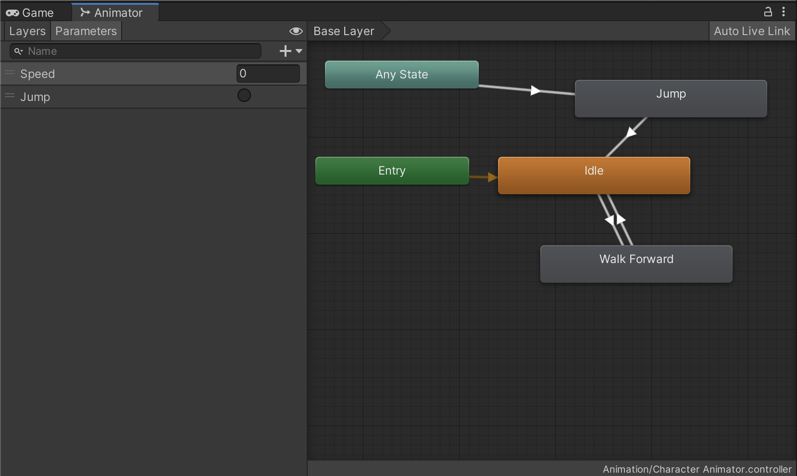

# 애니메이터 파라미터

1. unitychan 오브젝트에 Add Component -> 새로운 C# 스크립트

   - 이름은 PlayerController

   ```c#
   using System.Collections;
   using System.Collections.Generic;
   using UnityEngine;
   
   public class PlayerController : MonoBehaviour
   {
       // 애니메이션의 파라미터가 어떻게 되었는지 상관없이 코드단에서는 파라미터만 조정한다.
       public Animator anim;
   
       // Start is called before the first frame update
       void Start()
       {
           
           
       }
   
       // Update is called once per frame
       void Update()
       {
           if (Input.GetButtonDown("Jump"))
           {
               anim.SetTrigger("Jump"); // 파라미터에서 설정한 이름과 완전히 동일해야 한다.
           }
   
           float verticalInput = Input.GetAxis("Vertical");
   
           anim.SetFloat("Speed", verticalInput);
       }
   }
   
   ```

2. unitychan 의 Player Controller 스크립트 Anim 부분에 상단의 Animator 를 드래그 앤 드롭
3. 

- Any State 는 어떤 상태에서도 작동되게 한다.
- 즉, Any State 에 연결된 Jump 는 현재 어떤 상태이든 상관없이 조건만 맞으면 작동한다.

