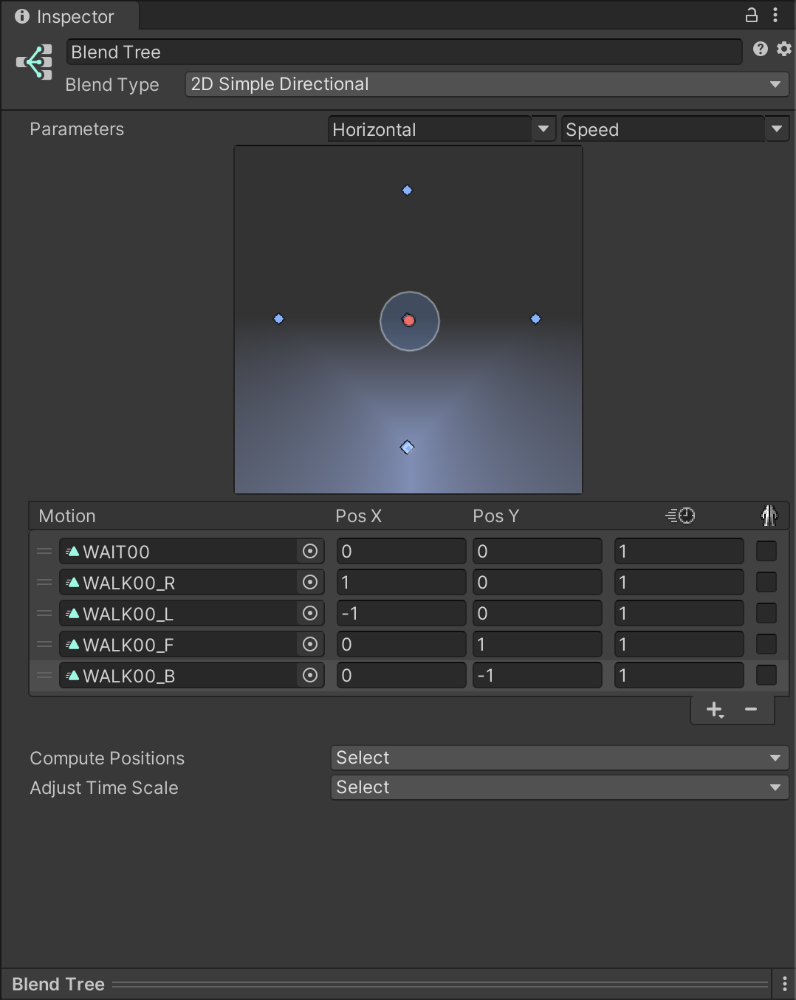
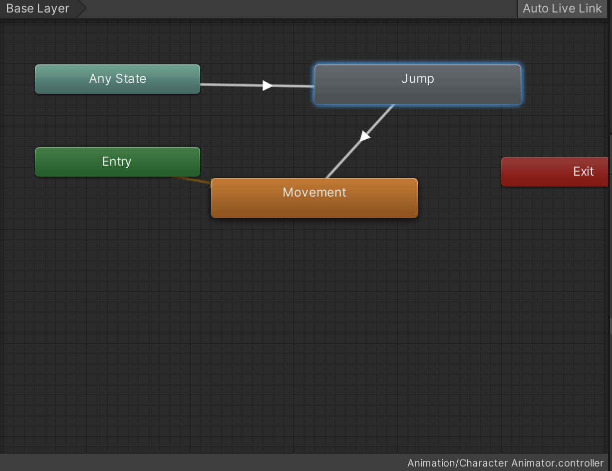

# 블랜드 트리

이번에는 유니티짱이 앞뒤 좌우 모든 방향으로 움직일 수 있게 하고 싶다.

- Assets/unity-chan!/Unity-chan! Model/Art/Animation/

  - WALK00_B, F, L, R 로 모든 방향에 해당하는 걷기 애니메이션이 다 있다.
  - 모든 방향의 걷기 애니메이션을 모두 Animator 창에 드래그 앤 드롭한다.
  - 이름은
    - Walk Right
    - Walk Left
    - Walk Backward
    - Walk Forward (이전에 이미 만들었음)

- Parameter 를 추가한다

  - Float -> Horizontal

- 대각선 오른쪽으로 이동한다면 Walk Forward와 Walk Right 를 섞어서 표시하게 하고싶다.

  - 그리고 각각의 전후좌우의 애니메이션 스테이트를 만들어서 사용하면 너무 복잡해진다.

- 모든 Walk 상태, Idle 상태를 지운다.

  - 우클릭 Create State -> From New Blend Tree
    - 이름을 Movement 로 변경
    - Movement 를 우클릭 -> Set as A Layer Default State

- Movement 를 더블클릭

  - Blend Type 을 2D Simple Directional 로 변경
  - x 방향에 대한 parameter 를 Horizontal
  - y 방향에 대한 parameter 를 Speed

- Motion 에 `+` 버튼을 눌러 5개의 필드를 추가

  

  

  ```c#
  using System.Collections;
  using System.Collections.Generic;
  using UnityEngine;
  
  public class PlayerController : MonoBehaviour
  {
      // 애니메이션의 파라미터가 어떻게 되었는지 상관없이 코드단에서는 파라미터만 조정한다.
      public Animator anim;
  
      // Start is called before the first frame update
      void Start()
      {
          
          
      }
  
      // Update is called once per frame
      void Update()
      {
          if (Input.GetButtonDown("Jump"))
          {
              anim.SetTrigger("Jump"); // 파라미터에서 설정한 이름과 완전히 동일해야 한다.
          }
  
          float verticalInput = Input.GetAxis("Vertical");
          float horizontalInput = Input.GetAxis("Horizontal");
  
          anim.SetFloat("Speed", verticalInput);
          anim.SetFloat("Horizontal", horizontalInput);
      }
  }
  
  ```

  