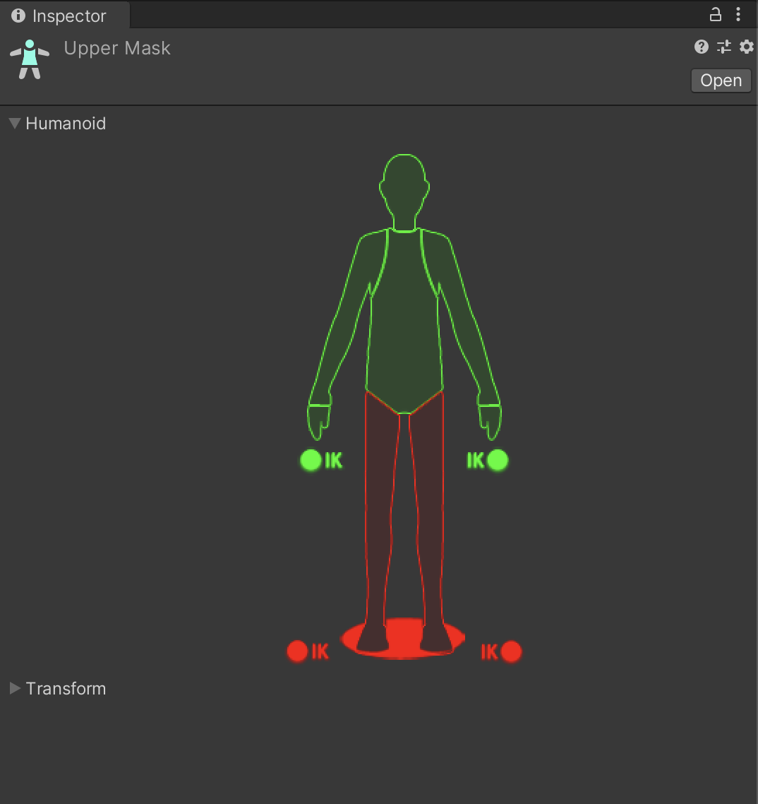

# 애니메이터 레이어

- Animator 창의 Layers 는 동시에 여러 상태를 돌릴 수 있게 해 준다.
- 아래쪽의 레이어가 위쪽의 레이어를 덮어쓰기 함. (겹치는 부분에 대해서는)
- 따라서 겹치지 않게 부위를 나눠서 레이어를 만든다. 예)
  - 움직임
  - 표정
  - 상체
  - 하체
- 레이어에는 weight 값이 있어서 1.0 에 가까울 수록 위쪽 레이어를 많이 덮어쓰기 한다.

---

1. Assets/Animation/ 우클릭 -> Create -> Avatar Mask

   - 이름을 Upper Mask

   - 하체를 모두 체크 해제

     

2. Layers 에서 Upper Layer, Face Layer 추가

3. Upeer Layer 의 마스크 필드에 위의 Upper Mask 를 적용

4. 같은 원리로 Face Layer 에는 Face Only Mask 적용 (유니티짱에서 기본 제공됨)

5. Upper Layer 에 LOSE00 애니메이션을 드래그 앤 드롭

6. Face Layer 에 angry 애니메이션 드래그 앤 드롭

7. Upper Layer 와 Face Layer 가 모두

   - weight: 1
   - ovverride 상태

   인지 확인

8. 플레이 버튼을 눌러서 잘 적용되는지 확인