# 게임 엔진의 원리

## 게임 오브젝트와 컴포넌트

### 왜 기존의 게임 엔진을 사용하는가?

- 이미 만들어진 기반 (API, **컴포넌트** 등) 을 재사용
- 게임 로직에 집중할 수 있음
- 유니티에서 주목해야 할 것은 **컴포넌트**이다

### 상속

- 컴포넌트를 이해하기 위해서는 상속의 개념을 먼저 알아야 한다
- 상속은 부모 클래스를 상속시켜 자식 클래스를 만들 수 있다
- 상속을 통해 자식 클래스는 부모 클래스에서 작성했던 코드를 다시 작성할 필요가 없다는 장점이 있다

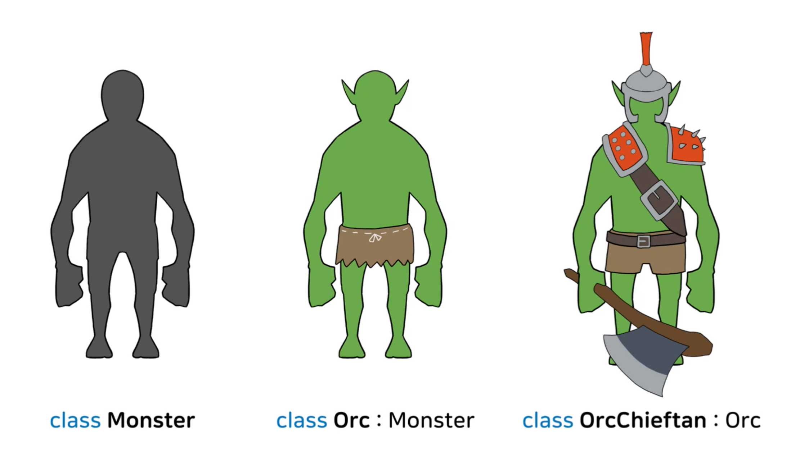

- 위 그림에서처럼 몬스터 클래스를 확장시켜 사용 가능하다

- 상속은 다음 그림과 같은 개념 (A is B) 으로 동작한다

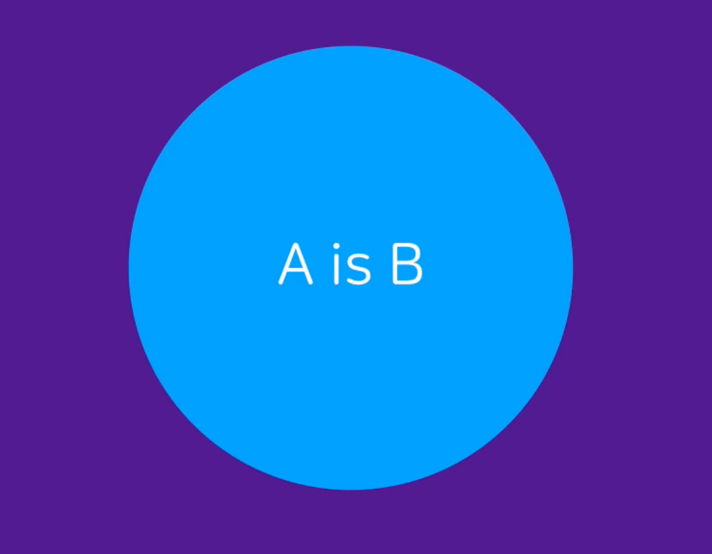

- *상속이 항상 잘 동작하는 것은 아니다*
  - 완벽하게 순수한 base 클래스를 만드는 것이 힘들기 때문
  - 자식 클래스는 선택적으로 기능을 상속할 수 없다

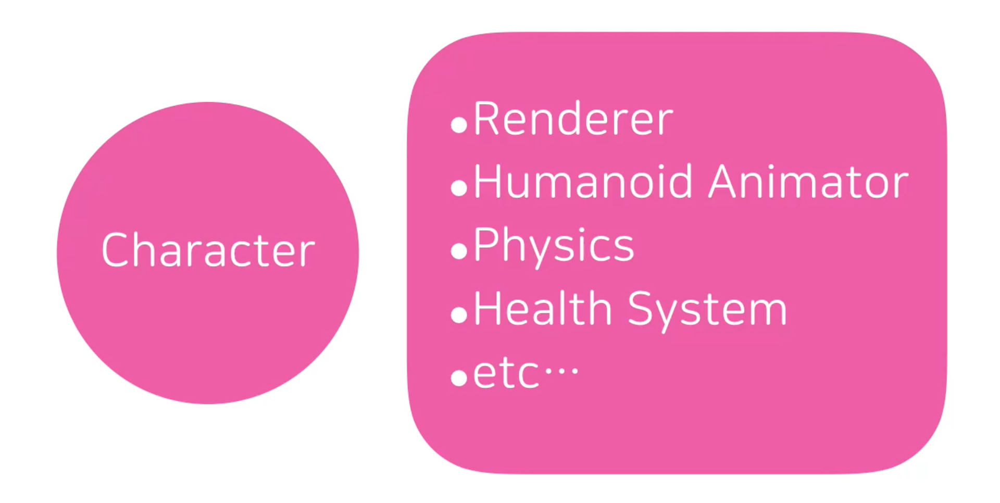

- 개발자가 개발 초기에 필요할 것들을 미리 예측해서 위 그림과 같이 Character 클래스를 만들었다고 해 보자

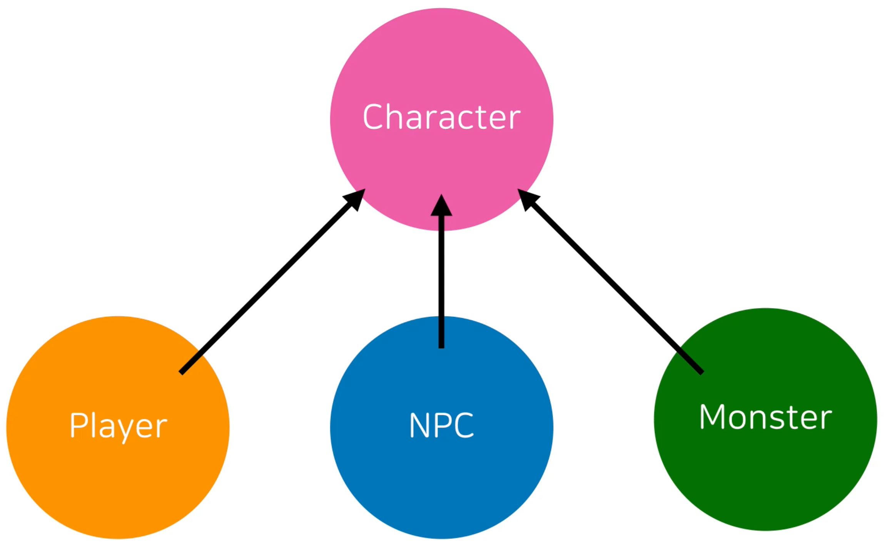

- 개발자는 위 그림 처럼 Character 클래스를 상속해서 Player, NPC, Monster 등의 자식 클래스를 만들어 사용하고 싶을 것이다
  - 하지만 항상 이렇게 이상적으로 동작하지는 않는다

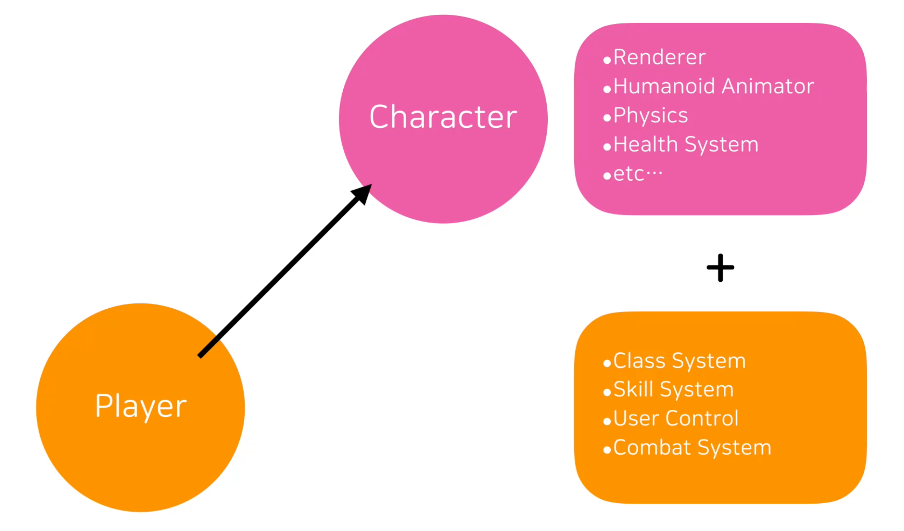

- Character 클래스를 상속해 Player 클래스를 만들었을때는 문제가 발생하지 않는다

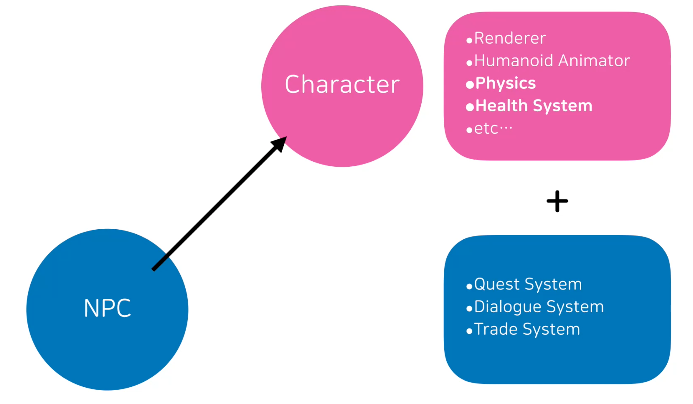

- Character 클래스를 상속해 Player 클래스를 만들었을때는 문제가 발생한다
  - Health System
    - 중요 NPC는 절대 죽으면 안된다
    - Health System 을 상속 받았기 때문에 죽을 수 있다
  - Physics
    - 움직일 필요가 없는 NPC도 있다
    - 괜히 물리 시스템을 상속받았다가 물리 오류를 발생시킬 수도 있다

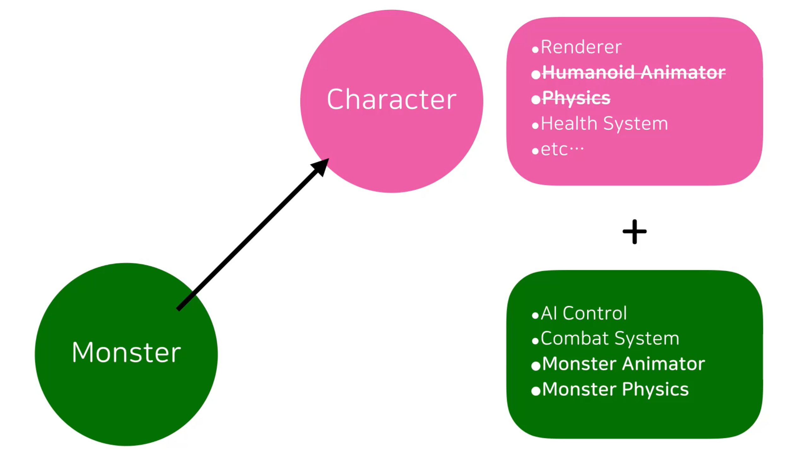

- Monster 클래스도 마찬가지로 문제가 발생한다
  - Humanoid Animator
    - 몬스터가 반드시 인간 형태이지는 않다
  - Physics
    - 몬스터는 인간 형태의 캐릭터와 다르게 조금 더 비현실적인 물리 효과를 받아야 할 수도 있다

- 이 때문에 상속은 오히려 코드 재사용을 어렵게 할 수 있고, 기획자가 매번 개발자에게 의존하게 만들 수 있다

### 컴포넌트

- A has ~ 형태의 개념을 도입한다

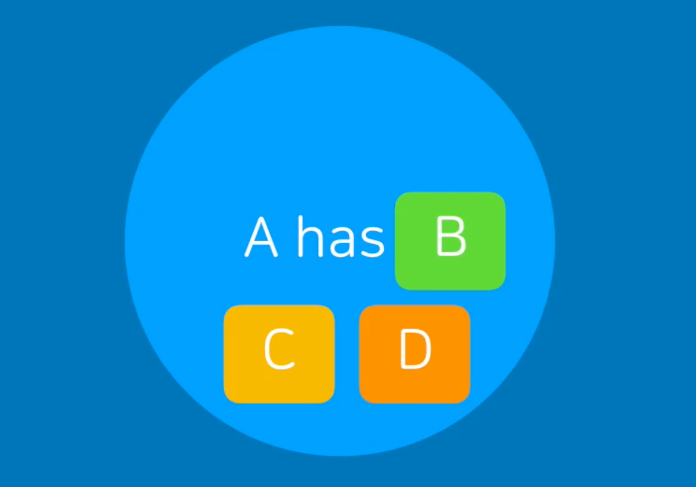

- 비어있는 컨테이너를 만들고, 그 컨테이너에 선택적으로 기능을 골라 붙이는 것이다
  - 이러한 패턴을 **게임 오브젝트-컴포넌트** 패턴이라고 한다
- 게임 오브젝트:
  - 단순 홀더(Holder), 빈 껍데기
- 컴포넌트:
  - 미리 만들어진 부품
  - 각자 대표 기능을 가진다

- 예시로 동물원 게임을 만든다고 해 보자

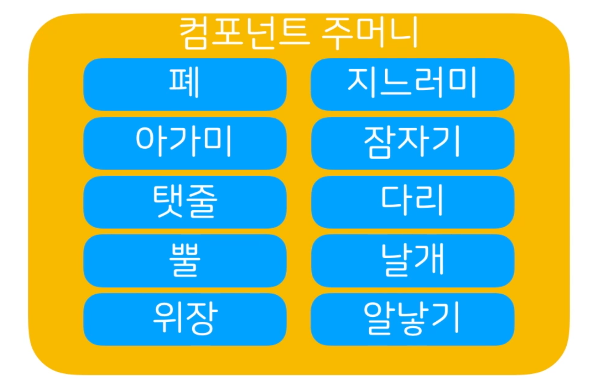

- 기획자가 프로그래머에 동물이 아니라, 동물에 사용될 다양한 부품을 미리 만들어 달라고 부탁한다
  - 미래에 어떤 동물이 사용되게 될지 모두 예측할 수는 없기 때문

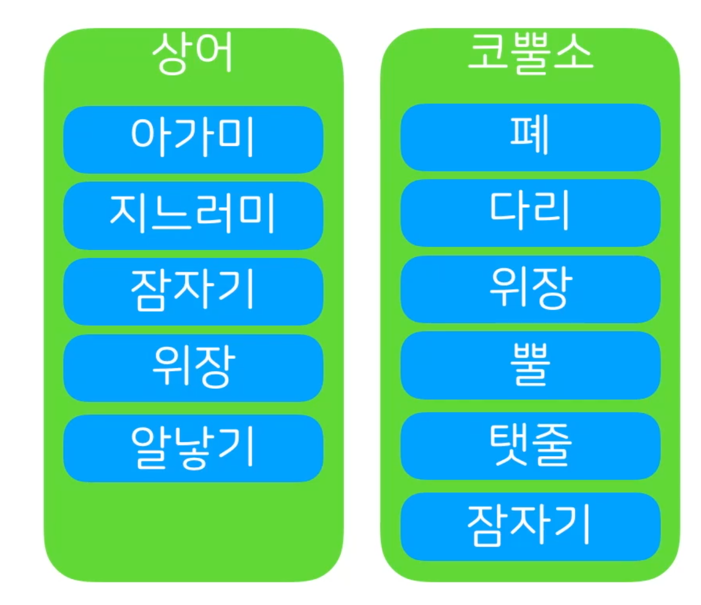

- 이 방식을 사용하면, 기획자가 프로그래머의 도움 없이도 컴포넌트를 게임 오브젝트라는 빈 껍떼기에 조립함으로서 원하는 동물을 구현 할 수 있다

- 컴포넌트의 장점:
  1. 유연한 재사용
  2. 기획자의 프로그래머 의존도가 낮아짐
  3. 독립성 덕분에 추가와 삭제가 쉽다
- 컴포넌트는 스스로 동작하는 독립 부품이다
  - 컴포넌트 내부 필요한 기능이 독립적으로 구현되어 있다
  - 다른 컴포넌트의 영향을 받지 않는다
  - 새로운 컴포넌트를 추가하거나 삭제해도 기능이 망가지지 않는다

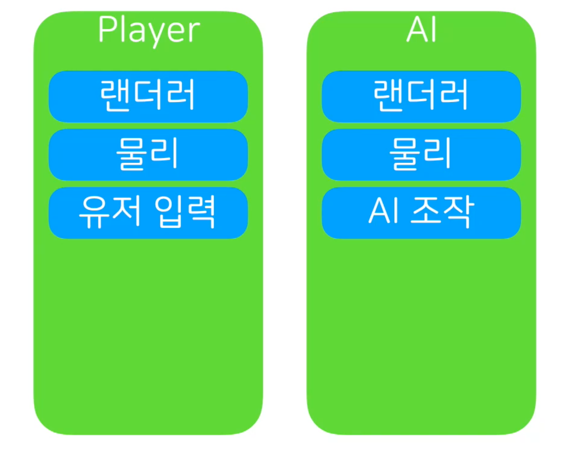

- 유니티 상에서 큐브로 예시를 보면

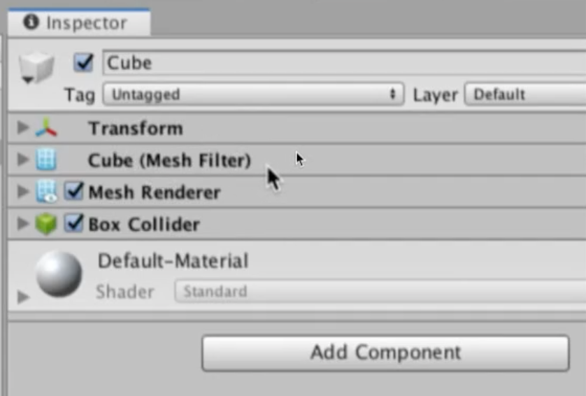

- 큐브는 Transform, Cube, Mesh Renderer, Box Collider 컴포넌트를 지님으로서 각각의 기능을 가지고 있는 것이다

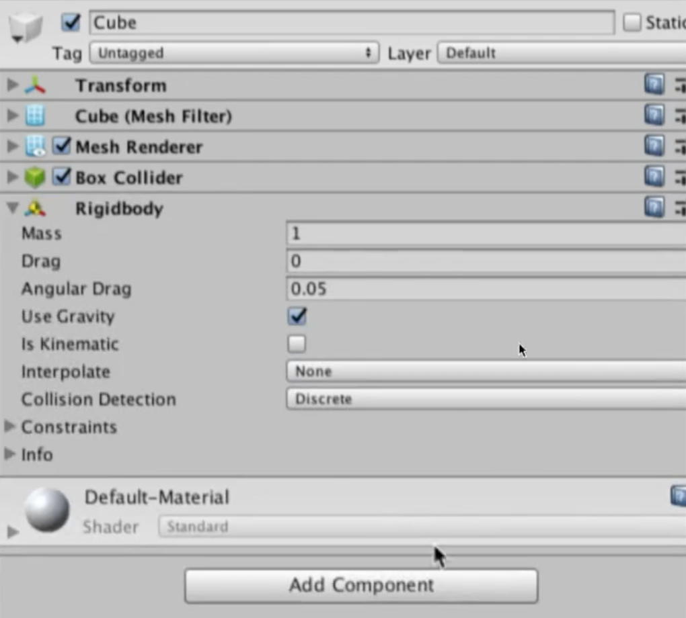

- 여기에 강체라는 의미의 Rigidbody 컴포넌트를 추가하면 물리 기능(중력에 의해 추락)을 새로 가지게 된다

- 마찬가지로 Box Collider 컴포넌트를 삭제하면 충돌하지 않고 바닥을 뚫고 떨어지게 된다

- 이 모든 장점은 컴포넌트가 독립적이기 때문에 가능한 것이다
  - 그렇다면 컴포넌트를 누가 실행시켜야 하는가 하는 문제가 남는다

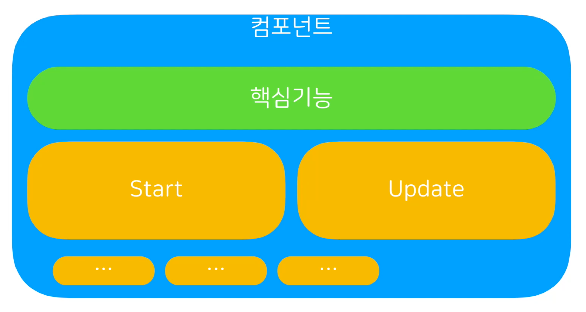

- 컴포넌트 내부에는 컴포넌트에게 시동을 거는 Start, 1초에 수십번씩 자신의 상태를 갱신하 주기적으로 실행되어야 할 것들을 실행시키는 Update 라는 기능을 가지고 있다
  - Start, Update 기능을 실행시켜야 한다
  - 그렇다면 독립적인 컴포넌트를 누가 시동을 걸어주고 누가 주기적으로 업데이트 시켜주는가?
    - 이 질문에 대한 답은 다음 강의에서 알아본다