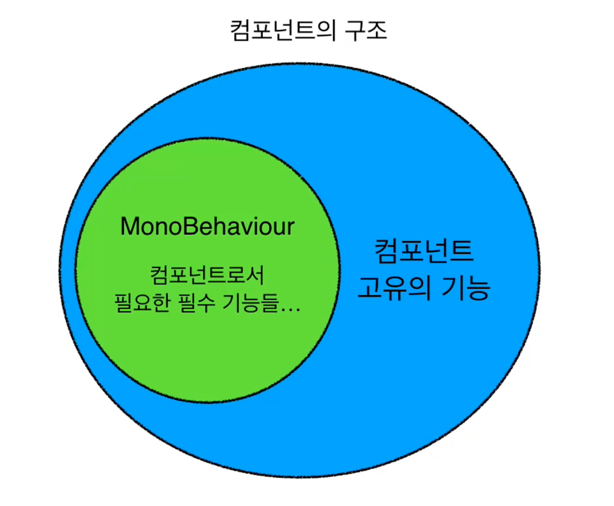
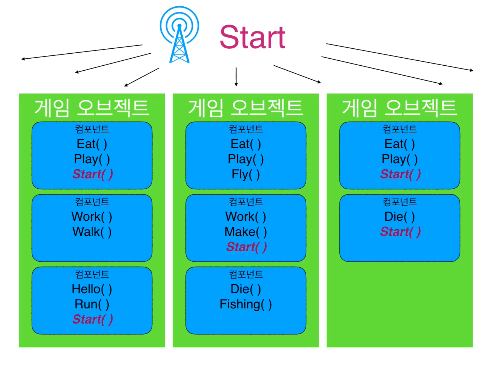
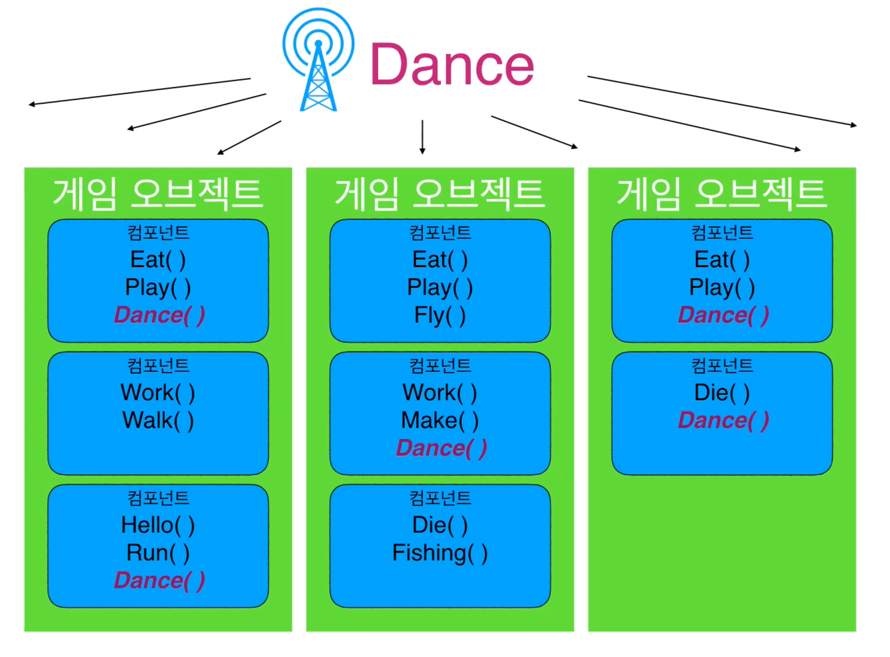
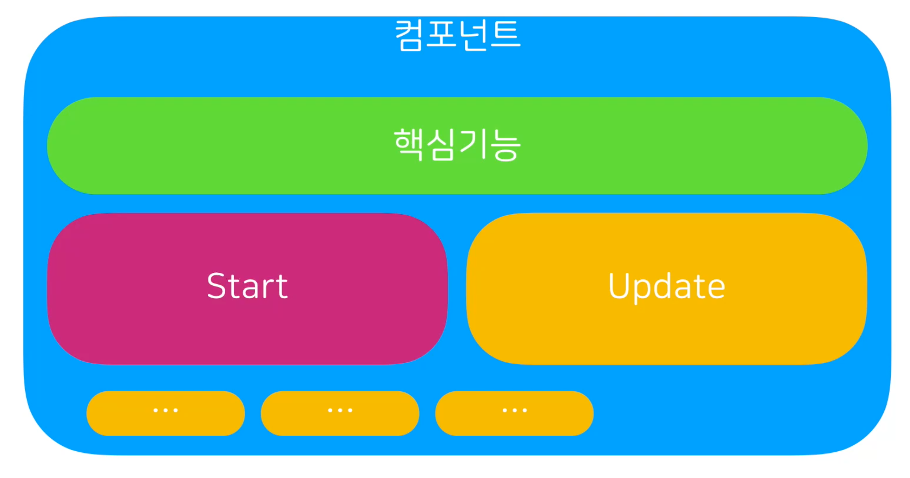
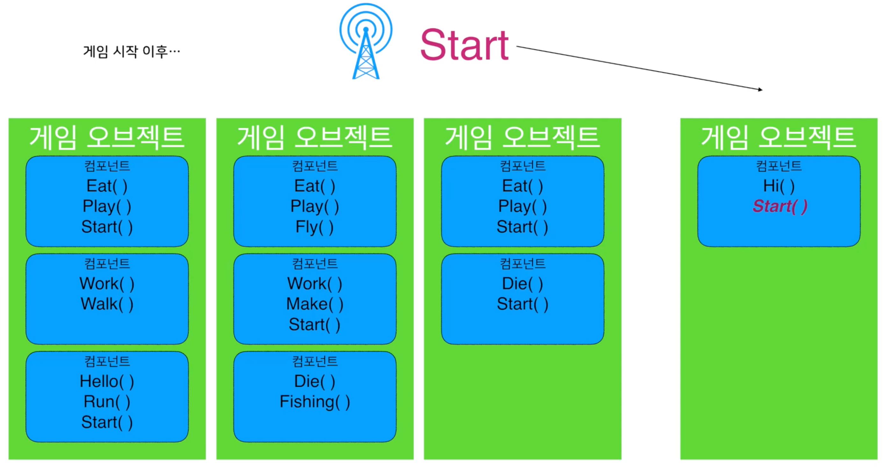

# 게임 엔진의 원리

## 메시지와 브로드캐스팅

> 외부의 간섭을 받지 않는 부품이 어떻게 스스로를 동작시킬까?

### 컴포넌트의 구조

- 유니티상의 모든 컴포넌트는 MonoBehaviour 클래스를 상속한다
- **MonoBehaviour**
  - 컴포넌트로서 게임 오브젝트에게 추가될 수 있다
  - 유니티의 통제를 받는다
  - 유니티 이벤트 메시지를 감지할 수 있게 된다

### 메시지 시스템

- **메시지**
  - 보내는 쪽은 누가 받는지 신경쓰지 않는다
  - 받는 쪽은 누가 보냈는지 신경 쓰지 않는다
  - 메시지에 명시된 기능을 가지고 있으면 실행, 없으면 무시한다

### 브로드 캐스팅

- 메시지를 무차별적으로 많이 보내는 것

> Dance 메시지를 브로드 캐스팅해서 모든 Dance 기능을 가진 컴포넌트들을 Dance시킴

### 처음 질문에 대한 답

> 외부의 간섭을 받지 않는 부품이 어떻게 스스로를 동작시킬까?

- 컴포넌트들은 자신의 핵심기능 이외에 초기를 위한 Start 메서드를 가지는 경우가 많다
- 즉 초기화를 위해 우리는 해당 컴포넌트의 Start 메서드를 실행 시켜주어야 한다

- 게임 시작시
  1. Start 메시지를 브로드 캐스팅
  2. 게임 오브젝트들이 Start 메시지를 받는다
  3. 자신이 가진 컴포넌트들 중 Start 기능을 가진 컴포넌트들을 실행시킨다
  4. 초기화 처리가 자동으로 이루어진다

- 게임 시작 이후 추가된 게임 오브젝트의 경우
  1. 해당 게임 오브젝트가 Start 메시지가 자신의 컴포넌트와, 자식 오브젝트들에게 브로드 캐스팅 됨
  2. 해당 게임 오브젝트가 처음 활성화 되는 순간에 자신의 컴포넌트들에서 Start 메서드가 자동으로 실행됨

### 유니티 이벤트 메서드

- 이름만 맞춰 구현하면, 해당 타이밍에 자동으로 실행된다

- `Start`, `Awake`, `Update`, `OnTriggerEnter` ... 등이 있다

- 메시지/브로드캐스팅 시스템을 통해
  - 복잡한 참조 관계를 끊고 라이프싸이클을 스스로 관리할 수 있게 함

